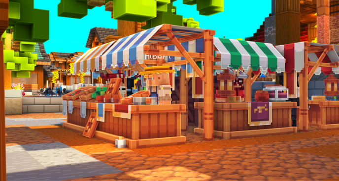
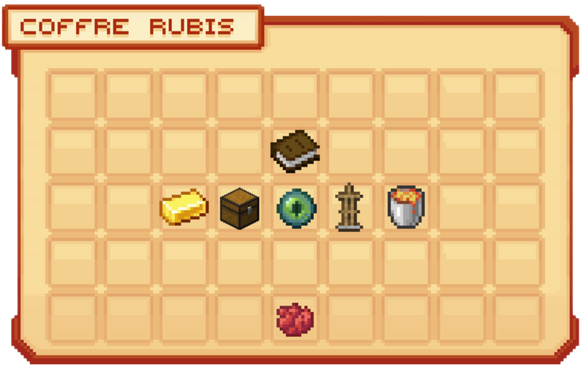
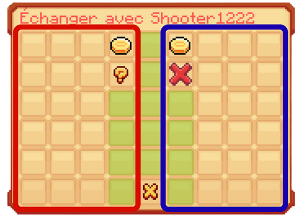
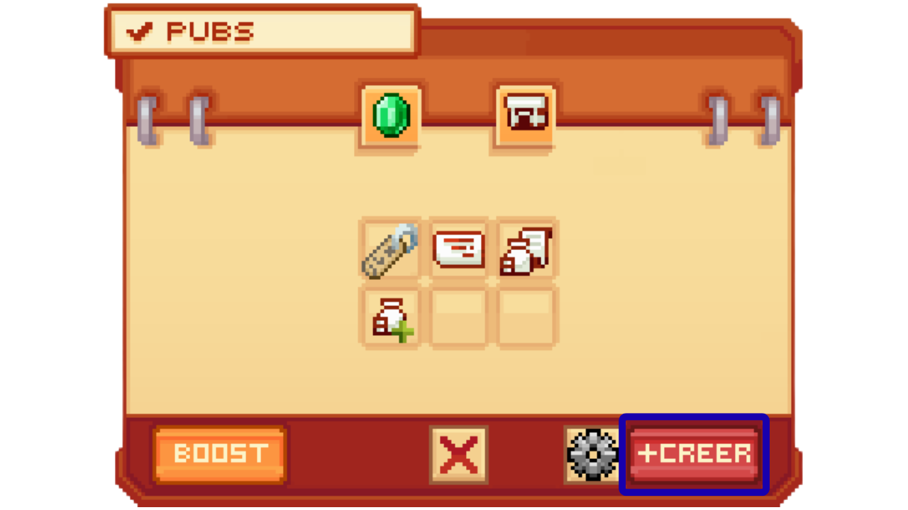

# 💰 Les Commerces


**Tuto : Comment gagner de l'argent sur Evolucraft avec les différents shops**


## <mark style="color:green;">💠 Coffre de Vente 🔖</mark>

Si vous souhaitez créer un coffre de vente ou d'achat, veuillez suivre ce lien : [<mark style="color:green;">**Les shops de joueurs 🛒**</mark>](https://wiki.evolucraft.fr/les-villes/les-shops-de-joueurs)

Le coffre de vente ou d'achat vous permet de vendre ou d'acheter des items entre joueurs directement à votre sublime pwarp, afin de créer votre richesse et développer votre marché ainsi que votre reconnaissance sur le serveur. À l'intérieur, vous pourrez acheter ou vendre n'importe quel item, des items vanilla pour les rangs, comme des items uniques au serveur tels que des cristaux de donjon ou encore des pierres de donjon.

Bien entendu, vous pouvez également choisir vos prix et régler les quantités en stock. C'est vous le propriétaire de votre commerce ! Cependant, le nombre de coffres est limité selon votre rang.

<figure><figcaption>
<strong>Aperçu d'un clic droit sur le Coffre de Vente</strong>
</figcaption></figure>

Vous pouvez également retrouver les produits de vos concurrents avec la commande `/finditem acheter/vendre [id de l'item]` afin de connaître leurs prix et réunir un maximum de clients.

## <mark style="color:green;">💠 Hôtel des Ventes 📢</mark>

### Présentation de l'hôtel des ventes :

Dans le `/ah` ou `/hdv`, vous pourrez retrouver toutes les offres des joueurs vendant leurs objets, qu'ils soient communs ou très rares. De quoi faire de bonnes affaires ! ✨

Afin de mieux vous y retrouver, le /ah est regroupé en plusieurs catégories listées ci-dessous :

* <mark style="color:green;">**Global 🌍**</mark> : Liste tous les objets mis en vente dans le <mark style="color:green;">**`/ah`**</mark>, triés par date d'ajout.
* <mark style="color:green;">**Armes ⚔️**</mark> : Regroupe les différentes armes disponibles à l'achat, telles que les épées, les arcs, etc.
* <mark style="color:green;">**Outils 🪓**</mark> : Catégorie dédiée aux outils, y compris les pioches, pelles, houes, etc.
* <mark style="color:green;">**Compagnons 🧸**</mark> : Section pour acheter ou vendre des compagnons ou "pets".
* <mark style="color:green;">**Classes 🧙‍♂️**</mark> : Cartes sur les classes de personnages disponibles.
* <mark style="color:green;">**Blocs 🧱**</mark> : Liste des blocs disponibles à l'achat pour la construction ou la décoration.
* <mark style="color:green;">**Spawners 🐾**</mark> : Présente les spawners disponibles à l'achat pour générer des créatures.

Les deux boutons en bas de l'interface permettent aux joueurs de gérer leurs ventes, puis de récupérer les objets qu'ils ont achetés.

<figure><figcaption>
<strong>Menu <code>/ah</code></strong>
</figcaption></figure>

### Commandes de l'hôtel des ventes

* <mark style="color:green;">**`/ah sell [prix]`**</mark> : Vend l'objet dans votre main à l'hôtel des ventes.
* <mark style="color:green;">**`/ah average`**</mark> : Donne le prix moyen de l'objet dans votre main.
* <mark style="color:green;">**`/ah claim`**</mark> : Ouvre l'interface de récupération des objets achetés à l'hôtel des ventes.
* <mark style="color:green;">**`/ah history`**</mark> : Ouvre l'historique de vos ventes/achats dans l'hôtel des ventes.
* <mark style="color:green;">**`/ah viewmine`**</mark> : Affiche vos objets mis en vente dans l'hôtel des ventes.
* <mark style="color:green;">**`/ah search [paramètre:nom du paramètre]`**</mark> : Permet de rechercher un objet spécifique par son nom ou son id, ou un vendeur à l'hôtel des ventes.

## <mark style="color:green;">💠 Shop Général 💸</mark>

Sur Evolucraft, vous pouvez accéder facilement au marché du spawn en utilisant la commande <mark style="color:green;">**`/shop`**</mark>. C'est l'endroit idéal pour vendre vos matériaux à des PNJ. Cependant, gardez à l'esprit que la rentabilité est assez faible 📉.

<figure><figcaption>
<strong>Aperçu de la zone <mark style="color:green;">/shop</mark></strong>
</figcaption></figure>

Ces acheteurs sont spécialisés dans l'achat de différentes catégories de produits :

* Acheteur de <mark style="color:green;">**Minerais ⛏️**</mark> : Ressources minérales comme le fer, l'or, le diamant, etc.
* Acheteur d'<mark style="color:green;">**Insectes 🐞**</mark> : Répertorie tous les insectes capturables dans le Parc d'Aurora.
* Acheteur de <mark style="color:green;">**Blocs 🧱**</mark> : Différents types de blocs pour la construction et la décoration.
* Vendeur d'<mark style="color:green;">**Objets utilitaires 🧰**</mark> : Composants Redstone pour créer des mécanismes. À noter que vous ne pouvez qu'en acheter !
* Acheteur de <mark style="color:green;">**Cultures 🌾**</mark> : Articles liés à l'agriculture tels que les plantes et les produits agricoles.
* Acheteur de <mark style="color:green;">**Loots de mobs 🧟‍♂️**</mark> : Objets obtenus en tuant des créatures.

## <mark style="color:green;">💠 Coffre de vente automatique ♻️</mark>

Les coffres de vente automatique vendent et octroient un boost de vente sur les objets du `/shop`. Pour mettre en marche votre coffre, posez-le au sol et attendez quelques secondes. Vous n'avez plus qu'à faire un clic droit sur le coffre pour ouvrir son interface. Ce boost varie en fonction du coffre : 

| Type de coffre de vente automatique                      | Multiplication du gain     |
| -------------------------------------------------------- | -------------------------- |
| <mark style="color:red;">**Coffre Rubis**</mark>         | **X 1.5**                  |
| <mark style="color:green;">**Coffre Leprechaun**</mark>  | **X 2**                    |

<figure><figcaption>
<strong>Aperçu du coffre Rubis</strong>
</figcaption></figure>

Les coffres de vente automatique possèdent 5 icônes :

* <mark style="color:green;">**Livre 📕 _(statistiques)_**</mark> : Il s'agit de diverses informations concernant votre coffre : propriétaire du coffre, type de coffre, multiplicateur de vente, argent gagné et nombre d’objets vendus.
* <mark style="color:green;">**Lingot d’or 📀 _(vente automatique)_**</mark> : Permet d’activer ou de désactiver la vente automatique du coffre Rubis.
* <mark style="color:green;">**Coffre 📫 _(inventaire)_**</mark> : Permet d’accéder à l’inventaire du coffre Rubis.
* <mark style="color:green;">**Œil de l’Ender 📮 _(suppression des invendus)_**</mark> : Permet de supprimer automatiquement du coffre les items ne pouvant être vendus au `/shop`.
* <mark style="color:green;">**Porte-armure 🤺 _(hologramme)_**</mark> : Permet d’afficher ou de cacher l’hologramme présent au-dessus du coffre.
* <mark style="color:green;">**Seau de lave 🪔 _(chargement)_**</mark> : Permet d’activer gratuitement votre coffre de vente pour une durée d’une heure. Vous pouvez recharger le coffre avec une durée maximum de 24h en continu.

## <mark style="color:green;">**💠 Échanges entre Joueurs 🤝**</mark>

Les joueurs peuvent également effectuer des échanges directs entre eux via la commande <mark style="color:green;">**`/trade "nom du joueur"`**</mark>. Cette commande permet d’effectuer des <mark style="color:green;">transactions sécurisées</mark> (objets ou argent) entre deux joueurs proches l’un de l’autre.

En prenant l'image ci-dessous, vous avez la <mark style="color:green;">partie de gauche</mark>, entourée en rouge, où vous devrez déposer les <mark style="color:green;">items à échanger</mark>. Quant à la <mark style="color:green;">partie de droite</mark>, en bleu, ce sont les <mark style="color:green;">items que l'autre joueur propose</mark>. L’<mark style="color:green;">icône de la pièce</mark> vous permet de voir l’argent que vous échangez également ; celle-ci se mettra en surbrillance lorsque le joueur en face proposera d’échanger de l’argent.

Lorsque vous êtes d’accord sur l’échange, vous devrez alors cliquer sur la <mark style="color:green;">croix rouge</mark> de votre côté. Si l’un de vous modifie les items échangés après avoir appuyé sur la croix, <mark style="color:green;">celle-ci se remettra en place</mark> pour garantir la sécurité de la transaction.

Lorsque les deux joueurs ont appuyé sur la croix, un <mark style="color:green;">compte à rebours</mark> sera lancé et l’échange sera effectué.


**REMARQUE 🤓☝: Si vous n’avez plus assez de place dans votre inventaire pour accueillir les items échangés, ils seront jetés au sol. Faites donc attention au clear lag** !


<figure><figcaption>
<strong>Aperçu de l’interface du <mark style="color:green;">/trade</mark></strong>
</figcaption></figure>

## <mark style="color:green;">💠 Publicité 📣</mark>

Le système de <mark style="color:green;">**`/pub`**</mark> offre aux joueurs une plateforme polyvalente pour promouvoir leurs articles, chercher des partenaires pour vaincre les boss des donjons, et bien plus encore.

Pour créer votre publicité, veuillez vous rendre à cette page du wiki : [<mark style="color:green;">**Créer une pub**</mark>](https://wiki.evolucraft.fr/tuto-et-astuce/creation-pub)

<figure><figcaption>
<strong>Aperçu du </strong><mark style="color:green;"><strong><code>/pub</code></strong></mark>
</figcaption></figure>

En cliquant sur le bouton "Trier", en bas à gauche du menu principal, vous trouverez les différentes catégories du /pub :&#x20;

* <mark style="color:green;">**Global 🌍**</mark>
* <mark style="color:green;">**Vente 💸**</mark>
* <mark style="color:green;">**Achat 🛒**</mark>
* <mark style="color:green;">**Pwarp 📌**</mark>
* <mark style="color:green;">**Donjon 🟪**</mark>
* <mark style="color:green;">**Recherche Donjon 🔍**</mark>
* <mark style="color:green;">**Recrutement 📢**</mark>
* <mark style="color:green;">**Service 💼**</mark>
* <mark style="color:green;">**Event 🎭**</mark>

1️⃣• L'icône représentant un livre permet de trier les annonces par date ou par auteur, par ordre alphabétique. 

2️⃣• Le bouton central permet d'activer des notifications. Cela vous permet d'activer ou de désactiver les notifications de publicité que vous souhaitez recevoir. 

3️⃣• Vous pouvez également enregistrer des modèles de pub grâce à l'icône représentant un engrenage.

4️⃣• Le bouton en bas à droite vous permet de poster votre annonce. 

5️⃣• Il est aussi possible de booster votre annonce pour l'afficher au milieu, en haut de l'interface, et donc attirer plus d'attention lors de la création de votre pub.

6️⃣• La petite gemme en haut à droite vous permet de consulter vos annonces actives.


**REMARQUE 🤓☝ :**Cependant, vous pouvez activer le message automatique dans le `/pub`. Pour cela, allez dans "mes annonces", cliquez sur la pub en question, puis activez "message récurrent" afin qu’il réapparaisse automatiquement toutes les 20 minutes dans le chat des autres joueurs.


<figure><figcaption>
<strong>Aperçu du </strong><mark style="color:green;"><strong><code>/pub suivant les numéros</code></strong></mark>
</figcaption></figure>

**Et voilà, vous connaissez tous les commerces du serveur ! 🥳**
 
