# 🎁 Les Caisses


**Tuto : Maximiser sa Progression sur Evolucraft**


Pour ajouter un aspect Aléatoire à votre aventure, des caisses sont disponibles sur Evolucraft. Certaines sont disponibles de manière permanente tandis que d'autres ne sont qu'éphémères.

Pour ouvrir ces caisses, vous devrez vous rendre, muni d'une clé, au <mark style="color:green;">**`/spawn`**</mark>. Les caisses se trouveront alors sur votre droite.

<figure><figcaption>
<strong>Aperçu des caisses</strong>
</figcaption></figure>

Il existe différents moyens d'obtenir des clés : en les achetant dans la boutique avec des Gemmes, en votant pour le serveur, ou encore en les gagnant dans les events.

## <mark style="color:green;">Caisse Vote</mark>

La clé de la Caisse Vote s'obtient en votant pour le serveur avec la commande <mark style="color:green;">**`/vote`**</mark>.

<figure><figcaption>
<strong>Récompense de la caisse Vote</strong>
</figcaption></figure>

| **Récompense**                                                                              | **Chance**                                   |
| ------------------------------------------------------------------------------------------- | -------------------------------------------- |
| <mark style="color:green;">**Épée de l'Aventurier**</mark>                                  | <mark style="color:green;">**4,08%**</mark>  |
| <mark style="color:green;">**Pioche de l'Aventurier**</mark>                                | <mark style="color:green;">**4,08%**</mark>  |
| <mark style="color:green;">**Houe de l'Aventurier**</mark>                                  | <mark style="color:green;">**4,08%**</mark>  |
| <mark style="color:green;">**Canne à Pêche de l'Aventurier**</mark>                         | <mark style="color:green;">**4,08%**</mark>  |
| <mark style="color:green;">**Hache de l'Aventurier**</mark>                                 | <mark style="color:green;">**4,08%**</mark>  |
| <mark style="color:green;">**5.000**</mark>**💰**                                           | <mark style="color:green;">**4,08%**</mark>  |
| <mark style="color:green;">**10.000**</mark>**💰**                                          | <mark style="color:green;">**4,08%**</mark>  |
| <mark style="color:green;">**10x Gemmes**</mark>                                            | <mark style="color:green;">**4,08%**</mark>  |
| <mark style="color:green;">**Spawner Aléatoire**</mark>                                     | <mark style="color:green;">**4,08%**</mark>  |
| <mark style="color:green;">**Booster Aléatoire**</mark> (10%) (30m)                         | <mark style="color:green;">**4,08%**</mark>  |
| <mark style="color:green;">**Pierre de Téléportation**</mark>                               | <mark style="color:green;">**4,08%**</mark>  |
| <mark style="color:green;">**EXP Métier Aléatoire**</mark> (x2.000)                         | <mark style="color:green;">**4,08%**</mark>  |
| <mark style="color:green;">**EXP Minecraft**</mark> (x1.395)                                | <mark style="color:green;">**4,08%**</mark>  |
| <mark style="color:green;">**Plume de Fly**</mark> (10m)                                    | <mark style="color:green;">**4,08%**</mark>  |
| <mark style="color:green;">**Plume de Fly**</mark> (30m)                                    | <mark style="color:green;">**4,08%**</mark>  |
| <mark style="color:green;">**Parchemin d'Aventure Aléatoire**</mark>                        | <mark style="color:green;">**4,08%**</mark>  |
| <mark style="color:green;">**Bonbon à la Pomme**</mark> (x2)                                | <mark style="color:green;">**4,08%**</mark>  |
| <mark style="color:green;">**Livre Raccommodage**</mark>                                    | <mark style="color:green;">**4,08%**</mark>  |
| <mark style="color:green;">**Entonnnoir**</mark>                                            | <mark style="color:green;">**4,08%**</mark>  |
| <mark style="color:green;">**Fragement de Netherite**</mark> (x2)                           | <mark style="color:green;">**4,08%**</mark>  |
| <mark style="color:green;">**Carapace de Shulker**</mark>                                   | <mark style="color:green;">**4,08%**</mark>  |
| <mark style="color:green;">**Chapeau de Tyro**</mark>                                       | <mark style="color:green;">**4,08%**</mark>  |
| <mark style="color:purple;">**Clé Cosmétique**</mark>                                       | <mark style="color:purple;">**4,08%**</mark> |
| <mark style="color:green;">**Clé Émeraude**</mark>                                          | <mark style="color:green;">**1%**</mark>     |
| <mark style="color:blue;">**Premium**</mark> [👑](https://emojipedia.org/fr/couronne) (24h) | <mark style="color:blue;">**1%**</mark>      |
| <mark style="color:red;">**Rat de Billy**</mark>                                            | <mark style="color:red;">**0,05%**</mark>    |

## <mark style="color:green;">Caisse Cosmétique</mark>

La clé de la Caisse Cosmétique s'obtient en l'achetant dans le <mark style="color:green;">**`/boutique`**</mark> au prix de 500 Gemmes, ou en participant à des events.

<figure>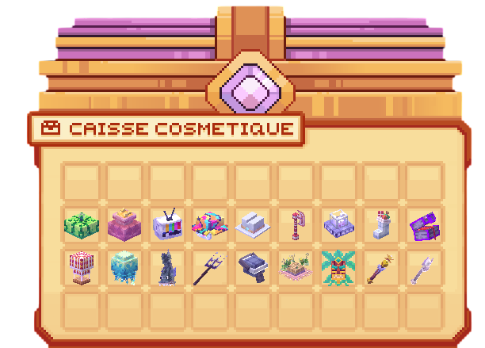<figcaption>
<strong>Récompense de la caisse Cosmétique</strong>
</figcaption></figure>

| **Récompense**                                                      | **Chance**                                   |
| ------------------------------------------------------------------- | -------------------------------------------- |
| <mark style="color:green;">**Bâton Œuf**</mark>                     | <mark style="color:green;">**5,55%**</mark>  |
| <mark style="color:green;">**Boîte en Carton**</mark>               | <mark style="color:green;">**5,55%**</mark>  |
| <mark style="color:green;">**Chapeau de Paille**</mark>             | <mark style="color:green;">**5,55%**</mark>  |
| <mark style="color:yellow;">**Ailes de Poulet**</mark>              | <mark style="color:yellow;">**5,55%**</mark> |
| <mark style="color:yellow;">**Chapeau de Pirate**</mark>            | <mark style="color:yellow;">**5,55%**</mark> |
| <mark style="color:yellow;">**Chapeau de Poulet**</mark>            | <mark style="color:yellow;">**5,55%**</mark> |
| <mark style="color:yellow;">**Coffre au Trésor**</mark>             | <mark style="color:yellow;">**5,55%**</mark> |
| <mark style="color:yellow;">**Coutelas**</mark>                     | <mark style="color:yellow;">**5,55%**</mark> |
| <mark style="color:blue;">**Bouclier Givré**</mark>                 | <mark style="color:blue;">**5,55%**</mark>   |
| <mark style="color:blue;">**Chapeau de Méduse**</mark>              | <mark style="color:blue;">**5,55%**</mark>   |
| <mark style="color:blue;">**Épée Givrée**</mark>                    | <mark style="color:blue;">**5,55%**</mark>   |
| <mark style="color:blue;">**Lame Cybernétique**</mark>              | <mark style="color:blue;">**5,55%**</mark>   |
| <mark style="color:blue;">**Queue de Krampus**</mark>               | <mark style="color:blue;">**5,55%**</mark>   |
| <mark style="color:blue;">**Réacteur Dorsal Cybernétique**</mark>   | <mark style="color:blue;">**5,55%**</mark>   |
| <mark style="color:purple;">**Bouclier du Roi Fantôme**</mark>      | <mark style="color:purple;">**5,55%**</mark> |
| <mark style="color:purple;">**Couronne du Roi Fantôme**</mark>      | <mark style="color:purple;">**5,55%**</mark> |
| <mark style="color:purple;">**Griffes de Dragon de l'Ombre**</mark> | <mark style="color:purple;">**5,55%**</mark> |
| <mark style="color:purple;">**Maison de Coucou**</mark>             | <mark style="color:purple;">**5,55%**</mark> |

## <mark style="color:green;">Caisse Émeraude</mark>

La clé de la Caisse Émeraude s'obtient en l'achetant dans le <mark style="color:green;">**`/boutique`**</mark> au prix de 350 Gemmes, ou en participant à des events.

<figure>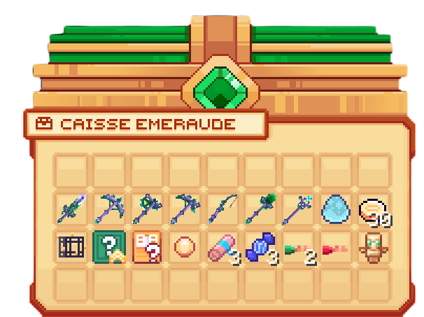<figcaption>
<strong>Récompense de la caisse Émeraude</strong>
</figcaption></figure>

| **Récompense**                                                           | **Chance**                                   |
| ------------------------------------------------------------------------ | -------------------------------------------- |
| <mark style="color:green;">**Épée en Émeraude**</mark>                   | <mark style="color:green;">**5,55%**</mark>  |
| <mark style="color:green;">**Pioche en Émeraude**</mark>                 | <mark style="color:green;">**5,55%**</mark>  |
| <mark style="color:green;">**Hache en Émeraude**</mark>                  | <mark style="color:green;">**5,55%**</mark>  |
| <mark style="color:green;">**Houe en Émeraude**</mark>                   | <mark style="color:green;">**5,55%**</mark>  |
| <mark style="color:green;">**Canne à Pêche en Émeraude**</mark>          | <mark style="color:green;">**5,55%**</mark>  |
| <mark style="color:green;">**Pelle en Émeraude**</mark>                  | <mark style="color:green;">**5,55%**</mark>  |
| <mark style="color:green;">**Sceptre en Émeraude**</mark>                | <mark style="color:green;">**5,55%**</mark>  |
| <mark style="color:green;">**Oeuf de Familier**</mark>                   | <mark style="color:green;">**5,55%**</mark>  |
| <mark style="color:green;">**300.000**</mark>**💰**                      | <mark style="color:green;">**5,55%**</mark>  |
| <mark style="color:green;">**Spawner Aléatoire**</mark>                  | <mark style="color:green;">**5,55%**</mark>  |
| <mark style="color:green;">**Booster Aléatoire**</mark> (25%) (1h)       | <mark style="color:green;">**5,55%**</mark>  |
| <mark style="color:yellow;">**Carte de Classe Aléatoire**</mark>         | <mark style="color:yellow;">**5,55%**</mark> |
| <mark style="color:yellow;">**Pierre de Téléportation**</mark>           | <mark style="color:yellow;">**5,55%**</mark> |
| <mark style="color:blue;">**Parchemin d'Aventure Difficile**</mark> (x3) | <mark style="color:blue;">**5,55%**</mark>   |
| <mark style="color:blue;">**Bonbon à la Myrtille**</mark> (x3)           | <mark style="color:blue;">**5,55%**</mark>   |
| <mark style="color:green;">**Clé Émeraude**</mark> (x2)                  | <mark style="color:green;">**5,55%**</mark>  |
| <mark style="color:red;">**Clé Rubis**</mark>                            | <mark style="color:red;">**5,55%**</mark>    |
| <mark style="color:yellow;">**Totem d'Immortalité**</mark>               | <mark style="color:yellow;">**5,55%**</mark> |

## <mark style="color:red;">Caisse Rubis</mark>

La clé de la Caisse Rubis s'obtient en l'achetant dans le <mark style="color:green;">**`/boutique`**</mark> au prix de 650 Gemmes.

<figure>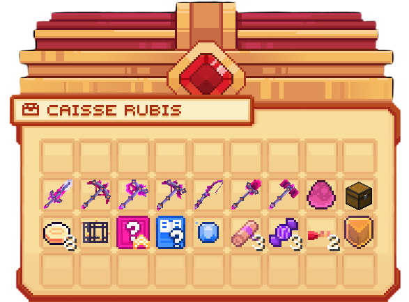<figcaption>
<strong>Récompense de la Caisse Rubis</strong>
</figcaption></figure>

| **Récompense**                                                                                   | **Chance**                                   |
| ------------------------------------------------------------------------------------------------ | -------------------------------------------- |
| <mark style="color:red;">**Épée en Rubis**</mark>                                                | <mark style="color:red;">**5,82%**</mark>    |
| <mark style="color:red;">**Pioche en Rubis**</mark>                                              | <mark style="color:red;">**5,82%**</mark>    |
| <mark style="color:red;">**Hache en Rubis**</mark>                                               | <mark style="color:red;">**5,82%**</mark>    |
| <mark style="color:red;">**Houe en Rubis**</mark>                                                | <mark style="color:red;">**5,82%**</mark>    |
| <mark style="color:red;">**Canne à Pêche en Rubis**</mark>                                       | <mark style="color:red;">**5,82%**</mark>    |
| <mark style="color:red;">**Pelle en Rubis**</mark>                                               | <mark style="color:red;">**5,82%**</mark>    |
| <mark style="color:red;">**Marteau en Rubis**</mark>                                             | <mark style="color:red;">**5,82%**</mark>    |
| <mark style="color:red;">**Oeuf de Familier**</mark>                                             | <mark style="color:red;">**5,82%**</mark>    |
| <mark style="color:red;">**Coffre Rubis**</mark>                                                 | <mark style="color:red;">**5,82%**</mark>    |
| <mark style="color:red;">**800.000**</mark>**💰**                                                | <mark style="color:red;">**5,82%**</mark>    |
| <mark style="color:red;">**Spawner Aléatoire**</mark>                                            | <mark style="color:red;">**5,82%**</mark>    |
| <mark style="color:red;">**Booster Aléatoire**</mark> (50%) (1h)                                 | <mark style="color:red;">**5,82%**</mark>    |
| <mark style="color:blue;">**Cartes de Classe Aléatoire**</mark>                                  | <mark style="color:blue;">**5,82%**</mark>   |
| <mark style="color:blue;">**Pierre de Téléportation**</mark>                                     | <mark style="color:blue;">**5,82%**</mark>   |
| <mark style="color:purple;">**Parchemin d'Aventure Expert**</mark> (x3)                          | <mark style="color:purple;">**5,82%**</mark> |
| <mark style="color:purple;">**Bonbon au Raisin**</mark> (x3)                                     | <mark style="color:purple;">**5,82%**</mark> |
| <mark style="color:red;">**Clé Rubis**</mark> (x2)                                               | <mark style="color:red;">**5,82%**</mark>    |
| <mark style="color:red;">**Grade**</mark> <mark style="color:yellow;">**Héros**</mark> (Version) | <mark style="color:red;">**1%**</mark>       |

## <mark style="color:orange;">Caisse Draconique</mark> (Temporaire)


La clé de la Caisse Draconique n'est plus disponible.


<figure>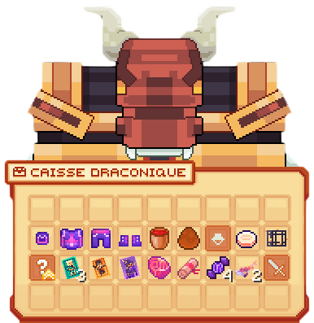<figcaption>
<strong>Aperçu de la Caisse Draconique</strong>
</figcaption></figure>

| **Récompense**                                                       | **Chance**                                   |
| -------------------------------------------------------------------- | -------------------------------------------- |
| <mark style="color:orange;">**Casque Draconique**</mark>             | <mark style="color:orange;">**5,55%**</mark> |
| <mark style="color:orange;">**Plastron Draconique**</mark>           | <mark style="color:orange;">**5,55%**</mark> |
| <mark style="color:orange;">**Pantalon Draconique**</mark>           | <mark style="color:orange;">**5,55%**</mark> |
| <mark style="color:orange;">**Bottes Draconiques**</mark>            | <mark style="color:orange;">**5,55%**</mark> |
| <mark style="color:orange;">**Seau d'eau Infini**</mark>             | <mark style="color:orange;">**5,55%**</mark> |
| <mark style="color:orange;">**Oeuf de Familier**</mark>              | <mark style="color:orange;">**5,55%**</mark> |
| <mark style="color:orange;">**Cosmétique Aléatoire**</mark>          | <mark style="color:orange;">**5,55%**</mark> |
| <mark style="color:orange;">**1.000.000💰**</mark>                   | <mark style="color:orange;">**5,55%**</mark> |
| <mark style="color:orange;">**Spawner Aléatoire**</mark>             | <mark style="color:orange;">**5,55%**</mark> |
| <mark style="color:orange;">**Booster Aléatoire**</mark> (100%) (1h) | <mark style="color:orange;">**5,55%**</mark> |
| <mark style="color:blue;">**Carte du Moine**</mark>                  | <mark style="color:blue;">**5,55%**</mark>   |
| <mark style="color:purple;">**Carte de l'Artiste Martial**</mark>    | <mark style="color:purple;">**5,55%**</mark> |
| <mark style="color:purple;">**Carte du Guerrier Dragon**</mark>      | <mark style="color:purple;">**5,55%**</mark> |
| <mark style="color:orange;">**Pierre de Téléportation**</mark>       | <mark style="color:orange;">**5,55%**</mark> |
| <mark style="color:red;">**Parchemin d'Aventure Impossible**</mark>  | <mark style="color:red;">**5,55%**</mark>    |
| <mark style="color:purple;">**Bonbon au Raisin**</mark> (x4)         | <mark style="color:purple;">**5,55%**</mark> |
| <mark style="color:orange;">**Clé Draconique**</mark> (x2)           | <mark style="color:orange;">**5,55%**</mark> |
| <mark style="color:orange;">**Armes Aléatoire**</mark>               | <mark style="color:orange;">**5,55%**</mark> |

## <mark style="color:blue;">Caisse Abyssale</mark> (Temporaire)


La clé de la Caisse Abyssale n'est plus disponible.


<figure>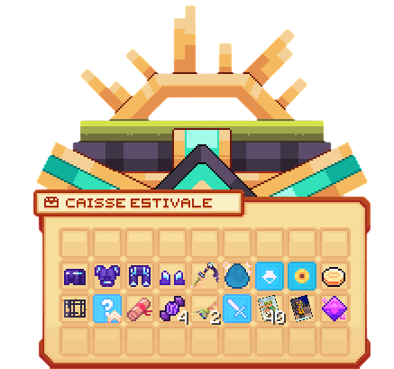<figcaption>
<strong>Aperçu de la Caisse Abyssal</strong>
</figcaption></figure>

| **Récompense**                                                      | **Chance**                                   |
| ------------------------------------------------------------------- | -------------------------------------------- |
| <mark style="color:blue;">**Casque Abyssal**</mark>                 | <mark style="color:blue;">**5,55%**</mark>   |
| <mark style="color:blue;">**Plastron Abyssal**</mark>               | <mark style="color:blue;">**5,55%**</mark>   |
| <mark style="color:blue;">**Pantalon Abyssal**</mark>               | <mark style="color:blue;">**5,55%**</mark>   |
| <mark style="color:blue;">**Bottes Abyssales**</mark>               | <mark style="color:blue;">**5,55%**</mark>   |
| <mark style="color:blue;">**Houe Abyssale**</mark>                  | <mark style="color:blue;">**5,55%**</mark>   |
| <mark style="color:blue;">**Oeuf de Familier**</mark>               | <mark style="color:blue;">**5,55%**</mark>   |
| <mark style="color:blue;">**Cosmétique Aléatoire**</mark>           | <mark style="color:blue;">**5,55%**</mark>   |
| <mark style="color:blue;">**Pack de Décorations Aléatoire**</mark>  | <mark style="color:blue;">**5,55%**</mark>   |
| <mark style="color:blue;">**1.500.000**</mark>**💰**                | <mark style="color:blue;">**5,55%**</mark>   |
| <mark style="color:blue;">**Spawner Aléatoire**</mark>              | <mark style="color:blue;">**5,55%**</mark>   |
| <mark style="color:blue;">**Booster Aléatoire**</mark> (100%) (1h)  | <mark style="color:blue;">**5,55%**</mark>   |
| <mark style="color:red;">**Parchemin d'Aventure Impossible**</mark> | <mark style="color:red;">**5,55%**</mark>    |
| <mark style="color:purple;">**Bonbon au Raisin**</mark> (x4)        | <mark style="color:purple;">**5,55%**</mark> |
| <mark style="color:blue;">**Clé Abyssale**</mark> (x2)              | <mark style="color:blue;">**5,55%**</mark>   |
| <mark style="color:blue;">**Arme Aléatoire**</mark>                 | <mark style="color:blue;">**5,55%**</mark>   |
| <mark style="color:green;">**Carte du Barde**</mark> (x40)          | <mark style="color:green;">**5,55%**</mark>  |
| <mark style="color:purple;">**Carte de l'Artificier**</mark>        | <mark style="color:purple;">**5,55%**</mark> |
| <mark style="color:blue;">**Pierre de Téléportation**</mark>        | <mark style="color:blue;">**5,55%**</mark>   |

## <mark style="color:purple;">Caisse aux Trésors</mark> (Temporaire)


La clé de la Caisse aux Trésors n'est plus disponible.


<figure>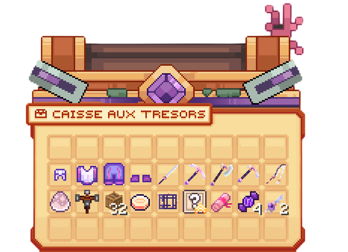<figcaption>
Aperçu de la Caisse aux Trésors
</figcaption></figure>

|                                                                               |                                              |
| ----------------------------------------------------------------------------- | -------------------------------------------- |
| **Récompense**                                                                | **Chance**                                   |
| <mark style="color:yellow;">**Casque du Conquistador**</mark>                 | <mark style="color:yellow;">**5,55%**</mark> |
| <mark style="color:yellow;">**Plastron du Conquistador**</mark>               | <mark style="color:yellow;">**5,55%**</mark> |
| <mark style="color:yellow;">**Jambières du Conquistador**</mark>              | <mark style="color:yellow;">**5,55%**</mark> |
| <mark style="color:yellow;">**Bottes du Conquistador**</mark>                 | <mark style="color:yellow;">**5,55%**</mark> |
| <mark style="color:yellow;">**Epée du Conquistador**</mark>                   | <mark style="color:yellow;">**5,55%**</mark> |
| <mark style="color:yellow;">**Pioche du Conquistador**</mark>                 | <mark style="color:yellow;">**5,55%**</mark> |
| <mark style="color:yellow;">**Hache du Conquistador**</mark>                  | <mark style="color:yellow;">**5,55%**</mark> |
| <mark style="color:yellow;">**Houe du Conquistador**</mark>                   | <mark style="color:yellow;">**5,55%**</mark> |
| <mark style="color:yellow;">**Canne à pêche du Conquistador**</mark>          | <mark style="color:yellow;">**5,55%**</mark> |
| <mark style="color:yellow;">**Œuf de Familier**</mark>                        | <mark style="color:yellow;">**5,55%**</mark> |
| <mark style="color:yellow;">**Arroseur Automatique**</mark>                   | <mark style="color:yellow;">**5,55%**</mark> |
| <mark style="color:yellow;">**Terre en pot**</mark>**&#x20;(x32)**            | <mark style="color:yellow;">**5,55%**</mark> |
| <mark style="color:yellow;">**2.000.000💰**</mark>                            | <mark style="color:yellow;">**5,55%**</mark> |
| <mark style="color:yellow;">**Spawner Aléatoire**</mark>                      | <mark style="color:yellow;">**5,55%**</mark> |
| <mark style="color:yellow;">**Booster Aléatoire**</mark>**&#x20;(100%) (1h)** | <mark style="color:yellow;">**5,55%**</mark> |
| <mark style="color:red;">**Parchemin d'Aventure Impossible**</mark>           | <mark style="color:red;">**5,55%**</mark>    |
| <mark style="color:purple;">**Bonbon au Raisin**</mark> (x4)                  | <mark style="color:purple;">**5,55%**</mark> |
| <mark style="color:yellow;">**Clé aux Trésors**</mark>**&#x20;(2x)**          | <mark style="color:yellow;">**5,55%**</mark> |

## <mark style="color:red;">Caisse Halloween</mark> (Temporaire)


La clé de la Caisse Halloween n'est plus disponible.


<figure>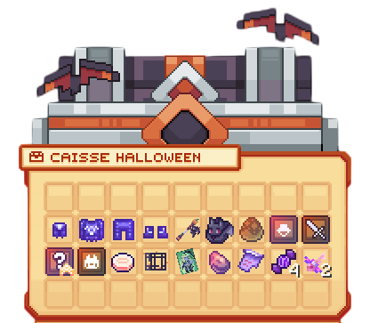<figcaption>
Aperçu de la Caisse Halloween
</figcaption></figure>

|                                                                               |                                              |
| ----------------------------------------------------------------------------- | -------------------------------------------- |
| **Récompense**                                                                | **Chance**                                   |
| <mark style="color:orange;">**Casque de Minuit**</mark>                       | <mark style="color:orange;">**5,55%**</mark> |
| <mark style="color:orange;">**Plastron de Minuit**</mark>                     | <mark style="color:orange;">**5,55%**</mark> |
| <mark style="color:orange;">**Jambières de Minuit**</mark>                    | <mark style="color:orange;">**5,55%**</mark> |
| <mark style="color:orange;">**Bottes de Minuit**</mark>                       | <mark style="color:orange;">**5,55%**</mark> |
| <mark style="color:orange;">**Sceptre du Bâtisseur**</mark>                   | <mark style="color:orange;">**5,55%**</mark> |
| <mark style="color:orange;">**Sac Chauve-souris**</mark>                      | <mark style="color:orange;">**5,55%**</mark> |
| <mark style="color:orange;">**Œuf de Familier**</mark>                        | <mark style="color:orange;">**5,55%**</mark> |
| <mark style="color:orange;">**Cosmétique Aléatoire**</mark>                   | <mark style="color:orange;">**5,55%**</mark> |
| <mark style="color:orange;">**Arme Aléatoire**</mark>                         | <mark style="color:orange;">**5,55%**</mark> |
| <mark style="color:orange;">**Booster Aléatoire**</mark>**&#x20;(100%) (1h)** | <mark style="color:orange;">**5,55%**</mark> |
| <mark style="color:orange;">**Peluche Aléatoire**</mark>                      | <mark style="color:orange;">**5,55%**</mark> |
| <mark style="color:orange;">**2.500.000💰**</mark>                            | <mark style="color:orange;">**5,55%**</mark> |
| <mark style="color:orange;">**Spawner Aléatoire**</mark>                      | <mark style="color:orange;">**5,55%**</mark> |
| <mark style="color:blue;">**Carte du Faucheur**</mark>**&#x20;(x3)**          | <mark style="color:blue;">**5,55%**</mark>   |
| <mark style="color:orange;">**Pierre de Téléportation**</mark>                | <mark style="color:orange;">**5,55%**</mark> |
| <mark style="color:orange;">**Parchemin Halloween**</mark>**&#x20;(x3)**      | <mark style="color:orange;">**5,55%**</mark> |
| <mark style="color:purple;">**Bonbon au Raisin**</mark>**&#x20;(x4)**         | <mark style="color:purple;">**5,55%**</mark> |
| <mark style="color:orange;">**Clé Halloween**</mark>**&#x20;(x2)**            | <mark style="color:orange;">**5,55%**</mark> |

## <mark style="color:blue;">Caisse Noël</mark> (Temporaire)


La clé de la Caisse Noël n'est plus disponible.


<figure>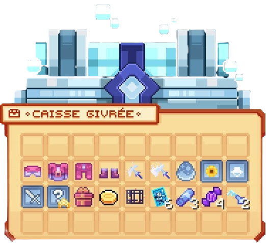<figcaption>
Aperçu de la Caisse Noël
</figcaption></figure>

|                                                                                 |                                              |
| ------------------------------------------------------------------------------- | -------------------------------------------- |
| **Récompense**                                                                  | **Chance**                                   |
| <mark style="color:blue;">**Casque du Père Noël**</mark>                        | <mark style="color:blue;">**5,55%**</mark>   |
| <mark style="color:blue;">**Plastron du Père Noël**</mark>                      | <mark style="color:blue;">**5,55%**</mark>   |
| <mark style="color:blue;">**Jambières du Père Noël**</mark>                     | <mark style="color:blue;">**5,55%**</mark>   |
| <mark style="color:blue;">**Bottes du Père Noël**</mark>                        | <mark style="color:blue;">**5,55%**</mark>   |
| <mark style="color:blue;">**Pioche des Glaces**</mark>                          | <mark style="color:blue;">**5,55%**</mark>   |
| <mark style="color:blue;">**Hache des Glaces**</mark>                           | <mark style="color:blue;">**5,55%**</mark>   |
| <mark style="color:blue;">**Œuf de Familier**</mark>                            | <mark style="color:blue;">**5,55%**</mark>   |
| <mark style="color:blue;">**Pack de Décorations**</mark>                        | <mark style="color:blue;">**5,55%**</mark>   |
| <mark style="color:blue;">**Cosmétique Aléatoire**</mark>                       | <mark style="color:blue;">**5,55%**</mark>   |
| <mark style="color:blue;">**Arme Aléatoire**</mark>                             | <mark style="color:blue;">**5,55%**</mark>   |
| <mark style="color:blue;">**Booster Aléatoire**</mark>                          | <mark style="color:blue;">**5,55%**</mark>   |
| <mark style="color:blue;">**Cadeau Givré**</mark>                               | <mark style="color:blue;">**5,55%**</mark>   |
| <mark style="color:blue;">**2.750.000💰**</mark>                                | <mark style="color:blue;">**5,55%**</mark>   |
| <mark style="color:blue;">**Spawner Aléatoire**</mark>                          | <mark style="color:blue;">**5,55%**</mark>   |
| <mark style="color:yellow;">**Carte Chevalier des Glaces**</mark>**&#x20;(x6)** | <mark style="color:yellow;">**5,55%**</mark> |
| <mark style="color:blue;">**Parchemin des Glaces**</mark>**&#x20;(x3)**         | <mark style="color:blue;">**5,55%**</mark>   |
| <mark style="color:purple;">**Bonbon au Raisin**</mark>**&#x20;(x4)**           | <mark style="color:purple;">**5,55%**</mark> |
| <mark style="color:blue;">**Clé Givrée**</mark>**&#x20;(x2)**                   | <mark style="color:blue;">**5,55%**</mark>   |

## <mark style="color:red;">Caisse Saint-Valentin</mark> (Temporaire)


La clé de la Caisse Saint-Valentin n'est plus disponible.


<figure>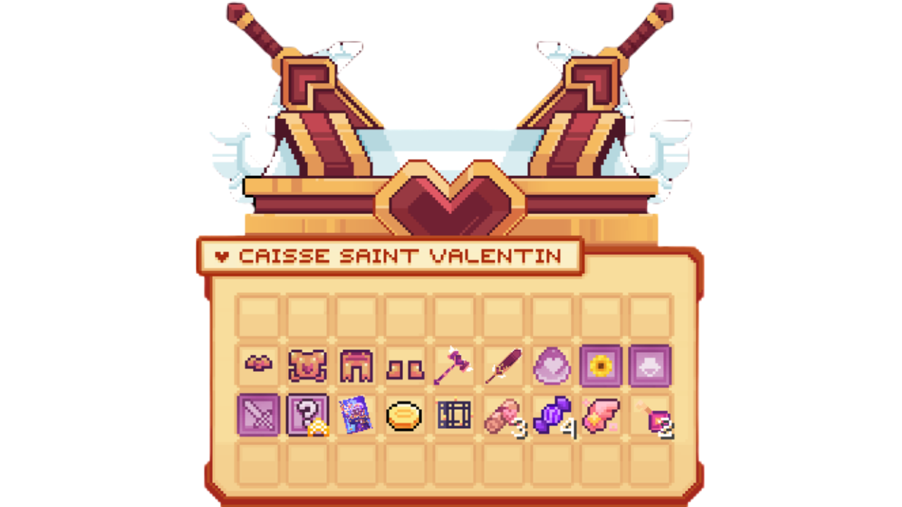<figcaption>
Aperçu de la Caisse Saint-Valentin
</figcaption></figure>

|                                                                        |                                              |
| ---------------------------------------------------------------------- | -------------------------------------------- |
| **Récompense**                                                         | **Chance**                                   |
| <mark style="color:red;">**Casque de Cupidon**</mark>                  | <mark style="color:red;">**5,55%**</mark>    |
| <mark style="color:red;">**Plastron de Cupidon**</mark>                | <mark style="color:red;">**5,55%**</mark>    |
| <mark style="color:red;">**Jambière de Cupidon**</mark>                | <mark style="color:red;">**5,55%**</mark>    |
| <mark style="color:red;">**Bottes de Cupidon**</mark>                  | <mark style="color:red;">**5,55%**</mark>    |
| <mark style="color:red;">**Marteau de Cupidon**</mark>                 | <mark style="color:red;">**5,55%**</mark>    |
| <mark style="color:red;">**Épée de Cupidon**</mark>                    | <mark style="color:red;">**5,55%**</mark>    |
| <mark style="color:red;">**Œuf de Familier**</mark>                    | <mark style="color:red;">**5,55%**</mark>    |
| <mark style="color:red;">**Pack de Décorations**</mark>                | <mark style="color:red;">**5,55%**</mark>    |
| <mark style="color:red;">**Cosmétique Aléatoire**</mark>               | <mark style="color:red;">**5,55%**</mark>    |
| <mark style="color:red;">**Arme Aléatoire**</mark>                     | <mark style="color:red;">**5,55%**</mark>    |
| <mark style="color:red;">**Booster Aléatoire**</mark>                  | <mark style="color:red;">**5,55%**</mark>    |
| <mark style="color:blue;">**Carte de l'Archimage**</mark>              | <mark style="color:blue;">**5,55%**</mark>   |
| <mark style="color:red;">**3.000.000💰**</mark>                        | <mark style="color:red;">**5,55%**</mark>    |
| <mark style="color:red;">**Spawner Aléatoire**</mark>                  | <mark style="color:red;">**5,55%**</mark>    |
| <mark style="color:red;">**Parchemin de l'Amour**</mark>**&#x20;(x3)** | <mark style="color:red;">**5,55%**</mark>    |
| <mark style="color:purple;">**Bonbon au Raisin**</mark>**&#x20;(x4)**  | <mark style="color:purple;">**5,55%**</mark> |
| <mark style="color:red;">**Pierre de Téléportation Aléatoire**</mark>  | <mark style="color:red;">**5,55%**</mark>    |
| <mark style="color:red;">**Clé de Cupidon**</mark>                     | <mark style="color:red;">**5,55%**</mark>    |

## <mark style="color:green;">Caisse Saint-Patrick</mark> (Temporaire)


La clé de la Caisse Saint-Patrick n'est plus disponible.


<figure>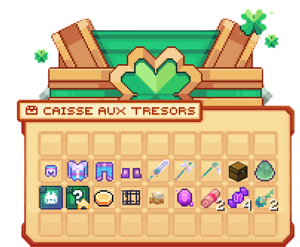<figcaption>
Aperçu de la Caisse Saint-Patrick
</figcaption></figure>

|                                                                                   |                                              |
| --------------------------------------------------------------------------------- | -------------------------------------------- |
| **Récompense**                                                                    | **Chance**                                   |
| <mark style="color:green;">**Casque du Leprechaun**</mark>                        | <mark style="color:green;">**5,55%**</mark>  |
| <mark style="color:green;">**Plastron du Leprechaun**</mark>                      | <mark style="color:green;">**5,55%**</mark>  |
| <mark style="color:green;">**Jambières du Leprechaun**</mark>                     | <mark style="color:green;">**5,55%**</mark>  |
| <mark style="color:green;">**Bottes du Leprechaun**</mark>                        | <mark style="color:green;">**5,55%**</mark>  |
| <mark style="color:green;">**Epée du Leprechaun**</mark>                          | <mark style="color:green;">**5,55%**</mark>  |
| <mark style="color:green;">**Bâton de Vent**</mark>                               | <mark style="color:green;">**5,55%**</mark>  |
| <mark style="color:green;">**Houe du Leprechaun**</mark>                          | <mark style="color:green;">**5,55%**</mark>  |
| <mark style="color:green;">**Coffre du Leprechaun**</mark>                        | <mark style="color:green;">**5,55%**</mark>  |
| <mark style="color:green;">**Oeuf du Leprechaun**</mark>                          | <mark style="color:green;">**5,56%**</mark>  |
| <mark style="color:green;">**Peluche Aléatoire**</mark>                           | <mark style="color:green;">**5,56%**</mark>  |
| <mark style="color:green;">**Booster Aléatoire (100%) (1h)**</mark>               | <mark style="color:green;">**5,56%**</mark>  |
| <mark style="color:green;">**3.500.000💰**</mark>                                 | <mark style="color:green;">**5,56%**</mark>  |
| <mark style="color:green;">**Spawner Aléatoire**</mark>                           | <mark style="color:green;">**5,56%**</mark>  |
| <mark style="color:green;">**Bière du Leprechaun**</mark>                         | <mark style="color:green;">**5,56%**</mark>  |
| <mark style="color:purple;">**Pierre de Téléportation**</mark>                    | <mark style="color:purple;">**5,56%**</mark> |
| <mark style="color:red;">**Parchemin d'aventure Impossible**</mark>**&#x20;(x2)** | <mark style="color:red;">**5,56%**</mark>    |
| <mark style="color:purple;">**Bonbon au Raisin**</mark>**&#x20;(x4)**             | <mark style="color:purple;">**5,56%**</mark> |
| <mark style="color:green;">**Clé du Leprechaun**</mark>**&#x20;(x2)**             | <mark style="color:green;">**5,56%**</mark>  |

## <mark style="color:green;">Caisse Pâques</mark> (Temporaire)


La clé de la caisse Pâques est actuellement n'est plus disponible.


<figure>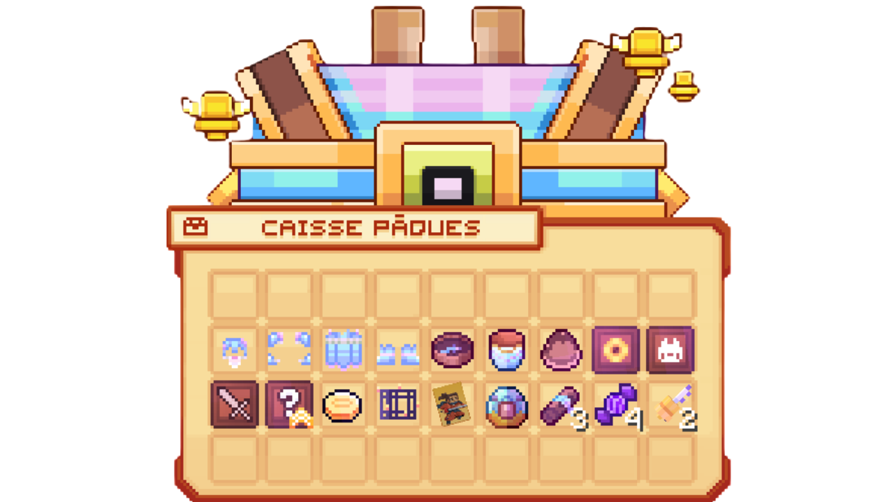<figcaption>
Aperçu de la Caisse Paques
</figcaption></figure>

|                                                                                 |                                              |
| ------------------------------------------------------------------------------- | -------------------------------------------- |
| **Récompense**                                                                  | **Chance**                                   |
| <mark style="color:yellow;">**Casque du Lapin**</mark>                          | <mark style="color:yellow;">**5,55%**</mark> |
| <mark style="color:yellow;">**Plastron du Lapin**</mark>                        | <mark style="color:yellow;">**5,55%**</mark> |
| <mark style="color:yellow;">**Jambières du Lapin**</mark>                       | <mark style="color:yellow;">**5,55%**</mark> |
| <mark style="color:yellow;">**Bottes du Lapin**</mark>                          | <mark style="color:yellow;">**5,55%**</mark> |
| <mark style="color:yellow;">**Traqueur de Donjon**</mark>                       | <mark style="color:yellow;">**5,55%**</mark> |
| <mark style="color:yellow;">**Sceau Vide Infini**</mark>                        | <mark style="color:yellow;">**5,55%**</mark> |
| <mark style="color:yellow;">**Oeufs de Pâques**</mark>                          | <mark style="color:yellow;">**5,55%**</mark> |
| <mark style="color:yellow;">**Pack de décoration**</mark>                       | <mark style="color:yellow;">**5,55%**</mark> |
| <mark style="color:yellow;">**Peluche Aléatoire**</mark>                        | <mark style="color:yellow;">**5,56%**</mark> |
| <mark style="color:yellow;">**Arme Aléatoire**</mark>                           | <mark style="color:yellow;">**5,56%**</mark> |
| <mark style="color:yellow;">**Booster Aléatoire (100%) (1h)**</mark>            | <mark style="color:yellow;">**5,56%**</mark> |
| <mark style="color:yellow;">**4.000.000💰**</mark>                              | <mark style="color:yellow;">**5,56%**</mark> |
| <mark style="color:yellow;">**Spawner Aléatoire**</mark>                        | <mark style="color:yellow;">**5,56%**</mark> |
| <mark style="color:yellow;">**Carte du Samouraï**</mark>                        | <mark style="color:yellow;">**5,56%**</mark> |
| <mark style="color:yellow;">**Pierre de Téléportation**</mark>                  | <mark style="color:yellow;">**5,56%**</mark> |
| <mark style="color:yellow;">**Parchemin Aléatoire Pâques**</mark>**&#x20;(x3)** | <mark style="color:yellow;">**5,56%**</mark> |
| <mark style="color:purple;">**Bonbon au Raisin**</mark>**&#x20;(x4)**           | <mark style="color:purple;">**5,56%**</mark> |
| <mark style="color:yellow;">**Clé Pâques**</mark>**&#x20;(x2)**                 | <mark style="color:yellow;">**5,56%**</mark> |

## <mark style="color:green;">Caisse Summer</mark> (Temporaire)


La clé de la caisse Summer est actuellement disponible (/boutique).


<figure>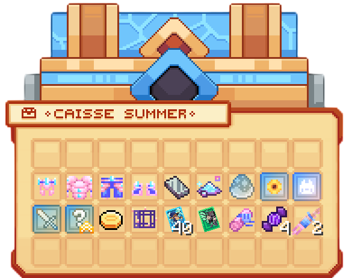<figcaption>
Aperçu de la Caisse Paques
</figcaption></figure>

|                                                                                    |                                                      |
| -----------------------------------------------------------------------------------| -----------------------------------------------------|
| **Récompense**                                                                     | **Chance**                                           |
| <mark style="color:blue;">**Casque Summer**</mark>                                 | <mark style="color:blue;">**5,56%**</mark>           |
| <mark style="color:blue;">**Plastron Summer**</mark>                               | <mark style="color:blue;">**5,56%**</mark>           |
| <mark style="color:blue;">**Jambières Summer**</mark>                              |  <mark style="color:blue;">**5,56%**</mark>          |
| <mark style="color:blue;">**Bottes Summer**</mark>                                 | <mark style="color:blue;">**5,56%**</mark>           |
| <mark style="color:blue;">**Adamantium**</mark>                                    | <mark style="color:blue;">**5,56%**</mark>           |
| <mark style="color:blue;">**Poussière d'étoile**</mark>                            | <mark style="color:blue;">**5,56%**</mark>           |
| <mark style="color:blue;">**Oeufs de familier summer**</mark>                      | <mark style="color:blue;">**5,56%**</mark>           |
| <mark style="color:blue;">**Pack de décoration**</mark>                            | <mark style="color:blue;">**5,56%**</mark>           |
| <mark style="color:blue;">**Peluche Aléatoire**</mark>                             | <mark style="color:blue;">**5,56%**</mark>           |
| <mark style="color:blue;">**Arme Aléatoire**</mark>                                | <mark style="color:blue;">**5,55%**</mark>           |
| <mark style="color:blue;">**Booster Aléatoire (100%) (1h)**</mark>                 | <mark style="color:blue;">**5,55%**</mark>           |
| <mark style="color:blue;">**4.500.000💰**</mark>                                   | <mark style="color:blue;">**5,55%**</mark>           |
| <mark style="color:blue;">**Spawner Aléatoire (x2)**</mark>                        | <mark style="color:blue;">**5,55%**</mark>           |
| <mark style="color:green;">**Carte de l'illusionniste (x40)**</mark>               | <mark style="color:blue;">**5,55%**</mark>           |
| <mark style="color:red;">**Carte du chavalier de la mort**</mark>                  | <mark style="color:blue;">**5,55%**</mark>           |
| <mark style="color:blue;">**Parchemin Abyssal**</mark>                             | <mark style="color:blue;">**5,55%**</mark>           |
| <mark style="color:purple;">**Bonbon au Raisin**</mark>**&#x20;(x4)**              | <mark style="color:purple;">**5,55%**</mark>         |
| <mark style="color:blue;">**Clé Summer**</mark>**&#x20;(x2)**                      | <mark style="color:blue;">**5,55%**</mark>           |


Tentez votre chance et ouvrez des caisses sur Evolucraft !

