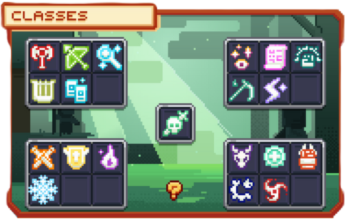
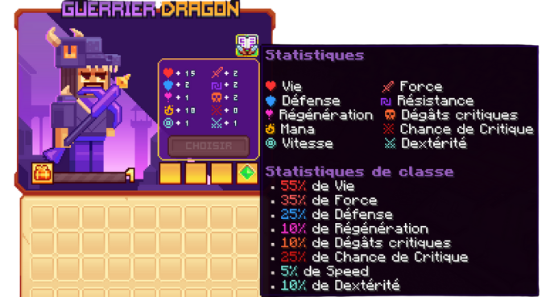
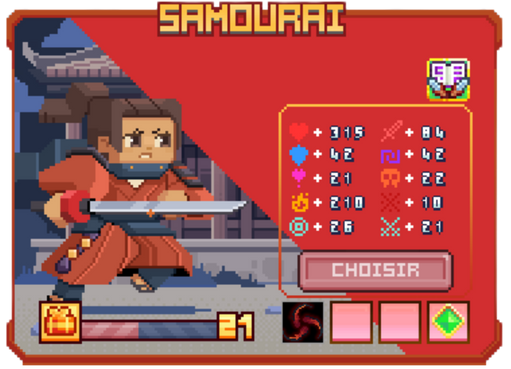
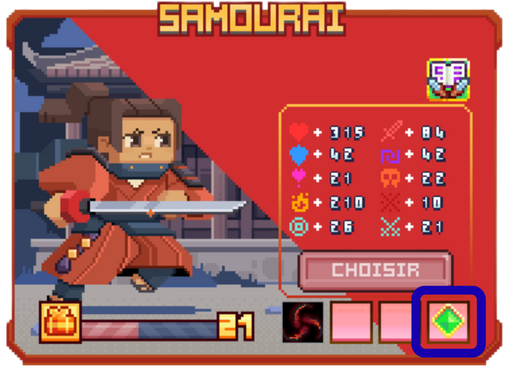
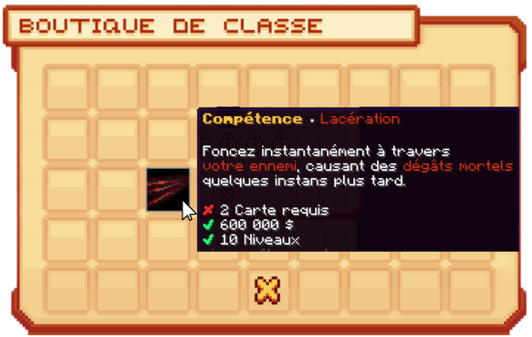
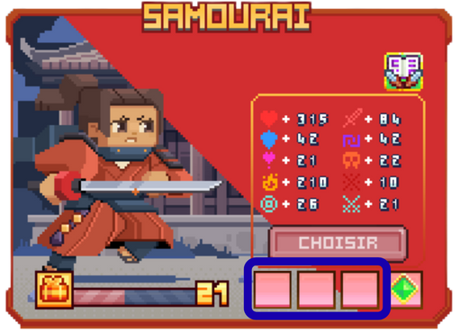
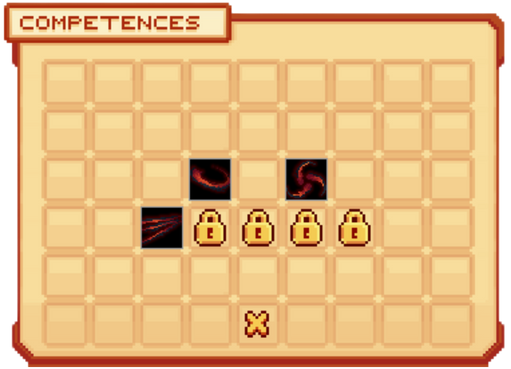

# ⚔️ Les Classes


**Tuto : Les Nouveautés MMO/RPG d'Evolucraft**


**Les <mark style="color:green;">classes</mark> sont une nouveauté majeure de la V4 d’Évolucraft 🌍, conçues pour enrichir et personnaliser le <mark style="color:green;">gameplay</mark> des joueurs. Grâce aux <mark style="color:green;">classes</mark>, chaque joueur bénéficie de <mark style="color:green;">statistiques de base modifiées</mark> telles que la <mark style="color:green;">vie</mark>, la <mark style="color:green;">vitesse</mark>, la <mark style="color:green;">défense</mark>, et bien d’autres encore, lui permettant d’adopter un style de jeu unique et adapté à ses préférences.**

**De plus, les <mark style="color:green;">classes</mark> permettent d’accéder aux <a href="https://wiki.evolucraft.fr/le-gameplay/les-donjons"><mark style="color:green;">donjons 🏛️</mark></a>, des lieux riches en aventures et en récompenses, où la <mark style="color:green;">stratégie</mark> et l’<mark style="color:green;">optimisation</mark> de votre classe seront essentielles pour triompher.**

**Choisir une <mark style="color:green;">classe</mark>, c’est donc faire évoluer son <mark style="color:green;">personnage</mark>, participer à des <mark style="color:green;">défis exclusifs</mark>, et découvrir une nouvelle <mark style="color:green;">dimension de progression</mark> sur Évolucraft !**

<figure><figcaption>
<strong>Aperçu des <mark style="color:green;">Classes</mark></strong>
</figcaption></figure>

## <mark style="color:green;">💠 Comment débloquer une classe ? 🕵️‍♂️</mark>

Nous vous invitons à lire cette page du wiki expliquant le <mark style="color:green;">processus</mark> pour rejoindre une <mark style="color:green;">classe</mark> : <a href="https://wiki.evolucraft.fr/tuto-et-astuce/avoir-une-classe"><mark style="color:green;">**Avoir une classe 🧙‍♀️**</mark></a>

## <mark style="color:green;">💠 Quelles sont les classes disponibles sur le serveur ? 🧐</mark>

Sur le serveur Évolucraft, il existe <mark style="color:green;">**20 classes**</mark> distinctes avec <mark style="color:green;">3 types de gameplay</mark> disponibles (<mark style="color:green;">Tank</mark>, <mark style="color:green;">Soutien</mark> et <mark style="color:green;">DPS</mark>) :

## <mark style="color:green;">Classes Communes</mark>

* [<mark style="color:green;">**Guerrier ⚔️**</mark>](https://wiki.evolucraft.fr/le-gameplay/les-classes/guerrier) : Experts du combat rapproché, équipés d'armures lourdes et d'armes variées, combattant en première ligne. _(Tanks)_
* [<mark style="color:green;">**Archer 🏹**</mark>](https://wiki.evolucraft.fr/le-gameplay/les-classes/archer) : Maîtres dans l'art du tir à l'arc, agiles et précis, ne ratant jamais leur cible. _(DPS)_
* [<mark style="color:green;">**Mage 🧙‍♂️**</mark>](https://wiki.evolucraft.fr/le-gameplay/les-classes/mage) : Manipulateurs des forces mystiques, lançant des sorts dévastateurs, incarnant la puissance des arcanes. _(DPS)_
* [<mark style="color:green;">**Barde 🎼**</mark>](https://wiki.evolucraft.fr/le-gameplay/les-classes/barde) : Maître dans l'art de la musique et de la poésie, charmant et inspirant, il envoûte toujours son auditoire. _(Soutien)_
* [<mark style="color:green;">**Illusioniste 🎭**</mark>](https://wiki.evolucraft.fr/le-gameplay/les-classes/illusionniste) : Maître des illusions et de la ruse, trouble les sens et trompe l'ennemi, il frappe où nul ne s'y attend. _(DPS)_

## <mark style="color:yellow;">Classes Rares</mark>

* [<mark style="color:yellow;">**Assassin 🗡️**</mark>](https://wiki.evolucraft.fr/le-gameplay/les-classes/assassin) : Maîtres de l'ombre, spécialisés dans les attaques furtives et les éliminations rapides. _(DPS)_
* [<mark style="color:yellow;">**Paladin 🛡️**</mark>](https://wiki.evolucraft.fr/le-gameplay/les-classes/paladin) : Chevaliers sacrés combattant au nom de la justice, purifiant les forces du malin. _(Tanks)_
* [<mark style="color:yellow;">**Élémentaliste 🌬️**</mark>](https://wiki.evolucraft.fr/le-gameplay/les-classes/elementaliste) : Maîtres des éléments primordiaux, manipulant le feu, le vent, l'eau et la terre. Aussi versatile que puissant. _(DPS)_
* [<mark style="color:yellow;">**Chevalier des glaces ❄️**</mark>](https://wiki.evolucraft.fr/le-gameplay/les-classes/chevalier-des-glaces) : Chevalier maniant le givre paralysant ses ennemis dans le froid et refroidi leurs ardeur. _(DPS)_

## <mark style="color:blue;">Classes Épiques</mark>

* [<mark style="color:blue;">**Chaman 🕯️**</mark>](https://wiki.evolucraft.fr/le-gameplay/les-classes/chaman) : Utilisateurs des pouvoirs surnaturels, puisant leur force dans les esprits, redoutables mages païens. _(Soutien)_
* [<mark style="color:blue;">**Invocateur 🤲**</mark>](https://wiki.evolucraft.fr/le-gameplay/les-classes/invocateur) : Manipulateurs de monstres, contrôlant les bêtes de ce monde pour combattre à leurs côtés. _(DPS)_
* [<mark style="color:blue;">**Moine 🙇**</mark>](https://wiki.evolucraft.fr/le-gameplay/les-classes/moine) : S'entraînant sans relâche dans des terres reculées, il combine un entraînement acharné et une foi inflexible. _(Tanks)_
* [<mark style="color:blue;">**Faucheur 💀**</mark>](https://wiki.evolucraft.fr/le-gameplay/les-classes/faucheur) : Fusion d'une discipline millénaire et d'une dévotion inflexible à la mort, le Faucheur aiguise sa faux, prêt à accomplir son devoir éternel. _(DPS)_
* [<mark style="color:blue;">**Archimage 📖**</mark>](https://wiki.evolucraft.fr/le-gameplay/les-classes/archimage) : Manipulateurs des forces mystiques, lançant des sorts dévastateurs, il incarne la puissance des arcanes. _(DPS)_

## <mark style="color:purple;">Classes Légendaires</mark>

* [<mark style="color:purple;">**Guerrier Dragon 🐲**</mark>](https://wiki.evolucraft.fr/le-gameplay/les-classes/guerrier-dragon) : Héros tueur de dragons, destructeur de cité, semant la peur dans le cœur de ses ennemis. _(DPS)_
* [<mark style="color:purple;">**Clerc ⛪**</mark>](https://wiki.evolucraft.fr/le-gameplay/les-classes/clerc) : Prêtres dévoués, guérissant les blessures et repoussant les forces obscures avec la magie divine. _(Soutien)_
* [<mark style="color:purple;">**Artiste Martial 🥋**</mark>](https://wiki.evolucraft.fr/le-gameplay/les-classes/artiste-martial) : Maître légendaire dans l'art antique du poing d'acier, il recherche la perfection dans chacune de ses frappes. _(DPS)_
* [<mark style="color:purple;">**Artificier 🎇**</mark>](https://wiki.evolucraft.fr/le-gameplay/les-classes/artificier) : Maître de la robotique et de la destruction, il répand la terreur avec son grincement sinistre. _(DPS)_
* [<mark style="color:purple;">**Samouraï 🥷**</mark>](https://wiki.evolucraft.fr/le-gameplay/les-classes/samourai) : Guerrier d'honneur et de discipline maître de la lame et du silence, le samouraï fauche ses ennemis avec grâce et précision. _(DPS)_

## <mark style="color:red;">Classe Mythique</mark>
* [<mark style="color:red;">**Chevalier de la mort ☠️**</mark>](https://wiki.evolucraft.fr/le-gameplay/les-classes/chevalier-de-la-mort) : Guerrier hanté, serviteur de la mort, maniant la corruption et la magie noire, il inspire la terreur. _(DPS)_

## <mark style="color:green;">💠 Que signifient les avantages statistiques ? 👨‍🔬</mark>

Après avoir découvert les <mark style="color:green;">classes</mark>, vous hésitez entre plusieurs <mark style="color:green;">classes</mark> et vous souhaitez de l’aide sur les <mark style="color:green;">statistiques</mark> ? Vous êtes au bon endroit !

<figure><figcaption>
<strong>Aperçu des Statistiques de la <mark style="color:green;">Classe Guerrier Dragon</mark></strong>
</figcaption></figure>

* <mark style="color:green;">**Vie ❤️**</mark> : Permet d’avoir plus de points de vie.
* <mark style="color:green;">**Défense 🛡️**</mark> : Permet de prendre moins de dégâts.
* <mark style="color:green;">**Régénération 💕**</mark> : Permet de régénérer plus vite sa vie.
* <mark style="color:green;">**Mana 🧪**</mark> : Permet d’avoir une plus grande capacité de mana.
* <mark style="color:green;">**Vitesse 🏃‍♂️**</mark> : Permet d’être plus rapide.
* <mark style="color:green;">**Résistance ⚔️**</mark> : Permet de réduire les dégâts de chute et autres.
* <mark style="color:green;">**Dégâts Critiques 💀**</mark> : Permet de faire plus mal en coup critique.
* <mark style="color:green;">**Chance de Critique 🥊**</mark> : Permet d’augmenter la probabilité de réaliser un coup critique.
* <mark style="color:green;">**Dextérité 🐱‍🏍**</mark> : Permet de taper plus rapidement.

## <mark style="color:green;">💠 Comment augmenter de niveau dans ma classe ? 🆙</mark>

Pour <mark style="color:green;">XP</mark> votre <mark style="color:green;">classe</mark> et monter en niveau afin d’accéder à d’autres <mark style="color:green;">donjons</mark> nécessitant un <mark style="color:green;">niveau supérieur</mark>, voici deux astuces possibles :

### <mark style="color:blue;">🔸 Les donjons 🏛️</mark>
Le meilleur moyen de faire évoluer votre <mark style="color:green;">classe</mark> est de réaliser des <mark style="color:green;">donjons</mark> en tuant des <mark style="color:green;">mobs</mark>, <mark style="color:green;">mini-boss</mark>, <mark style="color:green;">boss</mark> ou en obtenant les <mark style="color:green;">récompenses</mark> des donjons. Cela permet de monter rapidement les premiers niveaux, pour un <mark style="color:green;">amusement garanti</mark> !

L’<mark style="color:green;">XP</mark> donnée par les <mark style="color:green;">ennemis</mark> dépend du <mark style="color:green;">donjon</mark> réalisé. Consultez la page correspondante pour en savoir plus : <a href="https://wiki.evolucraft.fr/le-gameplay/les-donjons"><mark style="color:green;">donjons 🏛️</mark></a>

### <mark style="color:blue;">🔸 La box de vote 🧰</mark>
Pour ceux qui ne sont pas fans des <mark style="color:green;">donjons</mark>, il existe un autre moyen de faire évoluer votre <mark style="color:green;">classe</mark> !

Lorsque vous <a href="https://wiki.evolucraft.fr/tuto-et-astuce/gagner-argent#-les-clés-de-vote"><mark style="color:green;">votez sur le serveur</mark></a>, vous avez une chance d’obtenir la récompense <mark style="color:green;">"1000 XP CLASSE"</mark>, ce qui vous permettra de progresser plus rapidement dans les niveaux de classe !

## <mark style="color:green;">💠 Comment débloquer, installer et utiliser les compétences ? 🥏</mark>

Les <mark style="color:green;">compétences</mark> servent à réaliser des <mark style="color:green;">actions</mark> en fonction de la <mark style="color:green;">classe</mark> : infliger de <mark style="color:green;">gros dégâts</mark> ou <mark style="color:green;">soigner</mark> ses coéquipiers en échange de <mark style="color:green;">Mana</mark>. Très pratique pour avancer dans les <mark style="color:green;">donjons</mark> !

<figure><figcaption>
<strong>Exemple d'une compétence d'une <mark style="color:green;">Classe</mark></strong>
</figcaption></figure>

### <mark style="color:blue;">🔸 Débloquer des compétences/passifs 🆕</mark>

#### <mark style="color:green;">🔹 Étape 1️⃣</mark>
Effectuez la commande <mark style="color:green;">`/class`</mark> pour afficher le menu de votre <mark style="color:green;">classe</mark> comme sur l’image ci-dessous.

<figure><figcaption>
<strong>Aperçu de la <mark style="color:green;">classe Samouraï</mark></strong>
</figcaption></figure>

#### <mark style="color:green;">🔹 Étape 2️⃣</mark>
Cliquez sur <mark style="color:green;">"Boutique de Compétences"</mark> avec la petite <mark style="color:green;">gemme verte</mark> en bas à droite comme ci-dessous.

<figure><figcaption>
<strong>Aperçu du pictogramme de la <mark style="color:green;">boutique des compétences</mark></strong>
</figcaption></figure>

#### <mark style="color:green;">🔹 Étape 3️⃣</mark>
Passez votre curseur sur la <mark style="color:green;">compétence</mark> ou le <mark style="color:green;">passif</mark> affichés pour voir les <mark style="color:green;">prérequis</mark>, puis faites un <mark style="color:green;">clic droit</mark> pour l’acheter _(si vous remplissez les conditions)_.

<figure><figcaption>
<strong>Aperçu de la boutique de compétences de la <mark style="color:green;">classe Samouraï</mark></strong>
</figcaption></figure>

##### <mark style="color:green;">Commun</mark>

|  Compétence                                  |  Cartes requises                            |  Prix                                               |  Niveau de classe                              |
| -------------------------------------------- | ------------------------------------------- | --------------------------------------------------- | ---------------------------------------------- |
| <mark style="color:green;">**Passif**</mark> | <mark style="color:green;">**50**</mark>    | <mark style="color:green;">**50 000 💰**</mark>     | <mark style="color:green;">**Niveau 5**</mark>  |
| <mark style="color:green;">**1**</mark>      | <mark style="color:green;">**100**</mark>   | <mark style="color:green;">**150 000 💰**</mark>    | <mark style="color:green;">**Niveau 10**</mark> |
| <mark style="color:green;">**2**</mark>      | <mark style="color:green;">**200**</mark>   | <mark style="color:green;">**450 000 💰**</mark>    | <mark style="color:green;">**Niveau 15**</mark> |
| <mark style="color:green;">**3**</mark>      | <mark style="color:green;">**400**</mark>   | <mark style="color:green;">**1 350 000 💰**</mark>  | <mark style="color:green;">**Niveau 20**</mark> |
| <mark style="color:green;">**4**</mark>      | <mark style="color:green;">**800**</mark>   | <mark style="color:green;">**4 050 000 💰**</mark>  | <mark style="color:green;">**Niveau 30**</mark> |
| <mark style="color:green;">**5**</mark>      | <mark style="color:green;">**1 600**</mark> | <mark style="color:green;">**12 150 000 💰**</mark> | <mark style="color:green;">**Niveau 40**</mark> |

##### <mark style="color:yellow;">Rare</mark>

|  Compétence                                   |  Cartes requises                           |  Prix                                                |  Niveau de classe                               |
| --------------------------------------------- | ------------------------------------------ | ---------------------------------------------------- | ----------------------------------------------- |
| <mark style="color:yellow;">**Passif**</mark> | <mark style="color:yellow;">**10**</mark>  | <mark style="color:yellow;">**75 000 💰**</mark>     | <mark style="color:yellow;">**Niveau 5**</mark>  |
| <mark style="color:yellow;">**1**</mark>      | <mark style="color:yellow;">**20**</mark>  | <mark style="color:yellow;">**225 000 💰**</mark>    | <mark style="color:yellow;">**Niveau 10**</mark> |
| <mark style="color:yellow;">**2**</mark>      | <mark style="color:yellow;">**40**</mark>  | <mark style="color:yellow;">**675 000 💰**</mark>    | <mark style="color:yellow;">**Niveau 15**</mark> |
| <mark style="color:yellow;">**3**</mark>      | <mark style="color:yellow;">**80**</mark>  | <mark style="color:yellow;">**2 025 000 💰**</mark>  | <mark style="color:yellow;">**Niveau 20**</mark> |
| <mark style="color:yellow;">**4**</mark>      | <mark style="color:yellow;">**160**</mark> | <mark style="color:yellow;">**6 075 000 💰**</mark>  | <mark style="color:yellow;">**Niveau 30**</mark> |
| <mark style="color:yellow;">**5**</mark>      | <mark style="color:yellow;">**320**</mark> | <mark style="color:yellow;">**18 225 000 💰**</mark> | <mark style="color:yellow;">**Niveau 40**</mark> |

##### <mark style="color:blue;">Épique</mark>

|  Compétence                                  |  Cartes requises                         |  Prix                                              |  Niveau de classe                             |
| -------------------------------------------- | ---------------------------------------- | -------------------------------------------------- | --------------------------------------------- |
| <mark style="color:blue;">**Passif**</mark> | <mark style="color:blue;">**5**</mark>   | <mark style="color:blue;">**100 000 💰**</mark>    | <mark style="color:blue;">**Niveau 5**</mark>  |
| <mark style="color:blue;">**1**</mark>      | <mark style="color:blue;">**10**</mark>  | <mark style="color:blue;">**300 000 💰**</mark>    | <mark style="color:blue;">**Niveau 10**</mark> |
| <mark style="color:blue;">**2**</mark>      | <mark style="color:blue;">**20**</mark>  | <mark style="color:blue;">**900 000 💰**</mark>    | <mark style="color:blue;">**Niveau 15**</mark> |
| <mark style="color:blue;">**3**</mark>      | <mark style="color:blue;">**40**</mark>  | <mark style="color:blue;">**2 700 000 💰**</mark>  | <mark style="color:blue;">**Niveau 20**</mark> |
| <mark style="color:blue;">**4**</mark>      | <mark style="color:blue;">**80**</mark>  | <mark style="color:blue;">**8 100 000 💰**</mark>  | <mark style="color:blue;">**Niveau 30**</mark> |
| <mark style="color:blue;">**5**</mark>      | <mark style="color:blue;">**160**</mark> | <mark style="color:blue;">**24 300 000 💰**</mark> | <mark style="color:blue;">**Niveau 40**</mark> |


<mark style="color:green;">REMARQUE 🔍</mark> : Pour la <mark style="color:green;">classe Invocateur</mark>, le <mark style="color:green;">passif</mark> est débloqué automatiquement dès le <mark style="color:green;">niveau 1</mark>.


##### <mark style="color:purple;">Légendaire</mark>

|  Compétence                                   |  Cartes requises                          |  Prix                                                |  Niveau de classe                                |
| --------------------------------------------- | ----------------------------------------- | ---------------------------------------------------- | ------------------------------------------------ |
| <mark style="color:purple;">**Passif**</mark> | <mark style="color:purple;">**1**</mark>  | <mark style="color:purple;">**200 000 💰**</mark>    | <mark style="color:purple;">**Niveau 5**</mark>   |
| <mark style="color:purple;">**1**</mark>      | <mark style="color:purple;">**2**</mark>  | <mark style="color:purple;">**600 000 💰**</mark>    | <mark style="color:purple;">**Niveau 10**</mark> |
| <mark style="color:purple;">**2**</mark>      | <mark style="color:purple;">**4**</mark>  | <mark style="color:purple;">**1 800 000 💰**</mark>  | <mark style="color:purple;">**Niveau 15**</mark> |
| <mark style="color:purple;">**3**</mark>      | <mark style="color:purple;">**8**</mark>  | <mark style="color:purple;">**5 400 000 💰**</mark>  | <mark style="color:purple;">**Niveau 20**</mark> |
| <mark style="color:purple;">**4**</mark>      | <mark style="color:purple;">**16**</mark> | <mark style="color:purple;">**16 200 000 💰**</mark> | <mark style="color:purple;">**Niveau 30**</mark> |
| <mark style="color:purple;">**5**</mark>      | <mark style="color:purple;">**32**</mark> | <mark style="color:purple;">**48 600 000 💰**</mark> | <mark style="color:purple;">**Niveau 40**</mark> |

##### <mark style="color:red;">Mythique</mark>

| Compétence                                   | Cartes requises                        | Prix                                           | Niveau de classe                |
| -------------------------------------------- | -------------------------------------- | ---------------------------------------------- | ------------------------------- |
| <mark style="color:red;">**Passif**</mark>  | <mark style="color:red;">**1**</mark>  | <mark style="color:red;">**400 000 💰**</mark> | <mark style="color:red;">**Niveau 5**</mark>   |
| <mark style="color:red;">**1**</mark>       | <mark style="color:red;">**1**</mark>  | <mark style="color:red;">**1 200 000**</mark>  | <mark style="color:red;">**Niveau 10**</mark>  |
| <mark style="color:red;">**2**</mark>       | <mark style="color:red;">**2**</mark>  | <mark style="color:red;">**3 600 000**</mark>  | <mark style="color:red;">**Niveau 15**</mark>  |
| <mark style="color:red;">**3**</mark>       | <mark style="color:red;">**4**</mark>  | <mark style="color:red;">**10 800 000**</mark> | <mark style="color:red;">**Niveau 20**</mark>  |
| <mark style="color:red;">**4**</mark>       | <mark style="color:red;">**8**</mark>  | <mark style="color:red;">**32 400 000**</mark> | <mark style="color:red;">**Niveau 30**</mark>  |
| <mark style="color:red;">**5**</mark>       | <mark style="color:red;">**16**</mark> | <mark style="color:red;">**97 200 000**</mark> | <mark style="color:red;">**Niveau 40**</mark>  |

### <mark style="color:blue;">🔸 Installer des compétences/passifs 🔧</mark>

#### <mark style="color:green;">🔹 Étape 1️⃣</mark>
Effectuez la commande <mark style="color:green;">`/class`</mark> pour afficher le menu de votre <mark style="color:green;">classe</mark> comme sur l’image ci-dessous.

<figure><figcaption>
<strong>Aperçu de la <mark style="color:green;">classe Samouraï</mark></strong>
</figcaption></figure>

#### <mark style="color:green;">🔹 Étape 2️⃣</mark>
Sélectionnez l’un des <mark style="color:green;">carrés vides</mark> pour voir les <mark style="color:green;">compétences</mark> que vous avez sélectionnées sur votre <mark style="color:green;">classe</mark>.

<figure><figcaption>
<strong>Aperçu de la <mark style="color:green;">classe Samouraï</mark></strong>
</figcaption></figure>

#### <mark style="color:green;">🔹 Étape 3️⃣</mark>
Sélectionnez la <mark style="color:green;">compétence</mark> ou le <mark style="color:green;">passif</mark> que vous avez acheté.

<figure><figcaption>
<strong>Aperçu des compétences de la <mark style="color:green;">classe Samouraï</mark></strong>
</figcaption></figure>


**🚨 <mark style="color:green;">IMPORTANT</mark> 🚨 : Lorsque vous avez plus de 3 <mark style="color:green;">compétences achetées</mark>, il faut impérativement laisser le <mark style="color:green;">passif</mark> équipé. Sans ce dernier, aucune <mark style="color:green;">compétence</mark> ne pourra être lancée.**


### <mark style="color:blue;">🔸 Utiliser une compétence ou un passif 🔧</mark>

#### <mark style="color:orange;">◻️ Le passif</mark>
Le <mark style="color:green;">passif</mark> ne peut pas être choisi, il se lance automatiquement et aléatoirement lorsque vous frappez un <mark style="color:green;">ennemi</mark>.

#### <mark style="color:orange;">◻️ La compétence</mark>
Lorsque vos <mark style="color:green;">compétences</mark> sont équipées, vous pouvez les utiliser :
* <mark style="color:green;">Clic GAUCHE</mark> : Permet de réaliser l’<mark style="color:green;">attaque de base</mark> de la <mark style="color:green;">classe</mark>.
* <mark style="color:green;">Clic DROIT + Clic GAUCHE</mark> : Permet de lancer votre <mark style="color:green;">compétence</mark>.
* <mark style="color:green;">Double-clic DROIT</mark> : Permet de changer la <mark style="color:green;">compétence sélectionnée</mark>.

## <mark style="color:green;">💠 Comment augmenter son prestige ? 🆙</mark>
Lorsque vous atteignez le <mark style="color:green;">niveau 50</mark> de votre <mark style="color:green;">classe</mark>, vous avez accès aux <mark style="color:green;">niveaux de prestige</mark>. Cela vous permet de continuer à faire évoluer votre <mark style="color:green;">classe</mark> sans gagner de <mark style="color:green;">statistiques supplémentaires</mark>. Le <mark style="color:green;">prestige</mark> sert à "stacker" les niveaux dans le cas d’une augmentation du <mark style="color:green;">palier maximum</mark> des classes (actuellement 50).

Pour monter en <mark style="color:green;">prestige</mark>, il suffit de progresser dans votre <mark style="color:green;">classe</mark> comme d’habitude.

**Et voilà, vous connaissez TOUT sur vos <mark style="color:green;">classes préférées</mark>. À vous de faire votre <mark style="color:green;">choix</mark> ! 🤩**
