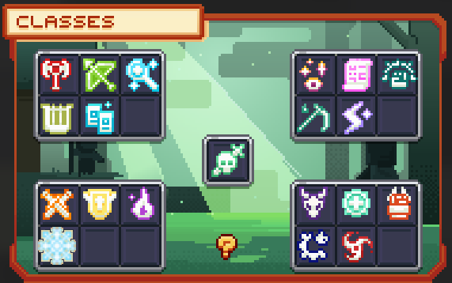

# ⚔️ Les Classes


**Tuto : Les Nouveautés MMO/RPG d'Evolucraft**


<figure><figcaption>
<strong>Compétence de Classe</strong>
</figcaption></figure>

## <mark style="color:green;">Informations Générales</mark>

Sur le serveur Evolucraft, il existe <mark style="color:green;">**18 classes**</mark> distinctes :

<figure><figcaption>
<strong>Aperçu des Classes</strong>
</figcaption></figure>

## <mark style="color:green;">Classes Communes</mark>

* <mark style="color:green;">**Guerrier**</mark> : Experts du combat rapproché, équipés d'armures lourdes et d'armes variées, combattant en première ligne.
* <mark style="color:green;">**Archer**</mark> : Maîtres dans l'art du tir à l'arc, agiles et précis, ne ratant jamais leur cible.
* <mark style="color:green;">**Mage**</mark> : Manipulateurs des forces mystiques, lançant des sorts dévastateurs, incarnant la puissance des arcanes.
* <mark style="color:green;">**Barde**</mark> : Maître dans l'art de la musique et de la poésie, charmant et inspirant, il envoûte toujours son auditoire.

## <mark style="color:yellow;">Classes Rares</mark>

* <mark style="color:yellow;">**Assassin**</mark> : Maîtres de l'ombre, spécialisés dans les attaques furtives et les éliminations rapides.
* <mark style="color:yellow;">**Paladin**</mark> : Chevaliers sacrés combattant au nom de la justice, purifiant les forces du malin.
* <mark style="color:yellow;">**Élémentaliste**</mark> : Maîtres des éléments primordiaux, manipulant le feu, le vent, l'eau et la terre. Aussi versatile que puissant.
* <mark style="color:yellow;">**Chevalier des glaces**</mark> : Chevalier maniant le givre paralysant ses ennemis dans le froid et refroidi leurs ardeur.

## <mark style="color:blue;">Classes Épiques</mark>

* <mark style="color:blue;">**Chaman**</mark> : Utilisateurs des pouvoirs surnaturels, puisant leur force dans les esprits, redoutables mages païens.
* <mark style="color:blue;">**Invocateur**</mark> : Manipulateurs de monstres, contrôlant les bêtes de ce monde pour combattre à leurs côtés.
* <mark style="color:blue;">**Moine**</mark> : S'entraînant sans relâche dans des terres reculées, il combine un entraînement acharné et une foi inflexible.
* <mark style="color:blue;">**Faucheur**</mark> : Fusion d'une discipline millénaire et d'une dévotion inflexible à la mort, le Faucheur aiguise sa faux, prêt à accomplir son devoir éternel.
* <mark style="color:blue;">**Archimage**</mark> : Manipulateurs des forces mystiques, lançant des sorts dévastateurs, il incarne la puissance des arcanes.

## <mark style="color:purple;">Classes Légendaires</mark>

* <mark style="color:purple;">**Guerrier Dragon**</mark> : Héros tueur de dragons, destructeur de cité, semant la peur dans le cœur de ses ennemis.
* <mark style="color:purple;">**Clerc**</mark> : Prêtres dévoués, guérissant les blessures et repoussant les forces obscures avec la magie divine.
* <mark style="color:purple;">**Artiste Martial**</mark> : Maître légendaire dans l'art antique du poing d'acier, il recherche la perfection dans chacune de ses frappes.
* <mark style="color:purple;">**Artificier**</mark> : Maître de la robotique et de la destruction, il répand la terreur avec son grincement sinistre.
* <mark style="color:purple;">**Samouraï**</mark> : Guerrier d'honneur et de discipline maître de la lame et du silence, le samouraï fauche ses ennemis avec grâce et précision.

## <mark style="color:red;">Classe Mythique</mark>
* <mark style="color:red;">**Chevalier de la mort**</mark> : 

## <mark style="color:green;">Catégories de Classes</mark>

Les classes sont réparties en trois catégories : Tanks, DPS, et Soutien.

**Tanks :&#x20;**<mark style="color:green;">**Guerrier**</mark>**&#x20;/&#x20;**<mark style="color:yellow;">**Paladin**</mark>**&#x20;/&#x20;**<mark style="color:blue;">**Moine**</mark>

**DPS :&#x20;**<mark style="color:green;">**Archer**</mark>**&#x20;/&#x20;**<mark style="color:green;">**Mage**</mark>**&#x20;/&#x20;**<mark style="color:yellow;">**Assassin**</mark>**&#x20;/&#x20;**<mark style="color:yellow;">**Élémentaliste**</mark>**&#x20;/&#x20;**<mark style="color:yellow;">**Chevalier des glaces**</mark>**&#x20;/&#x20;**<mark style="color:blue;">**Invocateur**</mark>**&#x20;/&#x20;** <mark style="color:blue;">**Faucheur**</mark>**&#x20;/&#x20;** <mark style="color:blue;">**Archimage**</mark>**&#x20;/&#x20;**<mark style="color:purple;">**Guerrier Dragon**</mark>**&#x20;/&#x20;**<mark style="color:purple;">**Artificier**</mark>**&#x20;/&#x20;**<mark style="color:purple;">**Artiste Martial**</mark>**&#x20;/&#x20;**<mark style="color:purple;">**Samouraï**</mark>

**Soutien :&#x20;**<mark style="color:green;">**Barde**</mark>**&#x20;/&#x20;**<mark style="color:blue;">**Chaman**</mark>**&#x20;/&#x20;**<mark style="color:purple;">**Clerc**</mark>

### <mark style="color:green;">Bonus Spécifiques aux Classes</mark>

Chaque catégorie de classe bénéficie de bonus uniques :

* <mark style="color:green;">**Tanks**</mark>**&#x20;:** 400% de vie en plus et un boost de 100% en défense.
* <mark style="color:green;">**Classes corps à corps hors tanks**</mark>**&#x20;:** 50% de vie en plus.

### <mark style="color:green;">Progression Basée sur la Rareté</mark>

En plus de ces bonus, les classes ont une progression basée sur leur rareté. Plus une classe est <mark style="color:green;">**rare**</mark>, plus les bonus <mark style="color:green;">**s'additionnent**</mark>, offrant ainsi des avantages supplémentaires en termes de vie et de défense.&#x20;

Les <mark style="color:green;">**compétences**</mark> varient également selon les classes, elles sont disponibles dans le menu de votre classe.

<figure><figcaption>
<strong>Aperçu des Statistiques de Classe</strong>
</figcaption></figure>

## <mark style="color:green;">Déblocage des Classes</mark>

Pour débloquer une classe, vous aurez besoin d'une carte correspondante à la classe souhaitée, trouvable dans les donjons ou obtenable via les récompenses de jobs et certaines quêtes.  Une fois la classe débloquée, faites `/class` afin d’ouvrir le menu des classes.

Pour augmenter les niveaux de classe, il faut tuer les monstres présents dans les donjons. Chaque monstre tué vous rapporte de l'expérience selon la rareté du donjon effectué.

## <mark style="color:green;">Déblocage des compétences de classe</mark>

Dans chaque menu de classe, vous trouverez une boutique dédiée à l'achat de nouvelles compétences. Pour acheter ces compétences, remplissez des pré-requis tels que de l'argent, des niveaux et des cartes de classe.

#### <mark style="color:green;">Commun</mark>

|               Compétences               |                        Cartes requises                       |                       Prix                       |
| :-------------------------------------: | :----------------------------------------------------------: | :----------------------------------------------: |
| <mark style="color:green;">**1**</mark> | <mark style="color:green;">**Obtention de la classe**</mark> |      <mark style="color:green;">**-**</mark>     |
| <mark style="color:green;">**2**</mark> |          <mark style="color:green;">**50**</mark>            |   <mark style="color:green;">**50 000**</mark>   |
| <mark style="color:green;">**3**</mark> |         <mark style="color:green;">**100**</mark>            |  <mark style="color:green;">**150 000**</mark>   |
| <mark style="color:green;">**4**</mark> |         <mark style="color:green;">**200**</mark>            |  <mark style="color:green;">**450 000**</mark>   |
| <mark style="color:green;">**5**</mark> |         <mark style="color:green;">**400**</mark>            | <mark style="color:green;">**1 350 000**</mark>  |
| <mark style="color:green;">**6**</mark> |         <mark style="color:green;">**800**</mark>            | <mark style="color:green;">**4 050 000**</mark>  |
| <mark style="color:green;">**7**</mark> |        <mark style="color:green;">**1600**</mark>            | <mark style="color:green;">**12 150 000**</mark> |

#### <mark style="color:yellow;">Rare</mark>

|                Compétences               |                        Cartes requises                        |                        Prix                       |
| :--------------------------------------: | :-----------------------------------------------------------: | :-----------------------------------------------: |
| <mark style="color:yellow;">**1**</mark> | <mark style="color:yellow;">**Obtention de la classe**</mark> |      <mark style="color:yellow;">**-**</mark>     |
| <mark style="color:yellow;">**2**</mark> |          <mark style="color:yellow;">**10**</mark>            |   <mark style="color:yellow;">**75 000**</mark>   |
| <mark style="color:yellow;">**3**</mark> |          <mark style="color:yellow;">**20**</mark>            |  <mark style="color:yellow;">**225 000**</mark>   |
| <mark style="color:yellow;">**4**</mark> |          <mark style="color:yellow;">**40**</mark>            |  <mark style="color:yellow;">**675 000**</mark>   |
| <mark style="color:yellow;">**5**</mark> |          <mark style="color:yellow;">**80**</mark>            | <mark style="color:yellow;">**2 025 000**</mark>  |
| <mark style="color:yellow;">**6**</mark> |         <mark style="color:yellow;">**160**</mark>            | <mark style="color:yellow;">**6 075 000**</mark>  |
| <mark style="color:yellow;">**7**</mark> |         <mark style="color:yellow;">**320**</mark>            | <mark style="color:yellow;">**18 225 000**</mark> |

<mark style="color:blue;">**Épique**</mark>

|               Compétences              |                       Cartes requises                       |                       Prix                      |
| :------------------------------------: | :---------------------------------------------------------: | :---------------------------------------------: |
| <mark style="color:blue;">**1**</mark> | <mark style="color:blue;">**Obtention de la classe**</mark> |      <mark style="color:blue;">**-**</mark>     |
| <mark style="color:blue;">**2**</mark> |            <mark style="color:blue;">**5**</mark>           |   <mark style="color:blue;">**100 000**</mark>  |
| <mark style="color:blue;">**3**</mark> |           <mark style="color:blue;">**10**</mark>           |   <mark style="color:blue;">**300 000**</mark>  |
| <mark style="color:blue;">**4**</mark> |           <mark style="color:blue;">**20**</mark>           |   <mark style="color:blue;">**900 000**</mark>  |
| <mark style="color:blue;">**5**</mark> |           <mark style="color:blue;">**40**</mark>           |  <mark style="color:blue;">**2 700 000**</mark> |
| <mark style="color:blue;">**6**</mark> |           <mark style="color:blue;">**80**</mark>           |  <mark style="color:blue;">**8 100 000**</mark> |
| <mark style="color:blue;">**7**</mark> |           <mark style="color:blue;">**160**</mark>          | <mark style="color:blue;">**24 300 000**</mark> |

<mark style="color:purple;">**Légendaire**</mark>

| Compétences                              | Cartes requises                                               | Prix                                              |
| ---------------------------------------- | ------------------------------------------------------------- | ------------------------------------------------- |
| <mark style="color:purple;">**1**</mark> | <mark style="color:purple;">**Obtention de la classe**</mark> | <mark style="color:purple;">**-**</mark>          |
| <mark style="color:purple;">**2**</mark> | <mark style="color:purple;">**1**</mark>                      | <mark style="color:purple;">**200 000**</mark>    |
| <mark style="color:purple;">**3**</mark> | <mark style="color:purple;">**2**</mark>                      | <mark style="color:purple;">**600 000**</mark>    |
| <mark style="color:purple;">**4**</mark> | <mark style="color:purple;">**4**</mark>                      | <mark style="color:purple;">**1 800 000**</mark>  |
| <mark style="color:purple;">**5**</mark> | <mark style="color:purple;">**8**</mark>                      | <mark style="color:purple;">**5 400 000**</mark>  |
| <mark style="color:purple;">**6**</mark> | <mark style="color:purple;">**16**</mark>                     | <mark style="color:purple;">**16 200 000**</mark> |
| <mark style="color:purple;">**7**</mark> | <mark style="color:purple;">**32**</mark>                     | <mark style="color:purple;">**48 600 000**</mark> |

<mark style="color:red;">**Mythique**</mark>

| Compétences                              | Cartes requises                                               | Prix                                              |
| ---------------------------------------- | ------------------------------------------------------------- | ------------------------------------------------- |
| <mark style="color:red;">**1**</mark>    | <mark style="color:red;">**Obtention de la classe**</mark>    | <mark style="color:red;">**-**</mark>             |
| <mark style="color:red;">**2**</mark>    | <mark style="color:red;">**1**</mark>                         | <mark style="color:red;">**400 000**</mark>       |
| <mark style="color:red;">**3**</mark>    | <mark style="color:red;">**1**</mark>                         | <mark style="color:red;">**1 200 000**</mark>     |
| <mark style="color:red;">**4**</mark>    | <mark style="color:red;">**2**</mark>                         | <mark style="color:red;">**3 600 000**</mark>     |
| <mark style="color:red;">**5**</mark>    | <mark style="color:red;">**4**</mark>                         | <mark style="color:red;">**10 800 000**</mark>    |
| <mark style="color:red;">**6**</mark>    | <mark style="color:red;">**8**</mark>                         | <mark style="color:red;">**32 400 000**</mark>    |
| <mark style="color:red;">**7**</mark>    | <mark style="color:red;">**16**</mark>                        | <mark style="color:red;">**97 200 000**</mark>    |

<mark style="color:green;">**Nombre de cartes nécessaires pour les classes aléatoires**</mark>

|                               Classe                               |          Nombre de cartes minimum          |          Nombre de cartes maximum          |
| :----------------------------------------------------------------: | :----------------------------------------: | :----------------------------------------: |
| <mark style="color:green;">**Classe aléatoire commune**</mark>     | <mark style="color:green;">**x15**</mark>  | <mark style="color:green;">**x30**</mark>  |
| <mark style="color:yellow;">**Classe aléatoire rare**</mark>       | <mark style="color:yellow;">**x5**</mark>  | <mark style="color:yellow;">**x10**</mark> |
| <mark style="color:blue;">**Classe aléatoire épique**</mark>       | <mark style="color:blue;">**x2**</mark>    | <mark style="color:blue;">**x4**</mark>    |
| <mark style="color:purple;">**Classe aléatoire légendaire**</mark> | <mark style="color:purple;">**x1**</mark>  | <mark style="color:purple;">**x1**</mark>  |
| <mark style="color:red;">**Classe aléatoire Mythique**</mark>      | <mark style="color:red;">**x1**</mark>     | <mark style="color:red;">**x1**</mark>     |

## <mark style="color:green;">Utilisation des compétences</mark>

Dans chaque menu de classe, vous trouverez différentes attaques que vous possédez. Pour équiper une compétence, cliquez sur un slot vide puis sélectionnez votre attaque.

Lorsque vos attaques sont équipées, vous pouvez les utiliser. Cliquez gauche pour faire l'attaque de base de la classe, double-cliquez droit pour changer de compétences, et cliquez droit + cliquez gauche pour lancer votre compétence.
