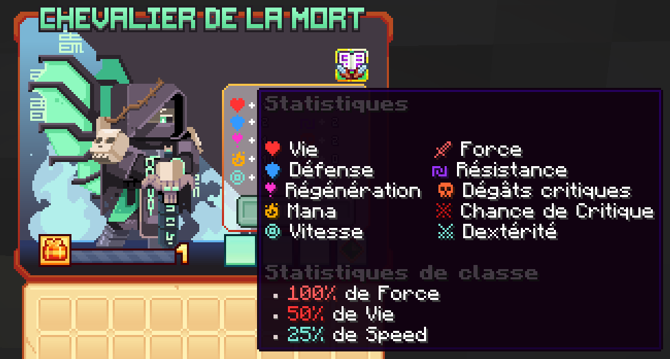

# ☠️ Chevalier de la Mort
Maître dans l'art du tir à l'arc, agile et précis, il ne rate jamais sa cible.

<figure><figcaption>
<strong>Aperçu des stats de la classe Chevalier de la Mort</strong>
</figcaption></figure>

## <mark style="color:green;">Compétences</mark>

### <mark style="color:green;">**Niveau 1 : Frappe Mortelle **</mark>

Frappez vers l'avent en repoussant les ennemis. Au troisème lancer. Lancez des chaînes en avant, accrochez-vous à des blocs ou des ennemis.

Au quatrième lancer, frappez le sol avec une force immense, libérant une onde de choc nécrotique massive.

* <mark style="color:green;">**Temps de recharge**</mark>**:** 0.5s
* <mark style="color:green;">**Mana**</mark>**:** 0
* <mark style="color:green;">**Dégâts**</mark>**:** 40,3 (pour les deux premières attaques), puis 9.4 (pour les deux suivantes)

### <mark style="color:green;">**Niveau 5 : Sceau Maudit**</mark>

Frappez votre ennemi pour lui infliger un sceau maudit, qui s'accumule à chaque attaque jusqu'à 4 charges.

En atteignant la pleine charge, l'ennemi marqué obtient Faiblesse I.

* <mark style="color:green;">**Temps de recharge**</mark>**:** 0s
* <mark style="color:green;">**Mana**</mark>**:** 0
* <mark style="color:green;">**Dégâts**</mark>**:** 0

### <mark style="color:green;">**Niveau 10 : Charge fantôme**</mark>

Foncez vers l'avent, avec une force écrasante, traînant les ennemis sur votre chemin et laissant le chaos dans votre sillage.

* <mark style="color:green;">**Temps de recharge**</mark>**:** 10s
* <mark style="color:green;">**Mana**</mark>**:** 25
* <mark style="color:green;">**Dégâts**</mark>**:** 53,6

### <mark style="color:green;">**Niveau 15 : Chaîne fantôme**</mark>

Déchaîne les chaînes fantomatique, liant les ennemis et les traînant lentement vers toi.

Les mains nécrotiques se lèvent, s'aggrippant à leurs cibles et les étourdissant en place.

* <mark style="color:green;">**Temps de recharge**</mark>**:** 12s
* <mark style="color:green;">**Mana**</mark>**:** 125
* <mark style="color:green;">**Dégâts**</mark>**:** 0

### <mark style="color:green;">**Niveau 20 : Barrière d'âme**</mark>

Invoque une barrière d'énergie nécrotique, vous accordant l'invulnérabilité pendant quelques secondes.

Pendant ce temps, tout les dégâts reçus sont absorbés et convertis en soins.

* <mark style="color:green;">**Temps de recharge**</mark>**:** 20s
* <mark style="color:green;">**Mana**</mark>**:** 100
* <mark style="color:green;">**Dégâts**</mark>**:**  62,3 + 311,6

### <mark style="color:green;">**Niveau 30 : Nécrophage **</mark>

Faites tourner votre Nécrophage dans un vortex mortel, soulevant légèrement les ennemis en l'air au contact.

À la fin de la compétence, invoquez des griffes nécrotiques pour trancher les ennemis proches et soignez-vous en fonction du nombre d'ennemis touchés. Les ennemis sont repoussées et ralentis.

* <mark style="color:green;">**Temps de recharge**</mark>**:** 17s
* <mark style="color:green;">**Mana**</mark>**:** 150
* <mark style="color:green;">**Dégâts**</mark>**:** 62,3 + 311,6

### <mark style="color:green;">**Niveau 40 : Peine de mort**</mark>

Déployez vos ailes mortelles et envolez-vous dans les airs, invoquer lentement votre lame d'âme. Plongez vers l'endroit choisi avec une force terrifiante en frappant tout les ennemis avec votre épée de l'âme.

Les ennemis avec des sceaux maudits complètement chargés prennent des dégâts supplémentaire, ne laissant aucune chance de survie.

* <mark style="color:green;">**Temps de recharge**</mark>**:** 35s
* <mark style="color:green;">**Mana**</mark>**:** 300
* <mark style="color:green;">**Dégâts**</mark>**:** 4012,1