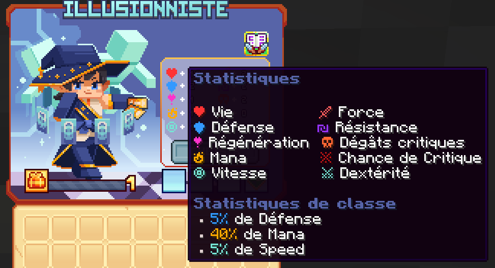

# 🎭 Illusionniste
Maître dans l'art du tir à l'arc, agile et précis, il ne rate jamais sa cible.

<figure><figcaption>
<strong>Aperçu des stats de la classe Illusionniste</strong>
</figcaption></figure>

## <mark style="color:green;">Compétences</mark>

### <mark style="color:green;">**Niveau 1 : Tir de cartes **</mark>

Lancez 1 à 3 cartes sur vos ennemis

* <mark style="color:green;">**Temps de recharge**</mark>**:** 0.5s
* <mark style="color:green;">**Mana**</mark>**:** 0
* <mark style="color:green;">**Dégâts**</mark>**:** 12,5

### <mark style="color:green;">**Niveau 5 : Reine**</mark>

Les cartes tourne autour de vous, étourdissant les ennemis autour.

* <mark style="color:green;">**Temps de recharge**</mark>**:** 0s
* <mark style="color:green;">**Mana**</mark>**:** 0
* <mark style="color:green;">**Dégâts**</mark>**:** 32,3

### <mark style="color:green;">**Niveau 10 : Flash fantôme**</mark>

Vous vous téléportez en diagonale vers l'arrière tout en lançant 3 cartes. 

Votre clone miroir fonce alors sur la trajectoire que vous venez de quitter infligeant des dégâts sur le chemin.

* <mark style="color:green;">**Temps de recharge**</mark>**:** 8s
* <mark style="color:green;">**Mana**</mark>**:** 025
* <mark style="color:green;">**Dégâts**</mark>**:** 55,7

### <mark style="color:green;">**Niveau 15 : Shuriken **</mark>

Lancez un shuriken miroir qui repousse les ennemis. 

Votre shuriken revient vers vous, repoussant les ennemis dans la direction opposée.

Les ennemis touché subissent un saignement

* <mark style="color:green;">**Temps de recharge**</mark>**:** 10s
* <mark style="color:green;">**Mana**</mark>**:** 125
* <mark style="color:green;">**Dégâts**</mark>**:** 80,7

### <mark style="color:green;">**Niveau 20 : Mirage **</mark>

Vous vous téléportez vers l'avant. Votre clone miroir se précipite à nouveau sur votre chemin, endommageant les ennemis en contact avec votre clone.

* <mark style="color:green;">**Temps de recharge**</mark>**:** 8s
* <mark style="color:green;">**Mana**</mark>**:** 100
* <mark style="color:green;">**Dégâts**</mark>**:**  297,8

### <mark style="color:green;">**Niveau 30 : Pique miroir**</mark>

Invoquez 2 miroirs sur vos côtés. Chaque miroir déclenche 3 aiguilles miroir

* <mark style="color:green;">**Temps de recharge**</mark>**:** 15s
* <mark style="color:green;">**Mana**</mark>**:** 150
* <mark style="color:green;">**Dégâts**</mark>**:** 362,2

### <mark style="color:green;">**Niveau 40 : Zone miroir**</mark>

Vous invoquez un portail miroir sous vos pieds, ce qui étourdit les ennemis proches. 

Après un court délai, le portail se téléporte dans la direction où vous regardez emmenant avec lui tout ennemis les ennemis étourdis qui se trouvent à l'intérieur.

* <mark style="color:green;">**Temps de recharge**</mark>**:** 20s
* <mark style="color:green;">**Mana**</mark>**:** 300
* <mark style="color:green;">**Dégâts**</mark>**:** 2360,6