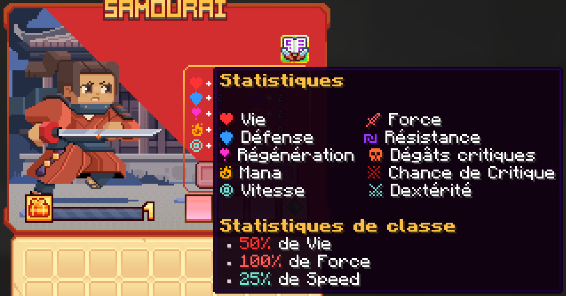

# 🥷 Samouraï

<figure><figcaption>
<strong>Aperçu des stats de la classe Samouraï</strong>
</figcaption></figure>

## <mark style="color:purple;">Compétences</mark>

### <mark style="color:purple;">**Niveau 1 : Tranchant sanglant **</mark>

* <mark style="color:purple;">**Temps de recharge**</mark>: 0.5s
* <mark style="color:purple;">**Mana**</mark>: 0
* <mark style="color:purple;">**Dégâts**</mark>: 

### <mark style="color:purple;">**Niveau 5 : Etat de flux **</mark>
Chaque utilisation de tranchant sanglant accorde un bonus de vitesse de déplacement cumulable jusqu'à la vitesse III.

Prendre des dégâts réinitialise votre bonus.

* <mark style="color:purple;">**Temps de recharge**</mark>: Passif (se déclenche automatiquement)
* <mark style="color:purple;">**Mana**</mark>: 0
* <mark style="color:purple;">**Dégâts**</mark>: 0

### <mark style="color:purple;">**Niveau 10 : Lacération**</mark>
Foncez instantanément dans votre ennemi, causant des dégâts mortels quelques instants plus tard.

* <mark style="color:purple;">**Temps de recharge**</mark>:
* <mark style="color:purple;">**Mana**</mark>:
* <mark style="color:purple;">**Dégâts**</mark>: 

### <mark style="color:purple;">**Niveau 15 : Fumigène**</mark>
Lancez une bombe fumigène qui crée une aura de fumée. L'aura vous confère un boost de saut et une invisibilité tout en donnant la cécité et la lenteur aux ennemis.

* <mark style="color:purple;">**Temps de recharge**</mark>: 
* <mark style="color:purple;">**Mana**</mark>: 
* <mark style="color:purple;">**Dégâts**</mark>: 

### <mark style="color:purple;">**Niveau 20 : Shuriken**</mark>
Faire un saut en arrière en lançant un shuriken qui rebondit entre les ennemis jusqu'à 3 fois, laissant une marque de shuriken.

* <mark style="color:purple;">**Temps de recharge**</mark>: 
* <mark style="color:purple;">**Mana**</mark>: 
* <mark style="color:purple;">**Dégâts**</mark>: 

### <mark style="color:purple;">**Niveau 30 : Charge mortelle**</mark>
Chargez vers les ennemis marqués tout en faisant tourner votre lame jusqu'à 4 fois.

* <mark style="color:purple;">**Temps de recharge**</mark>: 
* <mark style="color:purple;">**Mana**</mark>: 
* <mark style="color:purple;">**Dégâts**</mark>: 

### <mark style="color:purple;">**Niveau 40 : Art Oublié**</mark>
Entrez dans les ombres et foncez vers l'avant, transperçant rapidement vos ennemis 5 fois.

Puis vous effectuez une attaque tournante emmenant vos ennemis dans les airs et les frappant plusieurs fois.

Vous effectuez une frappe finale, amenant vos ennemis au sol provoquant des dégâts quelques instants plus tard.

* <mark style="color:purple;">**Temps de recharge**</mark>: 
* <mark style="color:purple;">**Mana**</mark>: 
* <mark style="color:purple;">**Dégâts**</mark>: 