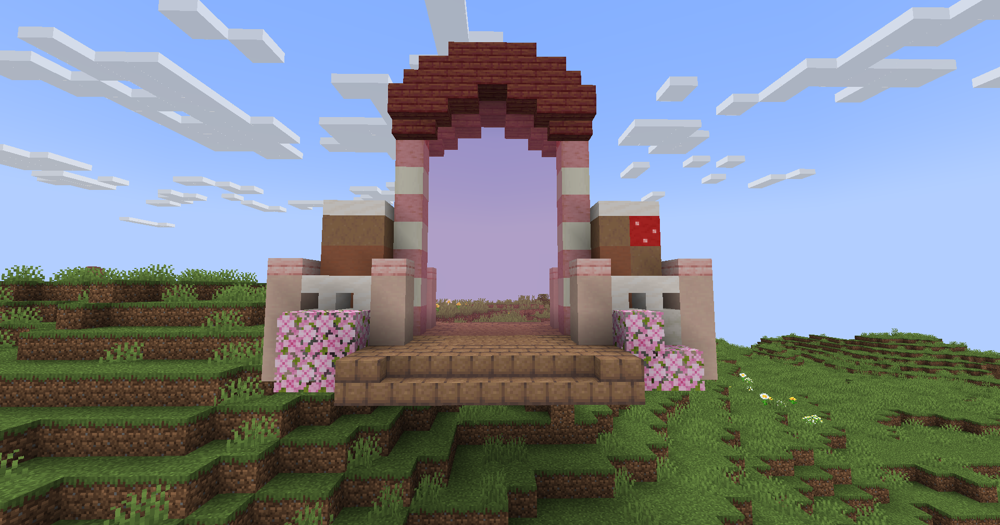

# 🟫 Fabrique de Chocolat

<figure><figcaption>
<strong>Aperçu d'une Fabrique de Chocolat</strong>
</figcaption></figure>

## <mark style="color:green;"> Pré-requis </mark>

Ce donjon est <mark style="color:green;">**limité à 4 personnes**</mark>. Pour le faire, vous devez être <mark style="color:green;">**niveau 40**</mark> dans votre classe.

## <mark style="color:green;">Aperçu des récompenses</mark>

### XP obtenable
Il n'y a pas encore d'information disponible a ce sujet.

### Récompense en fin de donjon

|                                                                                         |
|:---------------------------------------------------------------------------------------:|
| <mark style="color:yellow;"><strong>Parchemin de la Fabrique de Chocolat</strong></mark> |
| <mark style="color:yellow;"><strong>40.000 💰</strong></mark>                            |
| <mark style="color:yellow;"><strong>60.000 💰</strong></mark>                            |
| <mark style="color:yellow;"><strong>100.000 💰</strong></mark>                           |
| <mark style="color:yellow;"><strong>Tablette de chocolat (x2) 💰</strong></mark>         |
| <mark style="color:orange;"><strong>Bonbon à l'orange (x2)</strong></mark>              |
| <mark style="color:yellow;"><strong>Œuf de familier de Pâques</strong></mark>            |
| <mark style="color:yellow;"><strong>EXP classe (x5.000)</strong></mark>                  |
| <mark style="color:yellow;"><strong>Chocolat (x2.500)</strong></mark>                    |
| <mark style="color:yellow;"><strong>Clé de Pâques (x1)</strong></mark>                   |