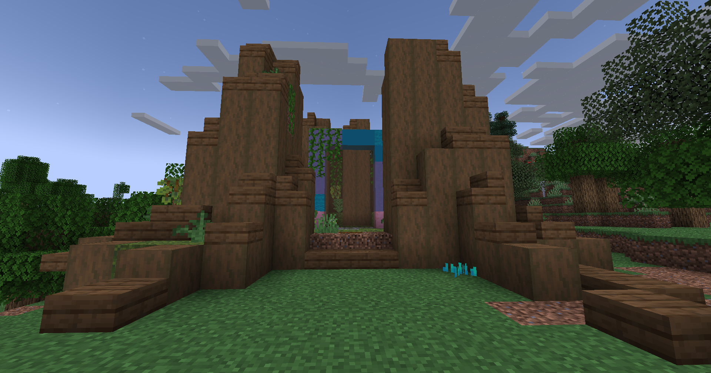

# 🟫 Terrier du Roi Lapin

<figure><figcaption>
<strong>Aperçu du Terrier du roi Lapin</strong>
</figcaption></figure>

## <mark style="color:green;"> Pré-requis </mark>

Ce donjon est <mark style="color:green;">**limité à 4 personnes**</mark>. Pour le faire, vous devez être <mark style="color:green;">**level 15**</mark> dans votre classe.

## <mark style="color:green;">Aperçu des récompenses</mark>

### XP obtenable
Il n'y a pas encore d'information disponible a ce sujet.

### Récompense en fin de donjon

|                                                                                   |
|:---------------------------------------------------------------------------------:|
| <mark style="color:yellow;"><strong>Parchemin du Terrier Roi Lapin</strong></mark> |
| <mark style="color:yellow;"><strong>10.000 💰</strong></mark>                      |
| <mark style="color:yellow;"><strong>15.000 💰</strong></mark>                      |
| <mark style="color:yellow;"><strong>25.000 💰</strong></mark>                      |
| <mark style="color:yellow;"><strong>Tablette de chocolat (x1) 💰</strong></mark>   |
| <mark style="color:green;"><strong>Bonbon à la pomme (x1)</strong></mark>         |
| <mark style="color:yellow;"><strong>Œuf de familier de Pâques</strong></mark>      |
| <mark style="color:yellow;"><strong>Exp classe (x1.000)</strong></mark>            |
| <mark style="color:yellow;"><strong>Chocolat (x500)</strong></mark>                |

