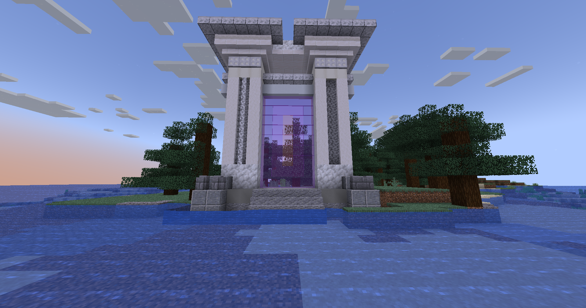

# 🟥 Cupidon

<figure><figcaption>
<strong>Aperçu d'un donjon Cupidon</strong>
</figcaption></figure>

## <mark style="color:green;">Pré-requis</mark>

Ce donjon est <mark style="color:green;">**limité à 8 personnes**</mark>. Pour le faire, vous devez être <mark style="color:green;">**niveau 40**</mark> dans votre classe.

## <mark style="color:green;">Aperçu des récompenses</mark>

### <mark style="color:green;">XP obtenable</mark>

Mob : 35 xp\
Mini boss : 1500 xp\
Boss : 4000 xp

### <mark style="color:green;">Récompense en fin de donjon</mark>

|                                                                |
| :------------------------------------------------------------: |
|    <mark style="color:red;">**Parchemin de l'amour**</mark>    |
|          <mark style="color:red;">**40.000 💰**</mark>         |
|          <mark style="color:red;">**60.000 💰**</mark>         |
|         <mark style="color:red;">**100.000 💰**</mark>         |
|        <mark style="color:red;">**Auréole (x2)**</mark>        |
|  <mark style="color:orange;">**Bonbon à l'orange (x2)**</mark> |
| <mark style="color:red;">**Œuf de familier de l'amour**</mark> |
|     <mark style="color:red;">**Exp classe (x5.000)**</mark>    |
|        <mark style="color:red;">**Cœur (x2.500)**</mark>       |
|      <mark style="color:red;">**Clé Cupidon (x1)**</mark>      |
