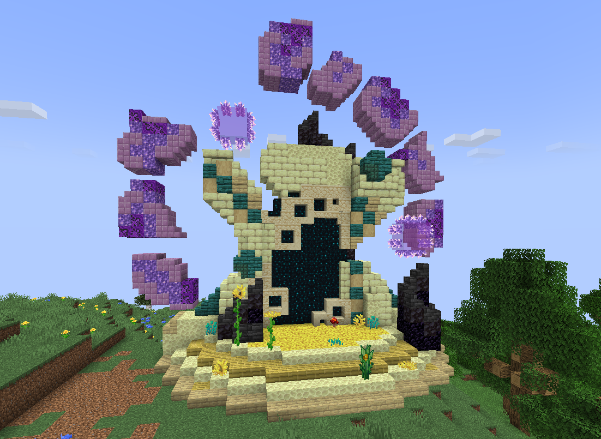

# 🟥 Donjon Mythique

<figure><figcaption>
<strong>Aperçu d'un donjon Mythique</strong>
</figcaption></figure>

## <mark style="color:green;"> Pré-requis </mark>

Ce donjon est <mark style="color:green;">**limité à 10 personnes**</mark>. Pour le faire, vous devez être <mark style="color:green;">**niveau 50**</mark> dans votre classe.

## <mark style="color:green;">Aperçu des récompenses</mark>

### <mark style="color:green;">XP obtenable</mark>
Lors de ce donjon vous pouvez obtenir l'xp de classe comme suit : 

* Mob normal : 75 xp
* Mini boss : 7500 xp
* Boss : 20000 xp

### <mark style="color:green;">Récompense en fin de donjon</mark>

|                                                                                   |
|:---------------------------------------------------------------------------------:|
| <mark style="color:blue;"><strong>Classe Aléatoire Épique</strong></mark>         |
| <mark style="color:purple;"><strong>Classe Aléatoire Légendaire</strong></mark>   |
| <mark style="color:purple;"><strong>Parchemin Expert</strong></mark>              |
| <mark style="color:red;"><strong>Parchemin Impossible</strong></mark>             |
| <mark style="color:red;"><strong>300.000 💰</strong></mark>                       |
| <mark style="color:red;"><strong>750.000 💰</strong></mark>                       |
| <mark style="color:red;"><strong>1.000.000 💰</strong></mark>                     |
| <mark style="color:red;"><strong>Cristaux de donjon Mythique</strong></mark>      |
| <mark style="color:purple;"><strong>Bonbon au Raisin (x2)</strong></mark>         |
| <mark style="color:purple;"><strong>Plume de Phoenix</strong></mark>              |
| <mark style="color:purple;"><strong>Item Évolutif Aléatoire</strong></mark>       |
| <mark style="color:purple;"><strong>Pet Aléatoire Donjon</strong></mark>          |
| <mark style="color:purple;"><strong>Clé Aléatoire</strong></mark>                 |
