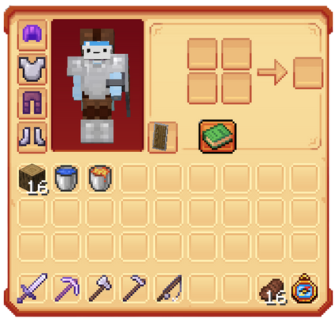
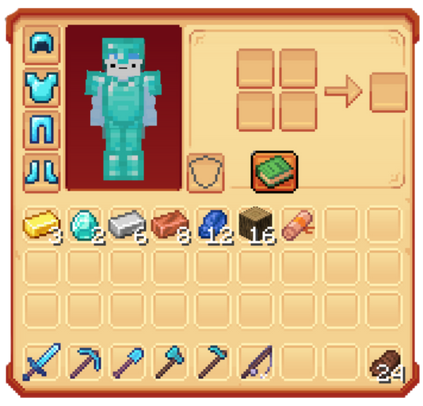
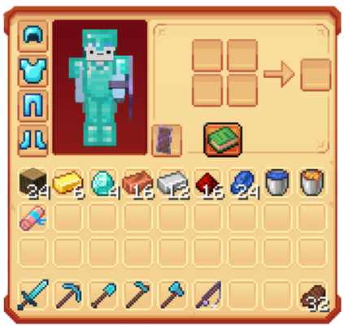
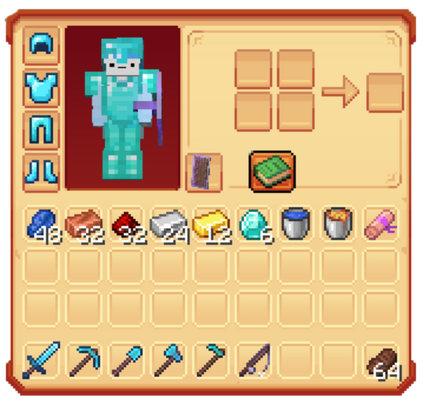

# 🦺 Les Kits

<mark style="color:green;">Les kits</mark> sont <mark style="color:green;">des pack d’items</mark> mis à disposition gratuitement pour tous les joueurs sur Évolucraft via la commande `/kits`. Ils permettent de <mark style="color:green;">récupérer facilement du stuff</mark>, <mark style="color:green;">des minerais</mark>, <mark style="color:green;">des outils</mark> et même <mark style="color:green;">des parchemins de toutes sortes</mark>, sans dépenser la moindre ressource. C’est une fonctionnalité particulièrement utile <mark style="color:green;">pour les nouveaux joueurs</mark> souhaitant se constituer <mark style="color:green;">un équipement de base rapidement</mark> et démarrer leur aventure dans de bonnes conditions !


**REMARQUE 🔍 :**Ces kits sont **récupérables une fois toutes les 24 heures** en utilisant la commande correspondante.


## 💠 <mark style="color:green;">Le /kit boussole 🧭</mark>

* <mark style="color:green;">**1 boussole de navigation du `/menu`**</mark>
<figure><figcaption></figcaption></figure>

## 💠 <mark style="color:green;">Le /kit donjon 🟩</mark>

* <mark style="color:green;">**1 pierre de téléportation donjon**</mark>
<figure><figcaption></figcaption></figure>

## 💠 <mark style="color:green;">Le /kit bienvenue 👋</mark>

* <mark style="color:green;">**Casque en cuir**</mark> _(Protection 2)_
* <mark style="color:green;">**Plastron en fer**</mark> _(Protection 2)_
* <mark style="color:green;">**Pantalon en cuir**</mark> _(Protection 2)_
* <mark style="color:green;">**Bottes en fer**</mark> _(Protection 2)_
* <mark style="color:green;">**Épée en fer**</mark> _(Tranchant 2)_
* <mark style="color:green;">**Pioche en fer**</mark> _(Efficacité 2)_
* <mark style="color:green;">**Hache en fer**</mark> _(Efficacité 2)_
* <mark style="color:green;">**Houe en fer**</mark> _(Solidité 1)_
* <mark style="color:green;">**Canne à pêche**</mark> _(Chance de la mer 1)_
* <mark style="color:green;">**1 boussole de navigation du `/menu`**</mark>
* <mark style="color:green;">**16 steaks**</mark>
* <mark style="color:green;">**16 bûches de chêne**</mark>
* <mark style="color:green;">**1 seau d’eau**</mark>
* <mark style="color:green;">**1 seau de lave**</mark>
* <mark style="color:green;">**1 bouclier**</mark>

<figure><figcaption></figcaption></figure>


**ATTENTION ⚠️ : Ce kit n'est obtenable qu'à partir du rangs Débutant.**


## 💠 <mark style="color:yellow;">Le /kit Héros ⚜️</mark>

* <mark style="color:yellow;">**Casque en diamant**</mark> _(Protection 2 / Solidité 2)_
* <mark style="color:yellow;">**Plastron en diamant**</mark> _(Protection 2 / Solidité 2)_
* <mark style="color:yellow;">**Pantalon en diamant**</mark> _(Protection 2 / Solidité 2)_
* <mark style="color:yellow;">**Bottes en diamant**</mark> _(Protection 2 / Solidité 2)_
* <mark style="color:yellow;">**Épée en diamant**</mark> _(Tranchant 2 / Solidité 2)_
* <mark style="color:yellow;">**Pioche en diamant**</mark> _(Efficacité 2 / Solidité 2)_
* <mark style="color:yellow;">**Pelle en diamant**</mark> _(Efficacité 2 / Solidité 2)_
* <mark style="color:yellow;">**Hache en diamant**</mark> _(Efficacité 2 / Solidité 2)_
* <mark style="color:yellow;">**Houe en diamant**</mark> _(Solidité 2)_
* <mark style="color:yellow;">**Canne à pêche**</mark> _(Chance de la mer 2 / Solidité 2)_
* <mark style="color:yellow;">**24 steaks**</mark>
* <mark style="color:yellow;">**3 lingots d’or**</mark>
* <mark style="color:yellow;">**2 diamants**</mark>
* <mark style="color:yellow;">**6 lingots de fer**</mark>
* <mark style="color:yellow;">**8 lingots de cuivre**</mark>
* <mark style="color:yellow;">**12 lapis-lazuli**</mark>
* <mark style="color:yellow;">**16 bûches de chêne**</mark>
* <mark style="color:yellow;">**1 parchemin d’aventure (Rare)**</mark>

<figure><figcaption></figcaption></figure>


**ATTENTION ⚠️ : Ce kit n'est obtenable qu'en ayant acheté un grade dans le /grades.**


## 💠 <mark style="color:blue;">Le /kit Élite 💠</mark>

* <mark style="color:blue;">**Casque en diamant**</mark> _(Protection 3 / Solidité 3 )_
* <mark style="color:blue;">**Plastron en diamant**</mark> _(Protection 3 / Solidité 3)_
* <mark style="color:blue;">**Pantalon en diamant**</mark> _(Protection 3 / Solidité 3)_
* <mark style="color:blue;">**Bottes en diamant**</mark> _(Protection 3 / Solidité 3)_
* <mark style="color:blue;">**Épée en diamant**</mark> _(Tranchant 3 / Solidité 3)_
* <mark style="color:blue;">**Pioche en diamant**</mark> _(Efficacité 3 / Solidité 3)_
* <mark style="color:blue;">**Pelle en diamant**</mark> _(Efficacité 3 / Solidité 3)_
* <mark style="color:blue;">**Hache en diamant**</mark> _(Efficacité 3 / Solidité 3)_
* <mark style="color:blue;">**Houe en diamant**</mark> _(Solidité 3)_
* <mark style="color:blue;">**Canne à pêche**</mark> _(Chance de la mer 3 / Solidité 3)_
* <mark style="color:blue;">**Bouclier**</mark> _(Solidité 2)_
* <mark style="color:blue;">**32 steaks**</mark>
* <mark style="color:blue;">**6 lingots d’or**</mark>
* <mark style="color:blue;">**4 diamants**</mark>
* <mark style="color:blue;">**12 lingots de fer**</mark>
* <mark style="color:blue;">**16 lingots de cuivre**</mark>
* <mark style="color:blue;">**24 lapis-lazuli**</mark>
* <mark style="color:blue;">**16 redstone**</mark>
* <mark style="color:blue;">**24 bûches de chêne**</mark>
* <mark style="color:blue;">**1 parchemin d’aventure (Difficile)**</mark>

<figure><figcaption></figcaption></figure>


**ATTENTION ⚠️ : Ce kit n'est obtenable qu'en ayant acheté un grade Élite ou plus.**


## 💠 <mark style="color:blue;">Le /kit Légende 💞</mark>

* <mark style="color:blue;">**Casque en diamant**</mark> _(Protection 4 / Solidité 3 / Affinité aquatique)_
* <mark style="color:blue;">**Plastron en diamant**</mark> _(Protection 4 / Solidité 3)_
* <mark style="color:blue;">**Pantalon en diamant**</mark> _(Protection 4 / Solidité 3)_
* <mark style="color:blue;">**Bottes en diamant**</mark> _(Protection 4 / Solidité 3 / Chute amortie 2)_
* <mark style="color:blue;">**Épée en diamant**</mark> _(Tranchant 4 / Solidité 3 / Butin 2)_
* <mark style="color:blue;">**Pioche en diamant**</mark> _(Efficacité 4 / Solidité 3 / Fortune 1)_
* <mark style="color:blue;">**Pelle en diamant**</mark> _(Efficacité 4 / Solidité 3)_
* <mark style="color:blue;">**Hache en diamant**</mark> _(Efficacité 4 / Solidité 3 / Fortune 1)_
* <mark style="color:blue;">**Houe en diamant**</mark> _(Efficacité 3)_
* <mark style="color:blue;">**Canne à pêche**</mark> _(Chance de la mer 3 / Solidité 3 / Appât 1)_
* <mark style="color:blue;">**Bouclier**</mark> _(Solidité 3)_
* <mark style="color:blue;">**64 steaks**</mark>
* <mark style="color:blue;">**12 lingots d’or**</mark>
* <mark style="color:blue;">**6 diamants**</mark>
* <mark style="color:blue;">**24 lingots de fer**</mark>
* <mark style="color:blue;">**32 lingots de cuivre**</mark>
* <mark style="color:blue;">**48 lapis-lazuli**</mark>
* <mark style="color:blue;">**32 redstone**</mark>
* <mark style="color:blue;">**1 parchemin d’aventure (Expert)**</mark>
* <mark style="color:blue;">**1 seau d’eau**</mark>
* <mark style="color:blue;">**1 seau de lave**</mark>

<figure><figcaption></figcaption></figure>


**ATTENTION ⚠️ : Ce kit n'est obtenable qu'en ayant acheté un grade Légende.**


**Vous connaissez maintenant tous les kits disponibles sur Évolucraft ! 🌍**

