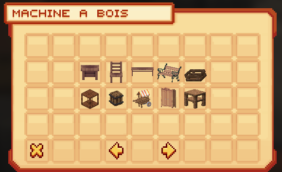
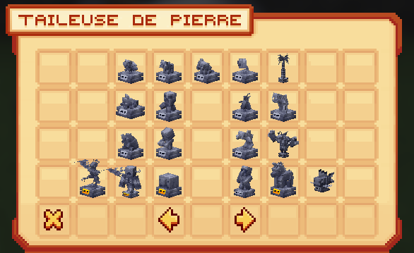

# ⚒️ Les Machines

## <mark style="color:green;">Informations Générales</mark>

Les machines sont des blocs de craft qui permettent aux joueurs de créer de nouvelles fournitures à partir de différentes ressources.&#x20;

Sur le serveur Evolucraft, voici les machines disponibles :

### <mark style="color:green;">**Machine à bois**</mark>**&#x20;:**

* Exprimez votre talent de menuisier en ornant votre ville d'un intérieur digne de ce nom grâce à cette machine. Créez une ambiance chaleureuse avec des meubles et des décorations en bois.
* La machine à bois est récupérable à partir du niveau 40 bûcheron.
<figure><figcaption>
<strong>Interface de la machine à bois</strong>
</figcaption></figure>

Voici un tableau récapitulatif de la machine à bois : 

| Meubles                  | Temps      | Ressources                                                            |
|--------------------------|------------|-----------------------------------------------------------------------|
| Tabouret                 | 5 minutes  | 4 buches de chêne, 8 planches de chêne                                |
| Chaise                   | 6 minutes  | 8 buches de chêne, 16 planches de chêne                               |
| Table                    | 8 minutes  | 16 buche de chêne et 32 16 planches de chêne                          |
| Banc                     | 6 minutes  | 8 buches de chêne, 16 planches de chêne                               |
| Cagette                  | 5 minutes  | 4 buchess de chêne, 8 planches de chêne                               |
| Grande Cage              | 8 minutes  | 4 buches de chêne, 8 planches de chêne,  8 cuirs                      |
| Baril                    | 6 minutes  | 3 buche de chêne, 16 planches de chêne,  4 fers                       |
| Charette                 | 15 minutes | 3 buches de chêne, 16 planches de chêne,  16 fers, 2 bottes de paille |
| Armoire                  | 6 minutes  | 4 buches de chêne, 8 planches de chêne,  8 fers                       |
| Présentoir de nourriture | 10 minutes | 16 buches de chêne, 24 planches de chêne  8 cuirs                     |

### <mark style="color:green;">**Tailleuse de pierre**</mark>**&#x20;:**

* Laissez libre cours à votre créativité en fabriquant des statues uniques, prêtes à être vendues chez le tailleur de pierre présent au <mark style="color:green;">**`/spawn`**</mark>.
* &#x20;Notez que chaque joueur est limité à deux tailleuses de pierre.
* Les statues sont fabriquées à partir de matériaux provenant des donjons et des ressources classiques.
* La Tailleuse en pierre est récupérable à partir du niveau 45 et 145 forgemage.
* Les statues sont vendable au près du tailleur de pierre situé au spawn. 
* Il existe 4 rareté de statue : commun, rare, épique et légendaire.

<figure><figcaption>
<strong>Interface de la tailleuse de pierre</strong>
</figcaption></figure>

<mark style="color:green;">**Les Statues communes**</mark>**&#x20;:**
Les statues de rareté commune, ont un temps de fabrication de 10 minutes. Voici une liste exaustif des statues commune fabricable :
| Nom de la statue | Ressource                                                              | Prix de revente |
|------------------|------------------------------------------------------------------------|-----------------|
| Poulet           | 16 pierres, 16 plumes, 32 graines                                      | 1 875           |
| Vache            | 16 pierres, 16 fers, 8 bloc d'herbes                                   | 2 225           |
| Palmier          | 64 roches, 32 topaze, 64 bûche de palmier,  1 cristal de donjon commun | 15 000          |
| Chien            | 16 pierres, 16 fers, 32 côtelettes de porc                             | 2 100           |
| Têtard           | 16 pierres, 16 fers, 32 morues                                         | 4 875           |

<mark style="color:yellow;">**Les Statues rare**</mark>**&#x20;:**
Les statues de rareté commune, ont un temps de fabrication de 20 minutes. Voici une liste exaustif des statues commune fabricable :
| Nom de la statue | Ressource                                  | Prix de revente |
|------------------|--------------------------------------------|-----------------|
| Creeper          | 64 pierres, 32 ors, 48 poudre à canon      | 5 625           |
| Renard           | 64 pierres, 32 ors, 64 poulets cru         | 5 813           |
| Perroquet        | 64 pierres, 32 ors, 32 plumes              | 5 250           |
| Requin           | 16 pierres, 16 fers, 32 côtelettes de porc | 9 000           |

<mark style="color:blue;">**Les Statues épique**</mark>**&#x20;:**
Les statues de rareté commune, ont un temps de fabrication de 30 minutes. Voici une liste exaustif des statues commune fabricable :
| Nom de la statue | Ressource                                                           | Prix de revente |
|------------------|---------------------------------------------------------------------|-----------------|
| Enderman         | 256 roches, 64 diamants, 64 perles de l'ender                       | 26 250          |
| Ours polaire     | 256 roches, 64 diamants, 320 bloc de neige                          | 21 000          |
| Nautilox         | 256 roches, 64 diamants, 2 poisson lune, 1 cristal de donjon épique | 90 000          |
| Dauphin          | 256 roches, 64 diamants, 1 saumon royal                             | 45 000          |

<mark style="color:purple;">**Les Statues légendaire**</mark>**&#x20;:**
Les statues de rareté commune, ont un temps de fabrication de 60 minutes. Voici une liste exaustif des statues commune fabricable :
| Nom de la statue   | Ressource                                                                                                 | Prix de revente |
|--------------------|-----------------------------------------------------------------------------------------------------------|-----------------|
| Phénix             | 512 roches, 32 émeraudes, 5 lingots de netherite, 1 plume de phénix                                       | 252 000         |
| Licorne            | 512 roches, 32 émeraudes, 4 lingots de netherite 1 corne de licorne                                       | 292 500         |
| Golem de   fer     | 512 roches, 32 émeraudes, 1 bloc de netherite,  128 bloc de fer                                           | 81 000          |
| Warden             | 512 roches, 32 émeraudes, 1 bloc de netherite,  3 sculk shrieker                                          | 135 000         |
| BlobFish           | 512 roches, 32 émeraudes, 4 lingots de netherite, 1 poisson perroquet, 1 truite arc-en-ciel, 1 hippocampe | 108 000         |
| Poisson   écarlate | 512 roches, 32 émeraudes, 1 poisson écarlate,  1 cristal de donjon légendaire                             | 1 500   000     |
