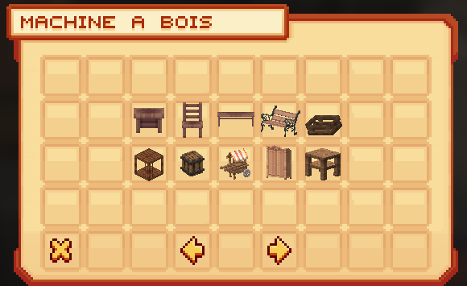
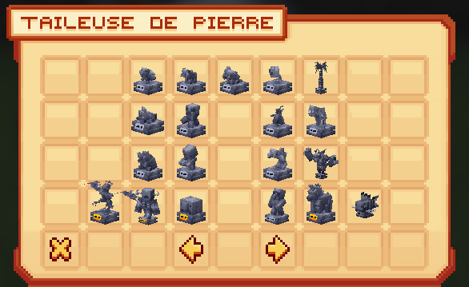
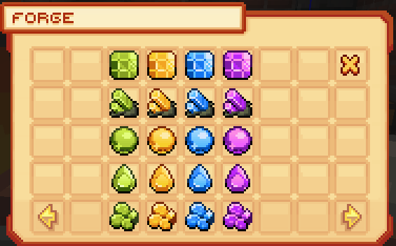

# ⚒️ Les Machines

### <mark style="color:green;">Informations Générales 📝</mark>

Les machines sont des blocs de craft qui permettent aux joueurs de créer de nouvelles fournitures à partir de différentes ressources.

Sur le serveur Evolucraft, voici les machines disponibles :

## <mark style="color:green;">**💠 Machine à bois 🪚**</mark> :

* La machine à bois est récupérable à partir du <mark style="color:green;">**niveau 40 bûcheron**</mark> <mark style="color:green;"></mark><mark style="color:green;">🪵</mark> avec la commande <mark style="color:green;">**`/jobs claim`**</mark>.

Exprimez votre talent de menuisier en ornant votre ville d'un intérieur digne de ce nom grâce à cette machine. Créez une ambiance chaleureuse avec des meubles et des décorations en bois.

<figure><figcaption>
<strong>Interface de la Machine à Bois</strong>
</figcaption></figure>


Pour plus d'informations concernant les crafts [<mark style="color:green;">**de la machine à bois**</mark>](https://wiki.evolucraft.fr/le-gameplay/les-machines/machine-a-bois)


## <mark style="color:green;">**💠 Tailleuse de pierre 🗿**</mark> :

* La tailleuse de pierre est récupérable à partir du <mark style="color:green;">**niveau 45 et 145 forgemage 📖**</mark> avec la commande <mark style="color:green;">**`/jobs claim`**</mark>.

Laissez libre cours à votre créativité en fabriquant des statues uniques et de différentes raretés : <mark style="color:green;">commun</mark>, <mark style="color:yellow;">rare</mark>, <mark style="color:blue;">épique</mark> et <mark style="color:purple;">légendaire</mark>, prêtes à être vendues chez le tailleur de pierre présent au <mark style="color:green;">**`/spawn`**</mark>. Les statues sont fabriquées à partir de matériaux provenant des donjons et des ressources classiques.

<figure><figcaption>
<strong>Interface de la Tailleuse de Pierre</strong>
</figcaption></figure>


Pour plus d'informations concernant les crafts de chaque statue [<mark style="color:green;">**dans la tailleuse de pierre**</mark>](https://wiki.evolucraft.fr/le-gameplay/les-machines/tailleuse-de-pierre)



🚨 **Attention ! Vous ne pouvez en poser que 2 par joueurs !**


## <mark style="color:green;">**💠 Forge 🔨**</mark> :

* La forge est récupérable à partir du <mark style="color:green;">**niveau 115 forgemage 📖**</mark> avec la commande <mark style="color:green;">**`/jobs claim`**</mark>.

La forge est une machine puissante qui vous permettra de crafter des gemmes de métier ou encore d'améliorer les armes de classe.

* <mark style="color:green;">**Création de Gemmes de Métier**</mark> 🎇 : Ces **gemmes sont disponibles en quatre raretés** différentes : <mark style="color:green;">commun</mark>, <mark style="color:yellow;">rare</mark>, <mark style="color:blue;">épique</mark>, <mark style="color:purple;">légendaire</mark> et <mark style="color:red;">mythique</mark> et vous serviront notamment à **l'amélioration dans le craft de vos armes de classe**.
* <mark style="color:green;">**Amélioration des Armes de Classe**</mark> ⚔️ : Utilisez la forge pour **améliorer les armes spécifiques à chaque classe** à l'aide de **cristaux de métier et d'autres ressources mystères** afin de renforcer vos capacités de combat et de défense pour mieux affronter les défis qui vous attendent dans le monde d'Evolucraft.

<figure><figcaption>
<strong>Interface de la Forge</strong>
</figcaption></figure>


Pour plus d'informations concernant les crafts [<mark style="color:green;">**de la forge**</mark>](https://wiki.evolucraft.fr/le-gameplay/les-machines/forge)

