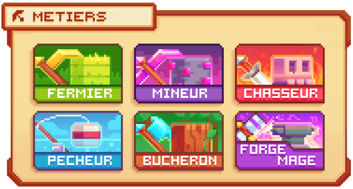
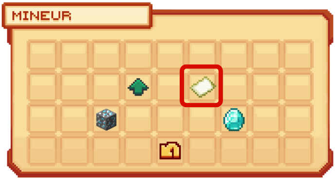
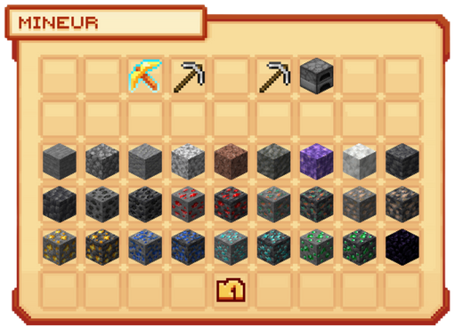

# 👷 Les Métiers


**Tuto : Comment gagner de l'argent sur Evolucraft**


Les <mark style="color:green;">métiers</mark> constituent un <mark style="color:green;">pilier essentiel</mark> du serveur, offrant aux joueurs une <mark style="color:green;">progression continue</mark> et motivante.  
En accomplissant des <mark style="color:green;">actions</mark> liées à votre <mark style="color:green;">métier choisi</mark>, vous pouvez non seulement <mark style="color:green;">gagner de l’argent</mark> mais aussi <mark style="color:green;">gravir les rangs</mark>, débloquant ainsi de <mark style="color:green;">nouveaux avantages</mark>.  
Chaque métier possède ses propres <mark style="color:green;">spécificités</mark>, ce qui permet à chacun de développer une <mark style="color:green;">stratégie unique</mark> selon son style de jeu et ses objectifs.  

<figure><figcaption>
<strong>Menu des <mark style="color:green;">Métiers</mark></strong>
</figcaption></figure>

## 💠 **<mark style="color:green;">Comment rejoindre un métier ?</mark> 🛠️**

Pour <mark style="color:green;">rejoindre un métier</mark>, il vous suffit de faire la commande <mark style="color:green;">`/jobs join [métier]`</mark>.  
Selon <mark style="color:green;">votre rang</mark>, vous pourrez <mark style="color:green;">choisir plusieurs métiers</mark> à la fois.  
Mais pas d'inquiétude : lorsque vous changez de métier, vous <mark style="color:green;">ne perdez pas votre progression</mark>.  

Voici la liste des <mark style="color:green;">métiers disponibles</mark> sur le serveur :  

* <mark style="color:green;">**Fermier 🌾**</mark> : Cultivez et récoltez une variété de cultures pour <mark style="color:green;">gagner de l'argent</mark> tout en contribuant à l’approvisionnement alimentaire.  
* <mark style="color:green;">**Mineur ⛏️**</mark> : Explorez les profondeurs pour extraire des <mark style="color:green;">minéraux précieux</mark> et des <mark style="color:green;">ressources essentielles</mark>.  
* <mark style="color:green;">**Chasseur 🗡️**</mark> : Traquez des créatures sauvages pour obtenir <mark style="color:green;">matériaux</mark> et <mark style="color:green;">récompenses rares</mark>.  
* <mark style="color:green;">**Pêcheur 🎣**</mark> : Capturez des <mark style="color:green;">poissons</mark> et autres trésors aquatiques.  
* <mark style="color:green;">**Bûcheron 🪚**</mark> : Abattez des <mark style="color:green;">arbres</mark> et récoltez du <mark style="color:green;">bois</mark> pour l’artisanat et la construction.  
* <mark style="color:green;">**ForgeMage 📖**</mark> : Maîtrisez la <mark style="color:green;">forge</mark> et l’<mark style="color:green;">enchantement</mark> afin de créer des équipements puissants.  

## 💠 **<mark style="color:green;">Comment savoir son avancée ?</mark> 📊**

Pour connaître votre <mark style="color:green;">progression</mark> (ou celle d’un autre joueur) dans les métiers, utilisez la commande :  
<mark style="color:green;">`/jobs stats [Pseudo]`</mark>.  
Un message apparaîtra dans votre chat, affichant pour chaque métier : votre <mark style="color:green;">niveau</mark>, votre <mark style="color:green;">xp actuel</mark>, l’<mark style="color:green;">xp requis</mark> ainsi que le <mark style="color:green;">pourcentage de progression</mark>.  

<figure><figcaption>
<strong>Message du <mark style="color:green;">/jobs stats</mark></strong>
</figcaption></figure>

## 💠 **<mark style="color:green;">A quoi sert l'interface du /jobs ?</mark> 🤨**

<figure><figcaption>
<strong>Aperçu du <mark style="color:green;">menu du Job Mineur</mark></strong>
</figcaption></figure>

En cliquant sur un <mark style="color:green;">métier</mark>, un menu s’ouvre et vous donne plusieurs informations utiles :  

### 🔸 <mark style="color:green;">**Classement du Job 🏆**</mark>  
Permet de vous comparer aux autres joueurs et de savoir où vous vous situez.  
Si vous ne faites pas partie des 50 meilleurs, vous pouvez consulter votre classement en passant votre curseur sur votre tête de joueur.  

### 🔸 <mark style="color:green;">**Actions Rémunérées 💱**</mark>  
Liste des <mark style="color:green;">actions</mark> qui rapportent de l’<mark style="color:green;">argent</mark> et de l’<mark style="color:green;">xp</mark>.  
Très utile pour optimiser vos <mark style="color:green;">farm</mark> et choisir les meilleures ressources.  

<figure><figcaption>
<strong>Aperçu des <mark style="color:green;">actions rémunérées du Mineur</mark></strong>
</figcaption></figure>

### 🔸 <mark style="color:green;">**Progression 💹**</mark>  
Montre votre <mark style="color:green;">niveau actuel</mark>, l’<mark style="color:green;">xp requis</mark> et vos <mark style="color:green;">paliers</mark>.  
Chaque niveau passé offre une <mark style="color:green;">récompense</mark> : objets, argent ou gemmes.  
Utilisez la commande <mark style="color:green;">`/jobs claim`</mark> pour récupérer vos récompenses.  

## 💠 **<mark style="color:green;">Comment augmenter ses gains ?</mark> 📈**

### 🔸 Monter de niveau de métier 🆙  
Monter de <mark style="color:green;">niveau de métier</mark> augmente légèrement vos <mark style="color:green;">revenus</mark> et votre <mark style="color:green;">xp</mark>.  
Les différences étant <mark style="color:green;">progressives</mark>, c’est sur le long terme que les avantages deviennent notables, récompensant la <mark style="color:green;">persévérance</mark>.  

### 🔸 Booster de métiers 💥  
Les <mark style="color:green;">boosters de métiers</mark> multiplient vos <mark style="color:green;">revenus</mark> ou votre <mark style="color:green;">xp</mark> pendant une durée limitée.  
Ils sont disponibles dans les [<mark style="color:green;">caisses</mark>](https://wiki.evolucraft.fr/le-gameplay/les-caisses) ou à l’[<mark style="color:green;">hôtel des ventes</mark>](https://wiki.evolucraft.fr/le-gameplay/le-commerce#hôtel-des-ventes).  

#### 🔷 Booster de savoir 🟢  
Augmente l’<mark style="color:green;">xp métiers</mark> gagnée à chaque action.  

#### 🔷 EXP Métier Aléatoire 🎰  
Donne un bonus de <mark style="color:green;">250 xp métiers</mark> aléatoire sur l’un des 6 métiers.  

#### 🔷 Booster de richesse 💸  
Augmente l’<mark style="color:green;">argent</mark> gagné par action.  


**REMARQUE 🔍 : Les boosters disponibles dans le <mark style="color:green;">/boutique</mark> fonctionnent comme ceux trouvés en jeu, mais ils profitent à l’ensemble des joueurs.**


### 🔸 Les pets 🐾  
Les <mark style="color:green;">pets</mark> vous accompagnent et offrent des <mark style="color:green;">bonus de métiers</mark> (xp ou revenus).  
Consultez le <mark style="color:green;">`/pokedex`</mark> ou la page dédiée : [<mark style="color:green;">Les Compagnons</mark>](https://wiki.evolucraft.fr/le-gameplay/les-compagnons).  

### 🔸 L'évènement FARM BOOST 💱  
Cet évènement temporaire offre des <mark style="color:green;">bonus de gains</mark> sur certains métiers.  
Plus d’informations ici : [<mark style="color:green;">Le Farm Boost</mark>](https://wiki.evolucraft.fr/le-gameplay/les-evenements#farm-boost).  


**REMARQUE 🔍 : Tous les types de <mark style="color:green;">boosts</mark> peuvent se cumuler pour maximiser vos gains.**

