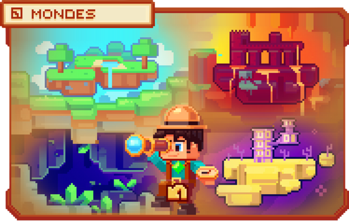
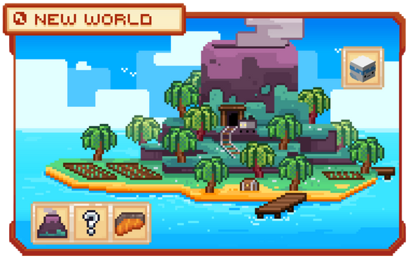

# 🌍 Les Mondes


**Tuto : Créer et gérer votre propre ville sur Evolucraft**


En débutant votre aventure sur le serveur, vous constaterez rapidement l’importance de collecter des ressources pour enrichir votre expérience de jeu.&#x20;

La commande <mark style="color:green;">**`/monde`**</mark> vous permet de naviguer entre les différents mondes disponibles.

<figure><figcaption>
<strong>Aperçu de la commande </strong><mark style="color:green;"><strong><code>/monde</code></strong></mark>
</figcaption></figure>

### 💠 Le monde CONSTRUCTION 🌁

Le monde <mark style="color:green;">**Construction**</mark> vous ouvre les portes d’un espace dédié à la <a href="https://wiki.evolucraft.fr/les-villes/creer-une-ville"><mark style="color:green;">création de votre ville</mark></a>, à l’exposition de vos shops et de votre richesse !  
Ici, seules les constructions dans le cadre d’une ville sont autorisées. Il n’est pas possible de poser des blocs sans revendiquer un territoire.

### 💠 Les mondes RESSOURCES ⛏️

#### • L'OVERWORLD 🌏  
Dans le monde <mark style="color:green;">**Ressources**</mark>, vous trouverez vos premières matières premières et affronterez vos premiers défis dans <a href="https://wiki.evolucraft.fr/le-gameplay/les-donjons"><mark style="color:green;">les donjons</mark></a>.  
C’est l’endroit idéal pour extraire des minerais, récolter des ressources naturelles et trouver des blocs pour vos constructions.

#### • LE NETHER 🔥  
Le monde <mark style="color:green;">**Nether**</mark>, accessible à partir du <mark style="color:green;">**rang Expérimenté**</mark>, regorge de toutes les ressources du Nether, mais aussi de quelques <a href="https://wiki.evolucraft.fr/le-gameplay/les-donjons"><mark style="color:green;">donjons</mark></a> maléfiques dignes de l’Overworld...

#### • L'END 🌌  
Enfin, le monde <mark style="color:green;">**End**</mark>, accessible à partir du <mark style="color:green;">**rang Chevronné**</mark>, abrite les ressources les plus rares, ainsi que le terrible dragon dont les objets sont échangeables via la commande <mark style="color:green;">**`/dragon`**</mark> !

### 💠 Le NEW-WORLD 🏝️

Pour entrer dans ce monde, il vous suffit de taper la commande <mark style="color:green;">**`/neworld`**</mark>, puis de cliquer sur **"New World"**.

<figure><figcaption>
<strong>Aperçu de la commande </strong><mark style="color:green;"><strong><code>/neworld</code></strong></mark>
</figcaption></figure>

Dans ce monde <mark style="color:green;">**New World**</mark>, vous pouvez explorer, récolter et développer vos métiers (à partir du niveau 50) avec :
* un **nouveau minerai** ⛏️  
* de **nouveaux mobs** 👹  
* des **nouveaux poissons** 🐟  
* un **nouveau bois** 🌴  
* de **nouvelles plantations** 🌱

### Chers aventuriers, il ne vous reste plus qu’à explorer 🤠
