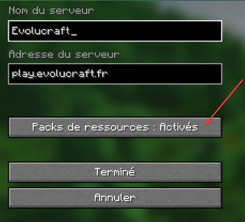
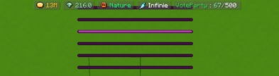
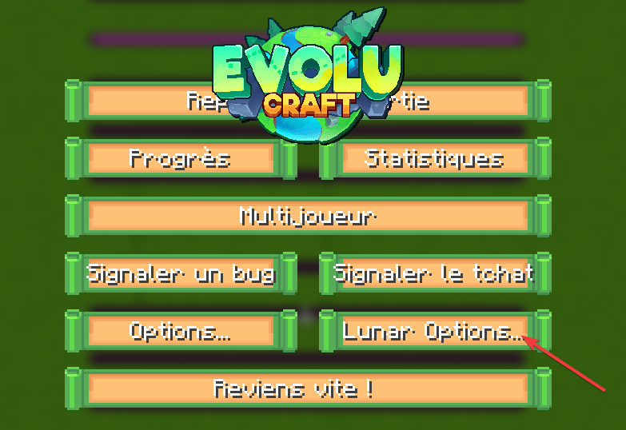

### <mark style="color:green;">Mettre le texture pack</mark>
Lors de votre première connexion, le serveur vous rajoute automatiquement le texture pack, si cela n'est pas le cas il vous suffit de suivre les étapes suivantes : 

1. Tu te rends dans le menu de sélection des serveurs, puis tu fais un **clic droit** sur Evolucraft. 
  <figure></figure>

2. En bas à gauche de ton écran, tu cliques sur le bouton **Modifier**.  
  <figure></figure>

3. Tu actives les packs de ressources, puis tu cliques sur **Terminer**.
  <figure></figure>


Pense à bien allouer suffisamment de RAM pour pouvoir le télécharger ! 


### <mark style="color:green;">Enlever les barres violettes</mark>
Si tu joues sur Lunar Client, Badlion, Feather ou autre sur un launcher autre que celui de base, il se peut que des **barres violettes** s'affichent sur ton écran lors de ta première connexion.  
<figure></figure>

Pour les enlever sur **Lunar Client**, voici les étapes à suivre (la manipulation reste plus ou moins sur les autres launchers) :
1. Tu appuies sur Echap et tu vas dans les **paramètres** de ton launcher. 
  <figure></figure>

2. Tu recherches **Boss Bar** dans l’onglet de recherche.
  <figure></figure>

3. Tu mets l'échelle à 1 (optionnel) et tu **désactives les barres personnalisées**.
  <figure></figure>

4. Pour finir, tu vas dans la section permettant de modifier l’HUD et tu **centres** la Boss Bar.
<figure></figure>

