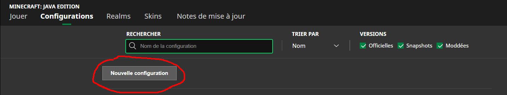
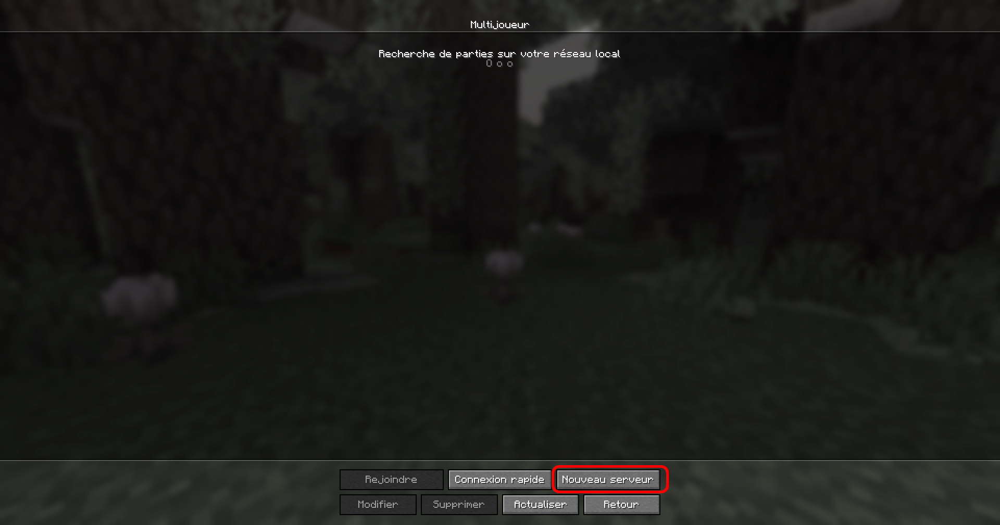
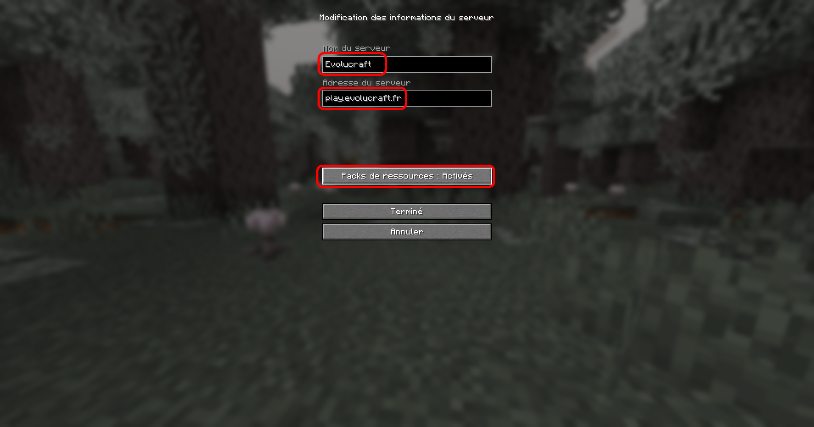
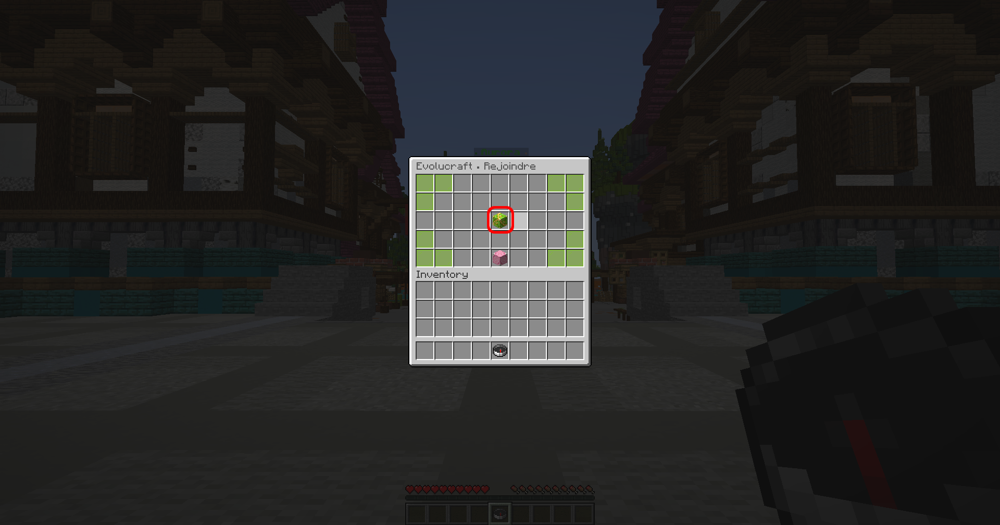
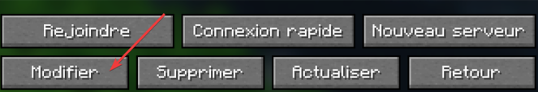

## <mark style="color:green;">💠 Comment ajouter et rejoindre le serveur ? 🌏</mark>

### <mark style="color:green;">Étape 1️⃣</mark>
**Lancez votre launcher Minecraft de base, puis cliquez sur l'onglet "Configuration" comme montré sur l'image ci-dessous.**
<figure></figure>

### <mark style="color:green;">Étape 2️⃣</mark>
**Cliquez sur le bouton "Nouvelle configuration".**
<figure></figure>

### <mark style="color:green;">Étape 3️⃣</mark>
**Cliquez sur la case "Version" pour ensuite sélectionner la version "release 1.20.4".**
<figure></figure>

### <mark style="color:green;">Étape 4️⃣</mark>
**Après cette étape, vous n'avez plus qu'à cliquer sur le bouton "Installer" en bas à droite et votre jeu sera lancé automatiquement !**
<figure></figure>

### <mark style="color:green;">Étape 5️⃣</mark>
**Après que votre jeu soit lancé, cliquez sur "Multijoueur", puis cliquez en bas sur "Nouveau serveur".**
<figure></figure>
<figure></figure>

### <mark style="color:green;">Étape 6️⃣</mark>
**Entrez les informations comme ci-dessous, puis mettez l'option du pack de ressources en mode "Activé". Quand cela est réalisé, cliquez sur "Terminé".**
<figure></figure>

### <mark style="color:green;">Étape 7️⃣</mark>
**Rejoignez le serveur en faisant un double clic sur le serveur, puis une fois arrivé dans le lobby, faites un clic droit avec la boussole en main pour ensuite cliquer sur le bloc vert comme ci-dessous.**
8. Pour finir, tu n'as plus qu'à cliquer sur le monde.
<figure></figure>

**Vous pouvez dès à présent commencer votre aventure sur Évolucraft ! 🥳**
<!-- Un grand merci à Corie pour les images ! -->

## <mark style="color:green;">💠 Comment avoir le pack de ressources activé à ma connexion ? 🖼️</mark>

Lors de votre première connexion, le serveur vous rajoute automatiquement le texture pack. Si cela n'est pas le cas, il vous suffit de suivre les étapes suivantes :

### <mark style="color:green;">Étape 1️⃣</mark>
**Sélectionnez le serveur Évolucraft, sans le rejoindre, puis cliquez sur "Modifier".**
<figure></figure>

### <mark style="color:green;">Étape 2️⃣</mark>
**Cliquez sur le bouton "Pack de ressources" jusqu'à ce qu'il soit indiqué "Activé" comme dans l'image ci-dessous.**
3. Tu actives le pack de ressources, puis tu cliques sur **Terminer**.
<figure></figure>


**⚠️ En cas d'échec, pensez à bien allouer suffisamment de RAM pour votre jeu afin qu'il puisse être téléchargé !**


**Et vous voilà dans une expérience incroyable avec ce pack de textures custom ! 🥳**

## <mark style="color:green;">💠 Comment enlever les barres violettes sur mon écran ? ♒</mark>

Si tu as ces barres, c'est que tu dois jouer sous launcher Lunar Client, Badlion, Feather ou autre que celui de base. Il se peut que des **barres violettes** s'affichent sur ton écran comme ci-dessous lors de ta première connexion 🤨.  
<figure></figure>

Pour les enlever sur **Lunar Client 🌙**, voici les étapes à suivre (la manipulation reste similaire sur les autres launchers cités plus haut) :

### <mark style="color:green;">Étape 1️⃣</mark>
**Appuyez sur la touche "ECHAP" de votre clavier, puis cliquez sur les "paramètres de votre launcher".** 
<figure></figure>

### <mark style="color:green;">Étape 2️⃣</mark>
**Recherchez "Boss Bar" dans l’onglet de recherche.**
<figure></figure>

### <mark style="color:green;">Étape 3️⃣</mark>
**Mettez l'échelle des bossbars à 1 (facultatif), puis désactivez les "barres personnalisées".**
<figure></figure>

### <mark style="color:green;">Étape 4️⃣</mark>
**Enfin, sélectionnez la modification de l'HUD, et cliquez sur votre bossbar afin de la positionner __tout en haut et au milieu de votre jeu__ comme sur l'image ci-dessous.**
<figure></figure>

**Et voilà, vous n'aurez plus les bossbars de visible pour votre plus grand bonheur ! 🥳**

## <mark style="color:green;">💠 Comment avoir les armures non bugguées avec son shader ? 🖼️</mark>

Vous vous demandez pourquoi vos armures custom ressemblent à l'image ci-dessous lorsque vous mettez un shader ? Nous avons la solution pour résoudre ce souci !
<figure></figure>

**Téléchargez le mod "[<mark style="color:green;">CustomItemTextures</mark>](https://modrinth.com/mod/cit-resewn/versions)" avec la version que vous avez, puis insérez-le dans votre dossier de mods. Relancez votre jeu, et normalement le souci sera résolu !**


**⚠️ Attention, le mod est disponible seulement sous Fabric**


## <mark style="color:green;">💠 Comment ajouter une pub dans le /pub ? 🏪</mark>

Le /pub vous permet de promouvoir votre publicité via un affichage ou dans le chat auprès des autres joueurs du serveur pendant une certaine période et pour diverses catégories. Mais comment la créer ? Voici donc un tuto.

### <mark style="color:green;">Étape 1️⃣</mark>
**Faites la commande `/pub` dans votre chat et une interface comme ci-dessous va apparaître.**
<figure></figure>

### <mark style="color:green;">Étape 2️⃣</mark>
**Cliquez sur le bouton "Créer" en bas à droite de l'interface.**
<figure></figure>

### <mark style="color:green;">Étape 3️⃣</mark>
**En faisant un clic droit ou un clic gauche sur l'émeraude ou l'élément qui apparaît à l'emplacement montré ci-dessous, sélectionnez la catégorie où vous souhaitez que votre publicité soit affichée.**
<figure></figure>

### <mark style="color:green;">Étape 4️⃣</mark>
**Veuillez insérer les informations demandées dans les éléments encadrés ci-dessous. Chaque item correspond à une information pour votre publicité.**
<figure></figure>


**⚠️ Attention, si votre texte dans l'une des catégories est trop long, votre pré-création de pub sera complètement effacée 😫**


### <mark style="color:green;">Étape 5️⃣</mark>
**Une fois les informations insérées, vous n'avez plus qu'à cliquer sur le bouton "Créer" en bas à droite, comme ci-dessous, et votre pub sera publiée.**
<figure></figure>

### <mark style="color:green;">Étape BONUS ✨</mark>
**Après que votre pub soit créée, vous avez la possibilité de faire retransmettre cette dernière dans le chat automatiquement toutes les 20 minutes. Pour cela, dans l'interface du /pub, vous devez cliquer sur "Mes annonces", puis sur la publicité pour laquelle vous voulez avoir un message automatique, et enfin sur la petite croix afin qu'elle devienne une petite coche verte.**
<figure></figure>
<figure></figure>
<figure></figure>

**Et voilà, vous savez désormais comment créer une publicité dans le /pub ! 🥳**
