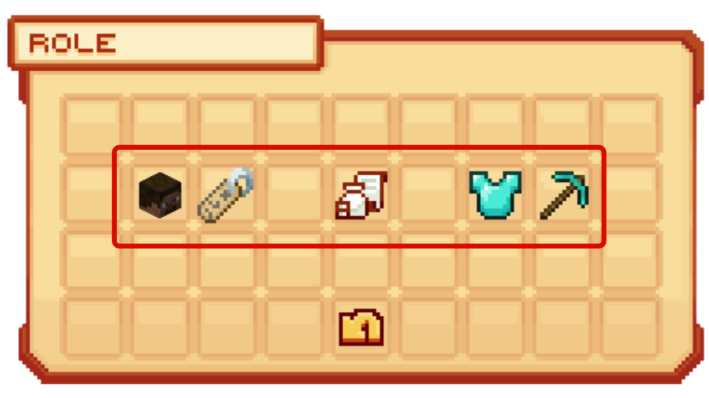
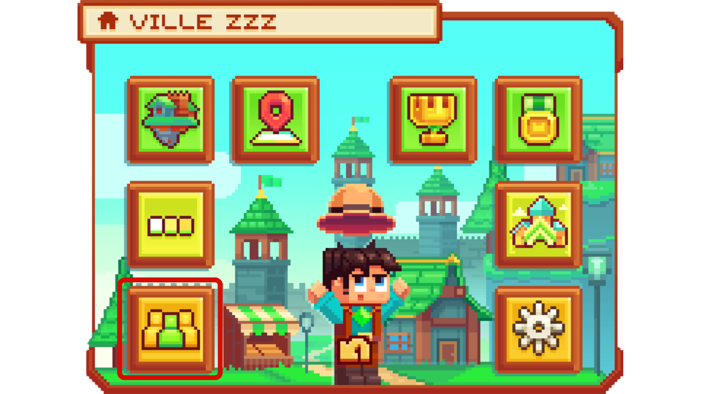

# Les Rôles 🎭

**Les rôles vous permettent de donner des permissions différentes suivant les joueurs pour garentir la sécurité dans la villes et éviter des abus. Elle permettent également, dans une question de role play, avoir une hiéarchie dans la ville et plein d'autre fonctionnalité ! 🎉

## <mark style="color:green;">**💠 Comment créer un rôle ? ✍**</mark>

### <mark style="color:green;">Étape 1️⃣</mark>
**Dans <mark style="color:green;">le menu de la ville</mark>, via la commande `/ville`, tout en pensant à bien utiliser `/v select` sur la bonne ville, cliquez sur <mark style="color:green;">"Rôle"</mark> comme sur l'image ci-dessous.**
<figure><figcaption></figcaption></figure>

### <mark style="color:green;">Étape 2️⃣</mark>
**Dans cette interface <mark style="color:green;">des Rôles</mark>, où vous retrouverez toutes les rôles de votre ville déjà créées, cliquez sur "<mark style="color:green;">Nouveau rôle</mark>", représentée par un petit personnage blanc sur la droite.**
<figure><figcaption></figcaption></figure>

### <mark style="color:green;">Étape 3️⃣</mark>
**Ecrivez dans votre chat, le nom du rôle que vous voulez créer.**


ATTENTION ⚠️ : Vous ne pouvez pas mettre d'espace dans le nom du rôle.


**Vous voilà avec un nouveau rôle dans votre ville** 🤗

## <mark style="color:green;">**💠 Comment modifier les accès au rôle ? ✍**</mark>

### <mark style="color:green;">Étape 1️⃣</mark>
**Dans <mark style="color:green;">le menu de la ville</mark>, via la commande `/ville`, tout en pensant à bien utiliser `/v select` sur la bonne ville, cliquez sur <mark style="color:green;">"Rôle"</mark> comme sur l'image ci-dessous.**
<figure><figcaption></figcaption></figure>

### <mark style="color:green;">Étape 2️⃣</mark>
**Dans cette interface <mark style="color:green;">des Rôles</mark>, cliquez sur le rôle que vous voulez modifié**
<figure><figcaption></figcaption></figure>

### <mark style="color:green;">Étape 3️⃣</mark>
**Dans cette interface, plusieurs catégorie d'action peut être réalisée. Afin d'en réaliser une, il vous suffit de cliquer sur la catégorie en question :**
* <mark style="color:green;">**Membre 👺**</mark> : Vous permet de voir quel joueur dans la ville à ce rôle, mais également de promouvoir ou destituer quelqu'un de ce rôle.
* <mark style="color:green;">**Renommée 🔖**</mark> : Vous permet de renommée le rôle en question.
* <mark style="color:green;">**Impôts 📜**</mark> : Vous permet de modifiée le montants des impots pour les joueurs ayant ce rôle.
* <mark style="color:green;">**Permission de Gestion 🔑**</mark> : Vous permet de modifiée la gestion administratif du rôle (_claim, ajouter des rôles ou des memebres, ect...)_.
* <mark style="color:green;">**Permission d'Action 🔧**</mark> : Vous permet de modifiée la gestion d'action du rôle (_ouvrir des coffres, fly, casser des blocks, ect...)_.

<figure><figcaption></figcaption></figure>


ATTENTION ⚠️ : Certaines action sont activés ou désactivé de base que ça soit pour le maire mais aussi les visiteurs. Veuillez donc à bien regardez vos préference d'action.


**Vous voilà prêt pour gérer les rôles dans votre ville** ✨

## <mark style="color:green;">**💠 Comment donner un rôle à un joueur ? 👤**</mark>

### <mark style="color:green;">Étape 1️⃣</mark>
**Dans <mark style="color:green;">le menu de la ville</mark>, via la commande `/ville`, tout en pensant à bien utiliser `/v select` sur la bonne ville, cliquez sur <mark style="color:green;">"Membres"</mark> comme sur l'image ci-dessous.**
<figure><figcaption></figcaption></figure>

### <mark style="color:green;">Étape 3️⃣</mark>
**Dans cette interface, plusieurs actions peut être réalisée sur le joueurs. Pour réaliser l'action que vous souhaitez, il vous suffit de suivre l'indication lorsque vous passez la souris sur la tête du joueur :**
* <mark style="color:green;">**Accéder 🖼️**</mark> : Vous permet de voir le /profile du joueur.
* <mark style="color:green;">**Promouvoir ⏫**</mark> : Vous permet de monter le role du joueurs.
* <mark style="color:green;">**Destituer ⏬**</mark> : Vous permet de descendre le role du joueur.
<figure><figcaption></figcaption></figure>

 ## <mark style="color:green;">**💠 Comment retirer un rôle ? ❌**</mark>

### <mark style="color:green;">Étape 1️⃣</mark>
**Dans <mark style="color:green;">le menu de la ville</mark>, via la commande `/ville`, tout en pensant à bien utiliser `/v select` sur la bonne ville, cliquez sur <mark style="color:green;">"Rôle"</mark> comme sur l'image ci-dessous.**
<figure><figcaption></figcaption></figure>

### <mark style="color:green;">Étape 2️⃣</mark>
**Dans cette interface <mark style="color:green;">des Rôles</mark>, passez la souris sur le rôle que vous voulez supprimer puis appuyez sur votre touche de drop et votre rôle y sera automatiquement supprimé.**


ATTENTION ⚠️ : Si un joueurs se trouvait encore dans le rôle supprimé, il sera automatiquement intégré au rôle Citoyen.


**Bravo ! Vous connaissez maintenant tous les choses à savoir sur les rôles dans les villes ! 🤩**
