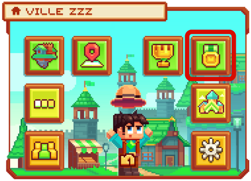
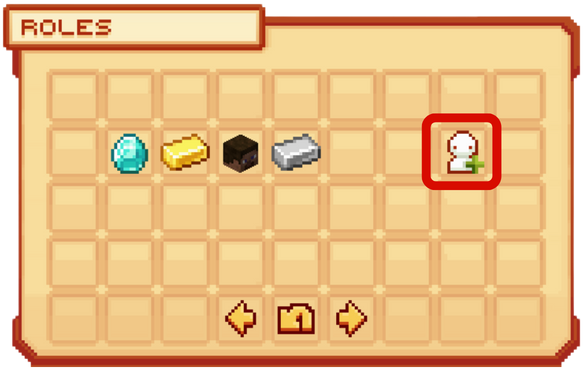
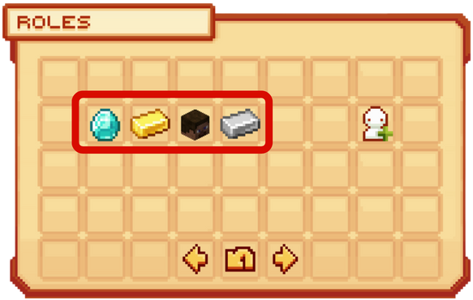
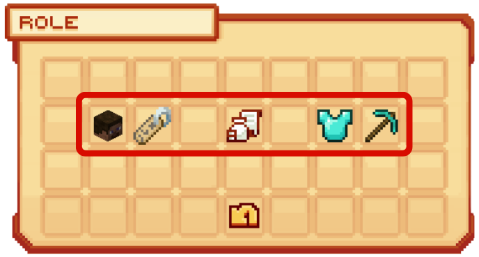
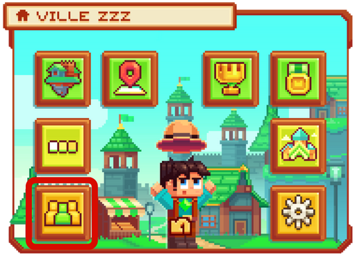
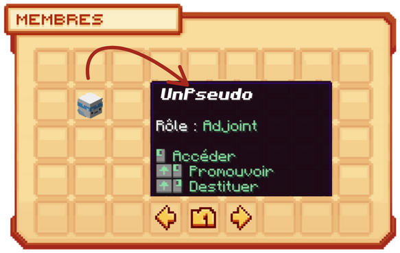

# Les Rôles 🎭

**Les rôles vous permettent d’attribuer des permissions différentes selon les joueurs afin de garantir la sécurité dans la ville et éviter les abus. Ils permettent également, dans une optique de roleplay, d’avoir une hiérarchie dans la ville et bien d’autres fonctionnalités ! 🎉**

## <mark style="color:green;">**💠 Comment créer un rôle ? ✍️**</mark>

### <mark style="color:green;">Étape 1️⃣</mark>
**Dans <mark style="color:green;">le menu de la ville</mark>, via la commande `/ville`, en veillant à bien utiliser `/v select` sur la bonne ville, cliquez sur <mark style="color:green;">"Rôle"</mark> comme sur l’image ci-dessous.**
<figure><figcaption></figcaption></figure>

### <mark style="color:green;">Étape 2️⃣</mark>
**Dans cette interface <mark style="color:green;">des Rôles</mark>, où vous retrouverez tous les rôles déjà créés de votre ville, cliquez sur "<mark style="color:green;">Nouveau rôle</mark>", représenté par un petit personnage blanc sur la droite.**
<figure><figcaption></figcaption></figure>

### <mark style="color:green;">Étape 3️⃣</mark>
**Écrivez dans votre chat le nom du rôle que vous souhaitez créer.**


ATTENTION ⚠️ : Vous ne pouvez pas mettre d’espace dans le nom du rôle.


**Et voilà, vous avez un nouveau rôle dans votre ville !** 🤗

## <mark style="color:green;">**💠 Comment modifier les accès d’un rôle ? ✍️**</mark>

### <mark style="color:green;">Étape 1️⃣</mark>
**Dans <mark style="color:green;">le menu de la ville</mark>, via la commande `/ville`, en veillant à bien utiliser `/v select` sur la bonne ville, cliquez sur <mark style="color:green;">"Rôle"</mark> comme sur l’image ci-dessous.**
<figure><figcaption></figcaption></figure>

### <mark style="color:green;">Étape 2️⃣</mark>
**Dans cette interface <mark style="color:green;">des Rôles</mark>, cliquez sur le rôle que vous souhaitez modifier.**
<figure><figcaption></figcaption></figure>

### <mark style="color:green;">Étape 3️⃣</mark>
**Dans cette interface, plusieurs catégories d’actions peuvent être réalisées. Pour effectuer une action, il vous suffit de cliquer sur la catégorie concernée :**
* <mark style="color:green;">**Membre 👺**</mark> : Permet de voir quels joueurs dans la ville ont ce rôle, mais aussi de promouvoir ou destituer quelqu’un de ce rôle.
* <mark style="color:green;">**Renommée 🔖**</mark> : Permet de renommer le rôle en question.
* <mark style="color:green;">**Impôts 📜**</mark> : Permet de modifier le montant des impôts pour les joueurs ayant ce rôle.
* <mark style="color:green;">**Permission de Gestion 🔑**</mark> : Permet de modifier la gestion administrative du rôle (_claim, ajouter des rôles ou des membres, etc._).
* <mark style="color:green;">**Permission d’Action 🔧**</mark> : Permet de modifier la gestion des actions du rôle (_ouvrir des coffres, fly, casser des blocs, etc._).

<figure><figcaption></figcaption></figure>


ATTENTION ⚠️ : Certaines actions sont activées ou désactivées par défaut, que ce soit pour le maire ou pour les visiteurs. Veillez donc à bien vérifier vos préférences d’action.


**Vous êtes désormais prêt à gérer les rôles dans votre ville !** ✨

## <mark style="color:green;">**💠 Comment attribuer un rôle à un joueur ? 👤**</mark>

### <mark style="color:green;">Étape 1️⃣</mark>
**Dans <mark style="color:green;">le menu de la ville</mark>, via la commande `/ville`, en veillant à bien utiliser `/v select` sur la bonne ville, cliquez sur <mark style="color:green;">"Membres"</mark> comme sur l’image ci-dessous.**
<figure><figcaption></figcaption></figure>

### <mark style="color:green;">Étape 2️⃣</mark>
**Dans cette interface, plusieurs actions peuvent être réalisées sur les joueurs. Pour effectuer l’action souhaitée, il vous suffit de suivre l’indication lorsque vous passez la souris sur la tête du joueur :**
* <mark style="color:green;">**Accéder 🖼️**</mark> : Permet de voir le /profile du joueur.
* <mark style="color:green;">**Promouvoir ⏫**</mark> : Permet d’attribuer un rôle supérieur au joueur.
* <mark style="color:green;">**Destituer ⏬**</mark> : Permet de rétrograder le rôle du joueur.
<figure><figcaption></figcaption></figure>

## <mark style="color:green;">**💠 Comment retirer un rôle ? ❌**</mark>

### <mark style="color:green;">Étape 1️⃣</mark>
**Dans <mark style="color:green;">le menu de la ville</mark>, via la commande `/ville`, en veillant à bien utiliser `/v select` sur la bonne ville, cliquez sur <mark style="color:green;">"Rôle"</mark> comme sur l’image ci-dessous.**
<figure><figcaption></figcaption></figure>

### <mark style="color:green;">Étape 2️⃣</mark>
**Dans cette interface <mark style="color:green;">des Rôles</mark>, passez la souris sur le rôle que vous souhaitez supprimer puis appuyez sur votre touche de drop : votre rôle sera automatiquement supprimé.**


ATTENTION ⚠️ : Si un joueur possédait encore le rôle supprimé, il sera automatiquement intégré au rôle Citoyen.


**Bravo ! Vous connaissez maintenant tout ce qu’il faut savoir sur les rôles dans les villes ! 🤩**
