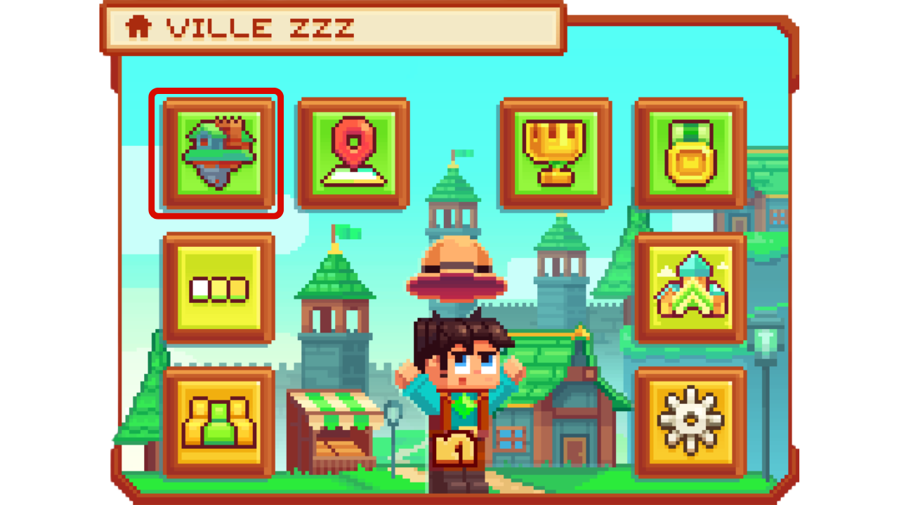
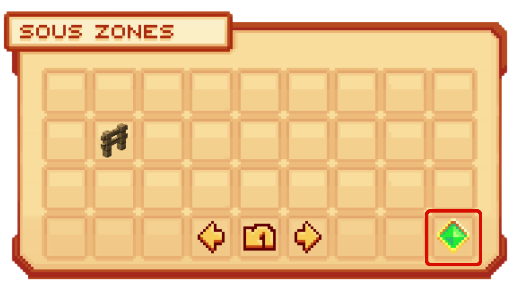
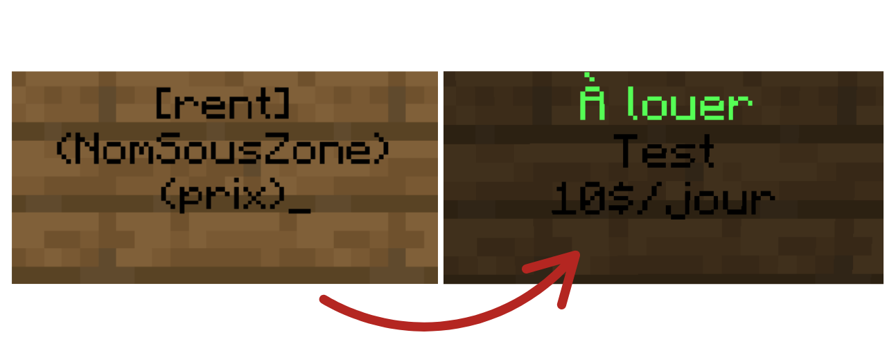

# 🗃️ Les sous-zones

Les sous-zones est un moyen de sur claim sa ville en définissant une région d'un point A à un point B dans sa ville, qui sera obligatoirement un parallélépipède ou un cube. Il vous perettra de modifier les actions que certains joueurs dans la ville peuvent faire dans cette endroit qui n'aurait pas accès à d'autre endroit. Il est souvent utilisée pour réalisée des champs publique, des locations ou de gestion de ville.

## <mark style="color:green;">**💠 Comment créer une sous-zone ? 🤔**</mark>


**REMARQUE ⚠️ : Avant de commencer la création, il est <mark style="color:green;">impératif que vous soyez dans l'un de ces deux cas pour que vous puissez créer des sous zone</mark> :**
* <mark style="color:green;">**Être maire de la ville**</mark>
* <mark style="color:green;">**Avoir accès à votre role, le peramètre de gestion des sous-zones**</mark>


### <mark style="color:green;">Étape 1️⃣</mark>
**Dans <mark style="color:green;">le menu de la ville,</mark> avec le `/ville`, tout en pensant à bien `/v select` la bonne ville. Cliquez sur les <mark style="color:green;">"Sous-Zones"</mark> comme sur l'image ci-dessous**
<figure><figcaption></figcaption></figure>

### <mark style="color:green;">Étape 2️⃣</mark>
**Dans <mark style="color:green;">ce menu des Sous-Zones</mark>, où l'ont va retrouver toutes vos sous-zones de votre ville déjà créer, cliquez sur "<mark style="color:green;">nouvelle zone**</mark>", représenter par la petite gemme à droite.**
<figure><figcaption></figcaption></figure>

### <mark style="color:green;">Étape 3️⃣</mark>

**À la suite de celà, <mark style="color:green;">une houe en or</mark> apparaitra dans votre main. Elle vous permet de <mark style="color:green;">délimiter dans une zone cubique</mark>, votre sous zone.**

**Pour délimiter votre sous zone, tout <mark style="color:green;">en gardant la houe en or sur les prochaines actions</mark>, faites <mark style="color:green;">un clique GAUCHE</mark> pour déterminer la première position de votre parallélépipède, puis <mark style="color:green;">un clique DROIT</mark> sur l'autre extrèmité du parallélépipède afin de choisir la deuxième position.**

**Cela vous permettra de créer <mark style="color:green;">une zone cubique avec un point A et un point B</mark>.**

<figure><figcaption>
<strong>_La visualisation des délimitation de la zone n'est pas issue de ce plugin_</strong>
</figcaption></figure>


🔎 <mark style="color:green;">**Remarque**</mark> : Lorsque vous sélectionné vos deux points, des particules s'afficheront pour vous délimiter la zone effectuée, qui vous permet donc de voir si la délimitation vous convient.


### <mark style="color:green;">Étape 4️⃣</mark>

**Effectuez la commande `/ville subarea selection create [Insérez un nom pour votre sous-zone]` afin de créer la sous zone.**


ATTENTION ⚠️ : Vous ne pouvez pas mettre d'espace dans le nom de votre sous-zone.


**Toutes nos félicitations ! 🥳 Vous savez à présent créer de nouvelles zones, gérables dans la section zones de votre menu ville.**

## <mark style="color:green;">**💠 Comment créer une location ? 🤔**</mark>

**Créer une location vous sert à faire louer une zone sur la journée à un prix que vous décidez, dans la zone que avez choisis. Très pratique pour y faire louer vos farm ou taxer encore plus vos citoyen de votre ville pour qu'ils puissent avoir un endroit tranquille à eux.**

**Pour réaliser une location, il vous faut être munie <mark style="color:green;">d'un panneau vanilla</mark>, peu importe le type de bois, et d'y faire <mark style="color:green;">cette forme ci-dessous</mark> ainsi qu'être dans la sous-zone où il y aura la location :**
<figure><figcaption>
<strong>Le texte entre parenthèse doit être modifiée pour correspondre au nom de votre sous-zone et au prix de la location</strong>
</figcaption></figure>

**Une fois réalisée, faites "Terminer" sur le panneau et votre panneau de location sera créer ! 🤗**

## <mark style="color:green;">**💠 Autres commandes 🤨**</mark>

* <mark style="color:green;">**/ville subarea kick [Nom de la sous-zone] [Pseudo]**</mark> :Vous permet d'exclure un membre de la sous-zone qui avait rejoindre cette dernière.

