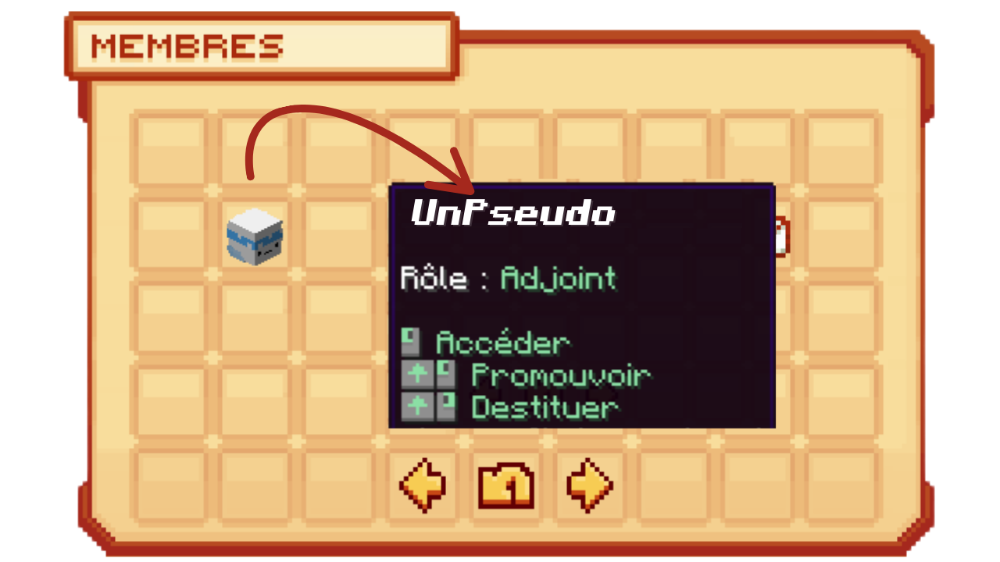
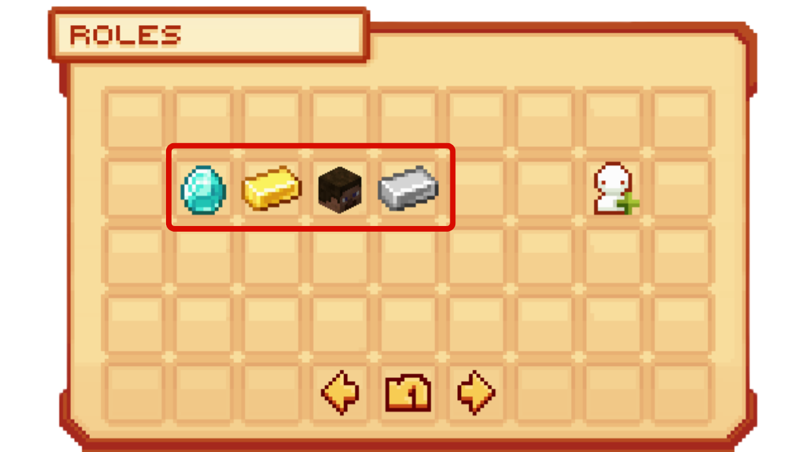

# 🏠 Les villes


**Tuto : Créer et gérer votre propre ville sur Evolucraft**


Les villes sont l'une des parties centrales du serveur. C'est à l'intérieur de celles-ci que vous pourrez stocker votre stuff, créer vos builds selon votre imagination ou encore installer vos fermes pour monter vos métiers ! À vous de créer le RP qui vous convient, selon ce que vous avez imaginé !

## <mark style="color:green;">**💠 Comment rejoindre une ville ? 🏙️**</mark>

Nous vous invitons à consulter ce petit tuto pour savoir comment : [<mark style="color:green;">Rejoindre une ville 🏙️</mark>](https://wiki.evolucraft.fr/tuto-et-astuce/creer-une-ville)

## <mark style="color:green;">**💠 Comment agrandir ma ville ? 📈**</mark>

Agrandir votre ville vous permet d'étendre votre territoire afin de réaliser des constructions de plus en plus impressionnantes. C'est aussi un moyen, dans une quête secondaire, d'augmenter le niveau de votre ville.

Pour l'agrandir, vous devez déposer de l'argent dans la banque de votre ville avec la commande <mark style="color:green;">**`/v bank deposit [montant]`**</mark>. À noter que le coût d'un claim dépend du niveau de votre ville.

Ensuite, en étant sur un chunk adjacent à votre ville, effectuez la commande <mark style="color:green;">**`/v claim`**</mark>. L'argent requis sera retiré de la banque de votre ville.


🔎 <mark style="color:green;">**Remarque**</mark> : Pour visualiser les différents chunks, vous pouvez utiliser le raccourci clavier F3+G, ou, pour connaître la bordure de votre ville, la commande <mark style="color:green;">**`/v view`**</mark> vous permettra de mieux visualiser votre territoire !


Si vous vous **êtes trompé de chunk à claim** et souhaitez **retirer un claim précis**, vous pouvez **utiliser la commande <mark style="color:green;">`/v unclaim`**</mark> en étant **à l'intérieur du chunk concerné**.

Et voilà, vous avez un chunk de plus dans votre ville ! 🎉

## <mark style="color:green;">**💠 Comment ajouter un membre à ma ville ? 👩🏻‍🤝‍🧑🏽**</mark>

Invitez vos amis à rejoindre la ville afin de vous aider à agencer votre ville ou même conquérir le monde d'Évolucraft !

Pour cela, il suffit d'utiliser la commande <mark style="color:green;">**`/v invite [Pseudo]`**</mark>.

L'autre joueur devra, quant à lui, utiliser la commande <mark style="color:green;">**`/v accept [Nom de votre ville]`**</mark> pour accepter l'invitation. Si le joueur a crashé ou s'est déconnecté durant l'action, il pourra toujours accepter l'invitation par la suite.

Si vous vous êtes trompé dans l'invitation du joueur, vous pouvez supprimer l'invitation dans le <mark style="color:green;">**`/v`, Divers, Invitation puis appuyez sur votre touche de jet d'item en ayant votre souris sur la tête du joueur**</mark>.

Et voilà, vous savez comment faire rejoindre vos amis dans votre ville ! 😎

## <mark style="color:green;">**💠 Comment supprimer ma ville ? ❌**</mark>

Vous avez besoin de supprimer votre ville afin de rejoindre une autre ou pour une autre raison ? Voici un petit tuto ! Mais attention, cette action est irréversible 🚨 !

Avant de supprimer votre ville, nous vous recommandons de <mark style="color:green;">reprendre l'argent de la banque de votre ville</mark> avec la commande <mark style="color:green;">`/v bank withdraw [montant]`</mark> ainsi que de récupérer le stuff dans <mark style="color:green;">vos coffres et vos items précieux</mark> ✨.


Après la suppression de votre ville, il ne restera que les blocs posés ainsi que les coffres qui resteront inaccessibles jusqu'à ce qu'une personne claim par-dessus. Pensez également à faire supprimer les coffres privés afin de limiter les tickets en cas de surclaim 🤗.


Une fois cela fait, vous pouvez utiliser la commande <mark style="color:green;">`/v disband`</mark> puis <mark style="color:green;">`/v disband --confirm`</mark> et votre ville sera automatiquement supprimée ! 😧

## <mark style="color:green;">**💠 Comment fonctionne le `/ville` ? 🏙️**</mark>

Lors de la création de votre ville, vous pourrez accéder à un menu de ville permettant de gérer tous les aspects de votre ville et la personnaliser à votre guise ! Pour y accéder, il suffit de faire la commande `/ville` ou `/v`.

<figure><figcaption>
<strong>Aperçu du "<mark style="color:green;">`/jobs`</mark></strong>
</figcaption></figure>

Dans cette interface de ville, vous avez 8 boutons cliquables correspondant à une catégorie d'action que vous pouvez réaliser :

### 🔶 <mark style="color:green;">Membres 👥</mark>
Dans cette interface, vous pouvez gérer les membres de votre ville via [les rôles 🎭](https://wiki.evolucraft.fr/les-villes/les-roles) et la hiérarchie de votre ville.

Pour cela, il vous suffit de passer votre souris sur la tête du joueur puis de suivre les instructions suivantes :
* <mark style="color:green;">**Accéder 🖼️**</mark> : Permet de voir le /profile du joueur. _(Clic gauche)_
* <mark style="color:green;">**Promouvoir ⏫**</mark> : Permet d’attribuer un rôle supérieur au joueur. _(Touche d'accroupissement + Clic gauche)_
* <mark style="color:green;">**Destituer ⏬**</mark> : Permet de rétrograder le rôle du joueur. _(Touche d'accroupissement + Clic droit)_
<figure><figcaption></figcaption></figure>

### 🔶 <mark style="color:green;">Divers 📂</mark>
Dans ce menu Divers, vous pouvez trouver l’aspect visuel ainsi que les informations principales de la ville pour vos habitants, comme :
 * <mark style="color:green;">**Nom de votre ville 🚩**</mark> : Permet de changer le nom de votre ville
 * <mark style="color:green;">**Description de votre ville 📜**</mark> : Permet de changer la description de votre ville
 * <mark style="color:green;">**Invitations 📧**</mark> : Permet d'envoyer ou de supprimer une invitation d'adhésion à la ville. _(Seuls les joueurs ayant la permission "Inviter des Joueurs" peuvent y accéder)_
 * <mark style="color:green;">**Taxes et Impôts 🧾**</mark> : Permet de voir la taxe payée par la banque de la ville et les impôts que vous payez
 * <mark style="color:green;">**Limites 🚦**</mark> : Permet de vérifier les limites de blocs par chunk imposées par le serveur
 * <mark style="color:green;">**Historique ⏪**</mark> : Permet de voir les interactions réalisées dans la ville (arrivée d’un joueur, retrait d’un joueur, infos de la banque de la ville, etc.)

### 🔶 <mark style="color:green;">Sous-Zones 🗃️</mark>

Les sous-zones permettent de définir une région d’un point A à un point B à l’intérieur de la ville (cube ou parallélépipède). Elles permettent de restreindre ou d’ouvrir des permissions à certains joueurs dans une partie spécifique de la ville, sans leur donner accès aux autres zones. C’est souvent utilisé pour des champs publics, des locations ou la gestion de la ville.

Nous vous invitons à lire cette page du wiki pour en savoir plus sur les sous-zones et leur création : **[<mark style="color:green;">Les Sous-Zones 🗃️</mark>](https://wiki.evolucraft.fr/les-villes/les-sous-zones)**

### 🔶 <mark style="color:green;">Téléportation 📌</mark>

Ce bouton permet de se téléporter au point de spawn de votre ville, comme avec la commande <mark style="color:green;">`/v spawn`</mark>.

### 🔶 <mark style="color:green;">Banque 💰</mark>
La banque vous permet de faire fonctionner et de maintenir la ville sur le serveur. Ce bouton est un moyen de déposer ou retirer de l’argent de la banque de votre ville. Pour cela il suffit de cliquer sur :
 * <mark style="color:green;">**Dépôt 🔺**</mark> : Permet de déposer de l’argent dans la banque de votre ville depuis votre compte.
 * <mark style="color:green;">**Retrait 🔻**</mark> : Permet de retirer de l’argent de la banque de votre ville et de le verser sur votre compte. _(Seuls les joueurs ayant la permission "Retirer de l'argent" peuvent y accéder)_

<figure><figcaption></figcaption></figure>


**ATTENTION ⚠️ : Lorsque votre banque est inférieure à 0, votre ville sera temporairement suspendue jusqu'à ce qu'un joueur remette de l’argent dans la banque.**


### 🔶 <mark style="color:green;">Rôles 🎭</mark>

Les rôles permettent d’attribuer des permissions différentes selon les joueurs afin de garantir la sécurité et éviter les abus. Ils permettent également, dans une optique de roleplay, d’avoir une hiérarchie dans la ville et bien d’autres fonctionnalités ! 🎉

Nous vous invitons à lire cette page du wiki pour en savoir plus sur les rôles : **[<mark style="color:green;">Les Rôles 🎭</mark>](https://wiki.evolucraft.fr/les-villes/les-roles)**
<figure><figcaption></figcaption></figure>

### 🔶 <mark style="color:green;">Niveau de ville 🔝</mark>

Les niveaux de ville permettent d’augmenter le nombre de claims lorsque vous atteignez certains paliers. Ils permettent de claim au fur et à mesure de votre avancée sur le serveur et offrent à tous la possibilité de créer et développer leur ville.

Nous vous invitons à lire cette page du wiki pour connaître les paliers de chaque niveau de ville : **[<mark style="color:green;">Les Niveaux de Ville 🔝</mark>](https://wiki.evolucraft.fr/les-villes/les-niveaux-de-ville)**

### 🔶 <mark style="color:green;">Paramètres de ville ⚙️</mark>

Ce bouton permet de gérer divers paramètres de la ville qui affectent l'environnement de jeu. Vous pouvez régler des paramètres tels que le spawn des animaux, l'activation du PvP (Player vs Player), et d'autres aspects pour personnaliser l’expérience de jeu dans votre ville.

<figure><figcaption></figcaption></figure>

## <mark style="color:green;">**💠 Les commandes diverses des villes 🕹️**</mark>


`[...]` Signifie que le paramètre est obligatoire

`<...>` Signifie que vous pouvez mettre une chaîne de caractères avec des espaces

`{...}` Signifie que le paramètre est optionnel


Voici les commandes à connaître pour gérer votre ville :

### 🔸Globales 🌏

* <mark style="color:green;">**`/v create <nom de votre ville>`**</mark> : Crée votre ville.
* <mark style="color:green;">**`/v`**</mark> : Ouvre le menu de votre ville.
* <mark style="color:green;">**`/v sethome` / `/v setspawn`**</mark> : Définit le point de téléportation de votre ville.
* <mark style="color:green;">**`/v home` / `/v spawn`**</mark> : Se téléporte au home de votre ville.
* <mark style="color:green;">**`/v leave <nom de votre ville>`**</mark> : Quitte la ville choisie.
* <mark style="color:green;">**`/v info [nom de la ville]`**</mark> : Affiche les informations de la ville.
* <mark style="color:green;">**`/v select`**</mark> : Permet de choisir sa ville principale.
* <mark style="color:green;">**`/v pinfo [joueur]`**</mark> : Donne des informations concernant la ville du joueur.
* <mark style="color:green;">**`/v list`**</mark> : Donne la liste de toutes les villes présentes sur le serveur.
* <mark style="color:green;">**`/v player [joueur]`**</mark> : Donne les informations d'un joueur : ville, statut dans la ville, dernière connexion.
* <mark style="color:green;">**`/v disband --confirm`**</mark> : Supprime votre ville.


**Important 🚨**
Avant de confirmer la suppression de votre ville, pensez à récupérer l’argent de votre ville avec la commande `/v bank withdraw [montant]` et à récupérer le stuff qui s’y trouve dans votre ville !


### 🔸Gestion des joueurs 👩🏻‍🤝‍🧑🏽

* <mark style="color:green;">**`/v add [joueur]` / `/v invite [joueur]`**</mark> : Invite un joueur dans votre ville.
* <mark style="color:green;">**`/v accept [joueur]`**</mark> : Accepte la demande d'adhésion d'un joueur à votre ville.
* <mark style="color:green;">**`/v kick [joueur]`**</mark> : Retire un joueur de votre ville.
* <mark style="color:green;">**`/v ban [joueur]`**</mark> : Bannit un joueur de votre ville.
* <mark style="color:green;">**`/v unban [joueur]`**</mark> : Retire le bannissement du joueur visé.
* <mark style="color:green;">**`/v setrole [joueur] [rôle]`**</mark> : Modifie le rôle des joueurs présents dans votre ville.
* <mark style="color:green;">**`/v setowner [joueur]`**</mark> : Donne le rôle de maire au joueur désigné.

### 🔸Gestion des claims 🗺️

* <mark style="color:green;">**`/v map`**</mark> : Donne la topographie des villes à l'endroit où vous vous situez.
* <mark style="color:green;">**`/v claim`**</mark> : Claim le chunk sur lequel vous vous situez.
* <mark style="color:green;">**`/v unclaim`**</mark> : Retire le claim du chunk sur lequel vous vous situez.
* <mark style="color:green;">**`/v autoclaim`**</mark> : Claim automatiquement les chunks sur lesquels vous marchez.
* <mark style="color:green;">**`/v view`**</mark> : Affiche la délimitation de votre ville avec des particules vertes.

### 🔸Chat de ville 💬

* <mark style="color:green;">**`/v chat`**</mark> : Active le chat de votre ville.
* <mark style="color:green;">**`/v chat message`**</mark> : Écrit dans le chat de la ville sans l'activer.


Votre futur royaume est à vos pieds !

