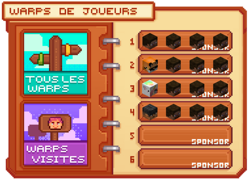

# 👁️‍🗨️ Les Warps


**Tuto : Créer et gérer votre propre ville sur Evolucraft**


## <mark style="color:green;">Informations Générales</mark>

PlayerWarp est une fonctionnalité essentielle sur notre serveur qui permet aux joueurs de créer leurs propres points de téléportation personnalisés, appelés warps.

Ces warps peuvent être utilisés pour se déplacer rapidement à travers le monde et faciliter l'exploration, les échanges commerciaux, ou tout simplement pour rendre la navigation plus pratique.

<figure><figcaption>
<strong>Aperçu du </strong><mark style="color:green;"><strong><code>/pwarp</code></strong></mark>
</figcaption></figure>

## <mark style="color:green;">Utilité des Warps</mark>

* <mark style="color:green;">**Exploration Rapide**</mark>**&#x20;:** Les warps permettent aux joueurs de se déplacer instantanément vers des endroits qu'ils ont déjà visités, facilitant ainsi l'exploration de nouvelles régions.
* <mark style="color:green;">**Commerce et Échanges**</mark>**&#x20;:** En créant des warps vers des endroits spécifiques comme des marchés, des magasins ou des zones d'échanges, les joueurs peuvent simplifier leurs transactions commerciales.
* <mark style="color:green;">**Gestion de Ville**</mark>**&#x20;:** Les maires de villes peuvent utiliser les warps pour permettre à leurs citoyens de se déplacer facilement à des endroits clés de la ville, comme les mairies, les arènes ou les fermes communautaires.

## <mark style="color:green;">Commandes de PlayerWarp</mark>

### <mark style="color:green;">Warps Personnels</mark>

* <mark style="color:green;">**`/pwarp create [nom du warp]`**</mark> : Crée un nouveau warp personnel avec le nom spécifié.
* <mark style="color:green;">**`/pwarp delete [nom du warp]`**</mark> : Supprime le warp personnel spécifié.
* <mark style="color:green;">**`/pwarp list`**</mark> : Affiche la liste de vos warps personnels.
* <mark style="color:green;">**`/pwarp setowner set [nom du warp] [nom du joueur]`**</mark> : envoyer une demande a un joueur de devenir le chef du warp
* <mark style="color:green;">**`/pwarp setowner accept [nom du warp]`**</mark> : accepter la demande de devenir chef d’un warp
* <mark style="color:green;">**`/pwarp setowner cancel [nom du warp]`**</mark> : refuser la demande de devenir chef d’un warp
* <mark style="color:green;">**`/pwarp cost remove`**</mark> : met le prix de teleportation au warp à 0
* <mark style="color:green;">**`/pwarp cost set [prix] [nom du warp]`**</mark> : mettre un prix à la teleportation au warp (max 500$)
* <mark style="color:green;">**`/pwarp ban set [nom du pwarp] [nom du joueur]`**</mark> : bannir un joueur du pwarp
* <mark style="color:green;">**`/pwarp ban list [nom du pwarp]`**</mark> : afficher la liste des joueurs bannis du pwarp
* <mark style="color:green;">**`/pwarp ban remove [nom du pwarp] [nom du joueur]`**</mark> : dé-bannir un joueur du pwarp
* <mark style="color:green;">**`/pwarp lock [nom du pwarp]`**</mark> <mark style="color:green;"></mark><mark style="color:green;">: Permet d'ouvrir ou fermer l'accès public à votre warp.</mark>

### <mark style="color:green;">Warps Publics</mark>

* <mark style="color:green;">**`/pwarp [nom du warp]`**</mark> : Téléporte-vous au warp public spécifié.
* <mark style="color:green;">**`/pwarp info [nom du warp]`**</mark> : Affiche des informations sur le warp public spécifié.
* <mark style="color:green;">**`/pwarp list`**</mark> : Affiche une liste de tous les warps publics disponibles.
* <mark style="color:green;">**`/pwarp setlocation [nom du warp]`**</mark> : Définit la position actuelle comme emplacement du warp public spécifié.
