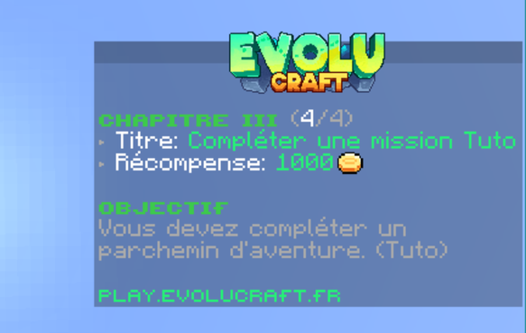
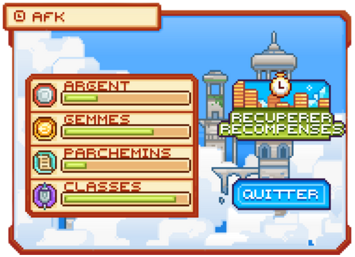
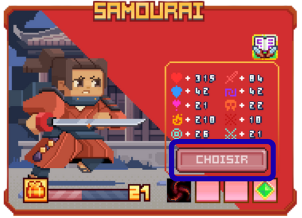

Avoir une <mark style="color:green;">classe</mark> vous permet d'obtenir un <mark style="color:green;">boost</mark> sur vos <mark style="color:green;">statistiques de base</mark>, comme plus de <mark style="color:green;">vitesse</mark>, plus de <mark style="color:green;">vie</mark>, plus de <mark style="color:green;">défense</mark>... Une <mark style="color:green;">classe</mark> vous permet également d'accéder au <mark style="color:green;">donjon</mark>, un lieu où vous pourrez obtenir de <mark style="color:green;">nombreuses récompenses intéressantes</mark>.

# 💠 <mark style="color:green;">Comment débloquer, choisir ou changer une classe ⚔️ ?</mark>

## 🔸 Obtention d'une carte aléatoire et son utilisation ❔

### <mark style="color:green;">🔹 Étape 1️⃣</mark>
Pour obtenir une <mark style="color:green;">classe</mark>, il faut <mark style="color:green;">acquérir une carte aléatoire</mark>. Cette carte vous permettra d'obtenir une carte de classe spécifique et donc de choisir votre classe. Plusieurs méthodes existent pour obtenir cet objet :

#### ◻️ <mark style="color:blue;">Le tuto 💡</mark>
À votre arrivée sur le serveur, après avoir découvert le début du spawn, une <mark style="color:green;">quête tutoriel</mark> vous est proposée pour découvrir les bases du serveur.

<figure><figcaption>
<strong>Aperçu d'une <mark style="color:green;">quête du tuto</mark></strong>
</figcaption></figure>

Une fois arrivé à un certain chapitre et à une certaine étape, il vous sera demandé d'exécuter la commande <mark style="color:green;">`/classe`</mark>. Après avoir effectué cette commande, une <mark style="color:green;">carte aléatoire commune</mark> vous sera donnée dans votre inventaire.

#### ◻️ <mark style="color:blue;">Le `/rewards` 🕐</mark>
Le <mark style="color:green;">`/rewards`</mark> vous permet de <mark style="color:green;">gagner des récompenses</mark> chaque jour, avec un reset à minuit _(heure française)_ selon votre temps de jeu. <mark style="color:green;">Une notification sur votre écran</mark> vous informe lorsqu’un cadeau est débloqué.

<figure><figcaption>
<strong>Aperçu de l’interface <mark style="color:green;">/rewards</mark></strong>
</figcaption></figure>

Lorsque vous atteignez le dernier palier, une <mark style="color:green;">carte aléatoire commune</mark> vous sera donnée.

#### ◻️ <mark style="color:blue;">Le `/afk` 💤</mark>
Le <mark style="color:green;">`/afk`</mark> est un espace où, si vous restez inactif pendant 15 minutes _(pour les joueurs sans grade)_, vous êtes téléporté à cet endroit et un affichage vous indique ce que vous avez gagné en étant à l'intérieur. 

Pour y <mark style="color:green;">gagner une carte de classe aléatoire</mark>, il faudra y <mark style="color:green;">rester afk</mark> pendant <mark style="color:green;">12H</mark>.

<figure><figcaption>
<strong>Aperçu de l’interface du <mark style="color:green;">/afk</mark></strong>
</figcaption></figure>

### <mark style="color:green;">🔹 Étape 2️⃣</mark>
Après avoir récupéré une <mark style="color:green;">carte aléatoire</mark>, prenez-la dans votre main et faites un <mark style="color:green;">clic droit</mark> avec. Des cartes de la même classe seront alors révélées. Selon la <mark style="color:green;">rareté</mark> de la carte, elle peut offrir un nombre différent de cartes :

<mark style="color:green;">**Nombre de cartes nécessaires pour les classes aléatoires**</mark>

|                               Classe                               |          Nombre de cartes minimum          |          Nombre de cartes maximum          |
| :----------------------------------------------------------------: | :----------------------------------------: | :----------------------------------------: |
| <mark style="color:green;">**Classe aléatoire commune**</mark>     | <mark style="color:green;">**x15**</mark>  | <mark style="color:green;">**x30**</mark>  |
| <mark style="color:yellow;">**Classe aléatoire rare**</mark>       | <mark style="color:yellow;">**x5**</mark>  | <mark style="color:yellow;">**x10**</mark> |
| <mark style="color:blue;">**Classe aléatoire épique**</mark>       | <mark style="color:blue;">**x2**</mark>    | <mark style="color:blue;">**x4**</mark>    |
| <mark style="color:purple;">**Classe aléatoire légendaire**</mark> | <mark style="color:purple;">**x1**</mark>  | <mark style="color:purple;">**x1**</mark>  |
| <mark style="color:red;">**Classe aléatoire mythique**</mark>      | <mark style="color:red;">**x1**</mark>     | <mark style="color:red;">**x1**</mark>     |

### <mark style="color:green;">🔹 Étape 3️⃣</mark>
Une fois le contenu de vos cartes aléatoires révélé, prenez celle(s) de la classe souhaitée et faites un <mark style="color:green;">clic droit</mark> pour <mark style="color:green;">déposer la carte</mark> dans le <mark style="color:green;">/classe</mark>.


<mark style="color:green;">ASTUCE ☝🤓</mark> : Si vous avez plusieurs cartes de la même classe, allez au spawn puis restez appuyé sur la touche de drop ; cela vous permet de gagner du temps pour déposer vos cartes dans l'interface de classe.


## 🔸 <mark style="color:green;">Choisir une classe 🧝‍♂️</mark>
Après avoir récolté des <mark style="color:green;">cartes de classe</mark>, vous pouvez choisir votre classe en suivant ces étapes :

### <mark style="color:green;">🔹 Étape 1️⃣</mark>
Effectuez la commande <mark style="color:green;">`/classe`</mark>. L'interface ci-dessous s'affichera.

<figure><figcaption>
<strong>Aperçu des <mark style="color:green;">classes</mark></strong>
</figcaption></figure>

### <mark style="color:green;">🔹 Étape 2️⃣</mark>
Cliquez sur la <mark style="color:green;">classe</mark> que vous souhaitez choisir en cliquant sur le pictogramme qui la représente.

### <mark style="color:green;">🔹 Étape 3️⃣</mark>
Cliquez sur le bouton <mark style="color:green;">"Choisir"</mark> pour sélectionner cette classe.

<figure><figcaption>
<strong>Aperçu de l’interface de la <mark style="color:green;">Classe Samouraï</mark></strong>
</figcaption></figure>


**🚨 <mark style="color:green;">IMPORTANT</mark> 🚨 : Vous devez choisir une classe où vous avez au minimum une <mark style="color:green;">carte déposée</mark> dans le menu.** Pour vérifier si vous avez déposé des cartes dans une classe, cliquez sur la classe voulue puis passez votre souris sur le bouton "Choisir". Il vous indiquera si vous avez des cartes de cette classe déposées.


<figure><figcaption>
<strong>Indication du <mark style="color:green;">nombre de cartes</mark></strong>
</figcaption></figure>

## 🔸 <mark style="color:green;">Changer de classe 🔁</mark>

Si vous n'êtes pas satisfait de votre <mark style="color:green;">classe</mark> ou que vous souhaitez relever un nouveau défi, il est possible de <mark style="color:green;">changer de classe</mark> ! Voici comment procéder :

### <mark style="color:green;">🔹 Étape 1️⃣</mark>
Effectuez la commande <mark style="color:green;">`/classe`</mark>. L'interface ci-dessous s'affichera.

<figure><figcaption>
<strong>Aperçu des <mark style="color:green;">classes</mark></strong>
</figcaption></figure>

### <mark style="color:green;">🔹 Étape 2️⃣</mark>
Cliquez sur la <mark style="color:green;">classe</mark> que vous souhaitez en cliquant sur le pictogramme qui la représente.

### <mark style="color:green;">🔹 Étape 3️⃣</mark>
Cliquez sur le bouton <mark style="color:green;">"Choisir"</mark> pour sélectionner cette classe, en gardant à l'esprit qu'il faut avoir au minimum une <mark style="color:green;">carte de cette classe</mark>.

<figure><figcaption>
<strong>Aperçu de l’interface de la <mark style="color:green;">Classe Samouraï</mark></strong>
</figcaption></figure>


<mark style="color:green;">REMARQUE 🔍</mark> : Si vous souhaitez revenir à votre classe initiale, votre <mark style="color:green;">progression</mark> y sera sauvegardée.


**Et voilà ! Vous savez désormais comment <mark style="color:green;">choisir</mark> ou <mark style="color:green;">changer</mark> de classe ✨**

