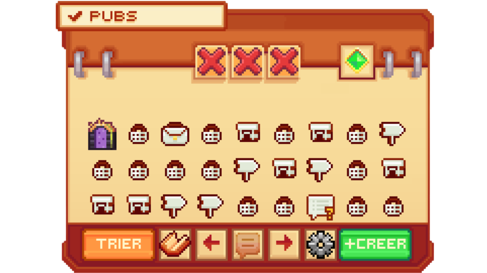
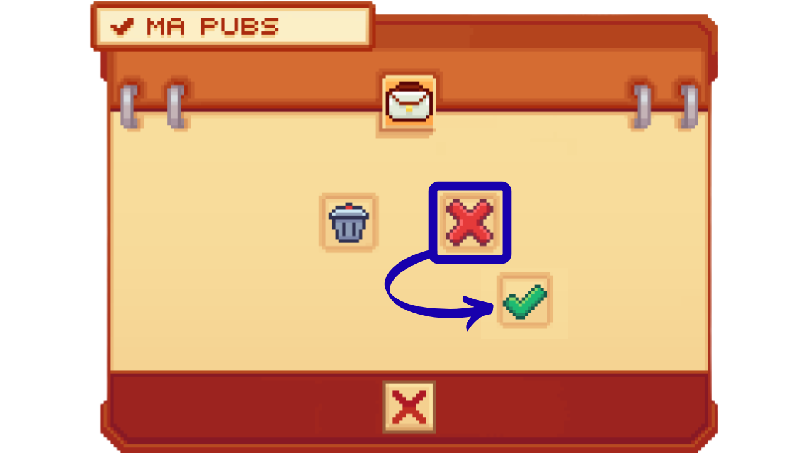


**La commande /Pub**


## <mark style="color:green;">💠 Comment ajouter une pub dans le /pub ? 🏪</mark>

Le /pub vous permet de promouvoir votre publicité via un affichage ou dans le chat auprès des autres joueurs du serveur pendant une certaine période et pour diverses catégories. Mais comment la créer ? Voici donc un tuto.

### <mark style="color:green;">• Étape 1️⃣</mark>
**Faites la commande `/pub` dans votre chat et une interface comme ci-dessous va apparaître.**
<figure></figure>

### <mark style="color:green;">• Étape 2️⃣</mark>
**Cliquez sur le bouton "Créer" en bas à droite de l'interface.**
<figure></figure>

### <mark style="color:green;">• Étape 3️⃣</mark>
**En faisant un clic droit ou un clic gauche sur l'émeraude ou l'élément qui apparaît à l'emplacement montré ci-dessous, sélectionnez la catégorie où vous souhaitez que votre publicité soit affichée.**
<figure></figure>

### <mark style="color:green;">• Étape 4️⃣</mark>
**Veuillez insérer les informations demandées dans les éléments encadrés ci-dessous. Chaque item correspond à une information pour votre publicité.**
<figure></figure>


**⚠️ Attention, si votre texte dans l'une des catégories est trop long, votre pré-création de pub sera complètement effacée 😫**


### <mark style="color:green;">• Étape 5️⃣</mark>
**Une fois les informations insérées, vous n'avez plus qu'à cliquer sur le bouton "Créer" en bas à droite, comme ci-dessous, et votre pub sera publiée.**
<figure></figure>

### <mark style="color:green;">• Étape BONUS ✨</mark>
**Après que votre pub soit créée, vous avez la possibilité de faire retransmettre cette dernière dans le chat automatiquement toutes les 20 minutes. Pour cela, dans l'interface du /pub, vous devez cliquer sur "Mes annonces", puis sur la publicité pour laquelle vous voulez avoir un message automatique, et enfin sur la petite croix afin qu'elle devienne une petite coche verte.**
<figure></figure>
<figure></figure>
<figure></figure>

**Et voilà, vous savez désormais comment créer une publicité dans le /pub ! 🥳**
