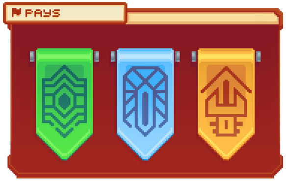

# **💠 Comment être dans une ville ? 🏙️**

**Être dans une ville vous permet d’y poser vos affaires et de vivre votre aventure, seul ou à plusieurs. En montant de [<mark style="color:green;">rangs</mark>](https://wiki.evolucraft.fr/le-gameplay/les-rangs#rang-de-depart), vous aurez la possibilité d’être dans plusieurs villes. Cependant, vous ne pourrez être maire que d’une seule ville.** 

_Alors, allez-vous créer votre ville ou rejoindre une ville déjà existante ?_ 🤔

## <mark style="color:green;">**💠 Comment créer votre ville ? 🏙️**</mark>

Vous souhaitez créer une ville ? Parfait, vous êtes au bon endroit ! Commençons.

### <mark style="color:green;">• Étape 1️⃣</mark>

**Choisissez un pays parmi (<mark style="color:green;">**Jaya**</mark>, <mark style="color:green;">**Lyria**</mark> ou <mark style="color:green;">**Sarys**</mark>) dans le <mark style="color:green;">**`/pays`**</mark>.**

<figure><figcaption>
<strong>Menu du <code>/pays</code></strong>
</figcaption></figure>

### <mark style="color:green;">• Étape 2️⃣</mark>

Trouvez une zone libre en étant à plus de 5 chunks des autres villes autour. Pour faciliter votre tâche, utilisez <mark style="color:green;">**`/rtp`**</mark> _(qui vous permet d’être téléporté aléatoirement dans le monde de construction choisi, dans un endroit libre)_ ainsi que <mark style="color:green;">**`/v map`**</mark> _(qui vous permet de voir, dans un périmètre de 5 chunks de rayon, s’il y a des villes proches de votre position)_ !

<figure><figcaption>
<strong>Aperçu du <code>/v map</code></strong>
</figcaption></figure>

### <mark style="color:green;">• Étape 3️⃣</mark>

**Une fois votre espace trouvé, vous pouvez créer votre ville grâce à la commande <mark style="color:green;">`/v create [Insérez le nom de votre ville]`</mark>.**


ATTENTION ⚠️ : Vous ne pouvez pas mettre d’espace dans le nom de votre ville.


**Félicitations, vous venez de créer votre ville 🎆**

## <mark style="color:green;">**💠 Comment rejoindre une ville ? 👋**</mark>

### 🔸`-`La recherche de ville 🔍
Si vous recherchez une ville qui pourra vous accueillir, plusieurs solutions s’offrent à vous :
* **Le Discord avec le channel [<mark style="color:green;">**`#📫・recrutement`**</mark>](https://discord.com/channels/699670538737418343/1374869572850684088)** qui vous permet de voir toutes les villes qui recrutent selon leurs critères et ainsi de contacter plus facilement le maire pour espérer les rejoindre ! 🤗
* **Le /pub dans la catégorie Recrutement** où vous pourrez lire toutes les annonces de villes recrutant directement en jeu si vous n’avez pas Discord, par exemple. Cependant, si le créateur de la pub n’est plus connecté, alors le message privé ne sera pas envoyé directement.

### 🔸`-`Le recrutement 🤗
Si vous avez trouvé quelqu’un pour vous recruter, alors après que le maire ait envoyé une invitation, il vous suffira d’utiliser la commande <mark style="color:green;">`/v accept [Insérez le nom de la ville]`</mark>


**REMARQUE 🔍 :** Si lors de l’invitation, il vous renvoie un message "joueur introuvable", veuillez attendre le lendemain. Si cela persiste, veuillez contacter un staff connecté en jeu ou via [<mark style="color:green;">**un ticket**</mark>](https://discord.com/channels/699670538737418343/709491272385298532).


**Félicitations, vous savez tout pour être dans une ville ! 🎆**

