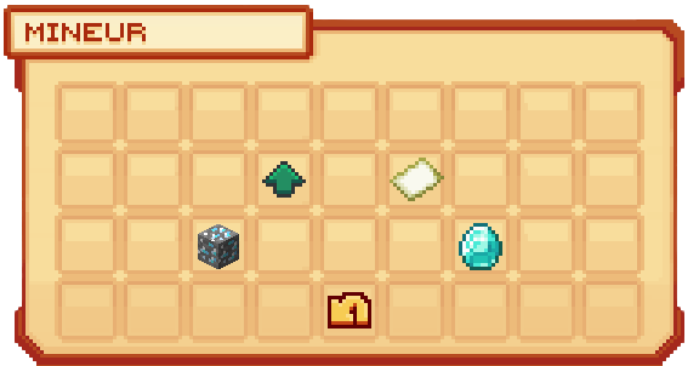
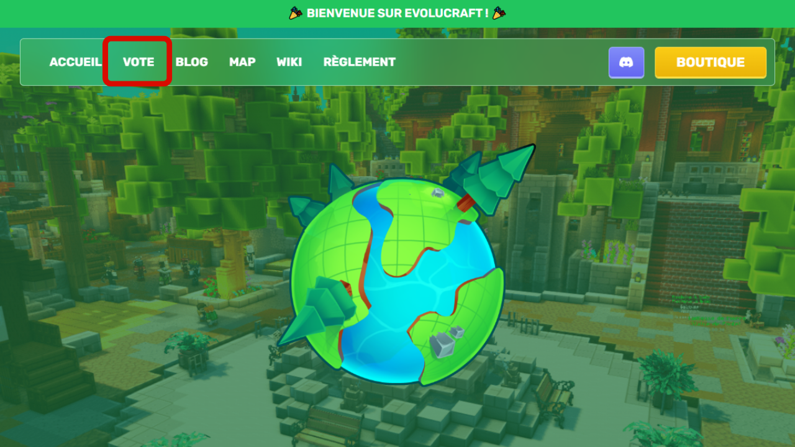
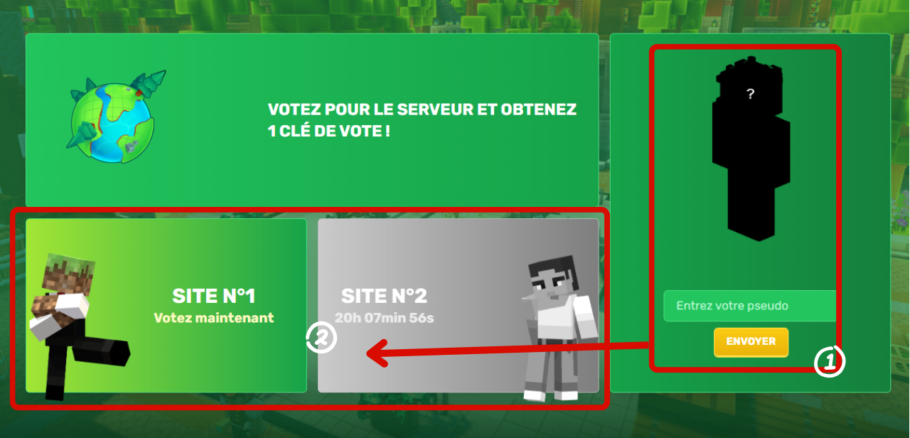
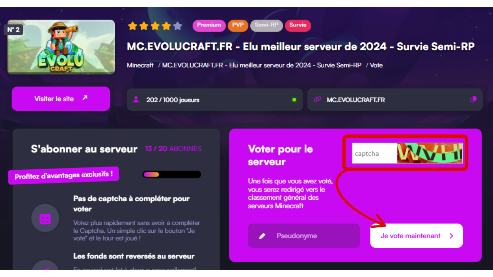
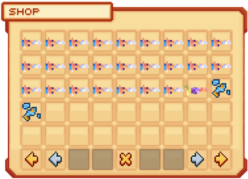
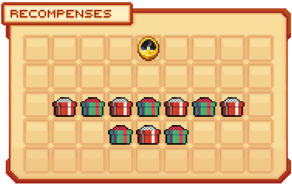

# 💠 Comment se faire de l'argent facilement sur le serveur ? 💸

L'argent sur ce serveur est indispensable pour monter ses rangs, faire évoluer sa ville ou encore acheter des services ou des items aux joueurs. Mais en tant que nouveau joueur, quels sont les moyens d'avoir une petite base d'argent pour subvenir à ses besoins ? Alors voici quelques astuces pour se faire de l'argent rapidement, sans mendier !

## 🔶 <mark style="color:green;">Les Métiers 👷‍♂️</mark>

**Les <mark style="color:green;">métiers</mark> vous permettent, en plus de monter des niveaux de jobs et d'accomplir <mark style="color:green;">les prérequis pour vos rangs</mark>, de <mark style="color:green;">gagner de l'argent</mark> selon les actions liées à votre métier.**

### 🔹 Comment rejoindre un métier ? 🛠️

Pour <mark style="color:green;">rejoindre un métier</mark>, il vous suffit de faire la commande <mark style="color:green;">`/jobs join [métier]`</mark>. Selon <mark style="color:green;">votre rang</mark>, vous pourrez <mark style="color:green;">choisir plusieurs métiers</mark> à la fois. Mais pas d'inquiétude : lorsque vous changez de métier, vous <mark style="color:green;">ne perdez pas votre progression</mark>.

### 🔹 Comment gagner de l'argent avec son métier ? 💰

Pour savoir quelles <mark style="color:green;">actions vous font gagner de l'argent</mark> (ainsi que de l'xp métier), il vous suffit d'abord de faire <mark style="color:green;">`/jobs`</mark> puis de <mark style="color:green;">sélectionner le métier</mark> que vous avez rejoint.
<figure><figcaption>
<strong>Aperçu du "<mark style="color:green;">`/jobs`</mark></strong>
</figcaption></figure>

Puis, il vous suffira de cliquer sur "<mark style="color:green;">Action rémunérée</mark>" représentée par <mark style="color:green;">une feuille de papier</mark>.
<figure><figcaption>
<strong>Aperçu du <mark style="color:green;">`/jobs`</mark></strong>
</figcaption></figure>

Et vous aurez la liste, selon la <mark style="color:green;">catégorie d'action</mark> (casser, tuer, pêcher, etc.) avec les <mark style="color:green;">actions possibles</mark> et <mark style="color:green;">leur gain associé</mark> (Argent et XP métier)
<figure><figcaption>
<strong>Aperçu des <mark style="color:green;">actions rémunérées du mineur</mark></strong>
</figcaption></figure>

Également, lorsque vous passez un niveau dans votre métier, vous pouvez récupérer de l'argent en faisant la commande <mark style="color:green;">`/jobs claim`</mark>. Elle vous donnera les récompenses de paliers de tous les métiers atteints.

Si vous avez besoin de <mark style="color:green;">plus d'infos sur les métiers</mark>, nous vous invitons à <mark style="color:green;">lire également la page dédiée</mark> : <a href="https://wiki.evolucraft.fr/le-gameplay/les-donjons"><mark style="color:green;">les métiers 👷‍♂️</mark></a>.

## 🔶 <mark style="color:green;">Les clés de vote 🗝️</mark>

Les <mark style="color:green;">clés de vote</mark> font partie des marchés préférés des joueurs qui aiment <mark style="color:green;">gagner</mark> par exemple <mark style="color:green;">de l'argent</mark> ou encore <mark style="color:green;">des items plutôt rares</mark> _(items en émeraude, Rubis Shiny ou encore des pets)_.

### 🔹 Comment voter sur le serveur ? ✅

#### <mark style="color:green;">• Étape 1️⃣</mark>
**Obtenir des clés est relativement simple : dans un premier temps, vous pouvez <mark style="color:green;">aller sur le site d'<a href="https://evolucraft.fr/vote">Évolucraft 🌏</mark></a> puis aller dans <mark style="color:green;">l'onglet Vote</mark>.**
<figure><figcaption>
<strong>Aperçu de la page <mark style="color:green;">d'accueil du site</mark></strong>
</figcaption></figure>

#### <mark style="color:green;">• Étape 2️⃣</mark>
**Ensuite, vous devrez <mark style="color:green;">insérer votre pseudo</mark> sur la droite comme sur l'image ci-dessous, <mark style="color:green;">veillez à bien écrire le pseudo exact, au caractère près</mark> !**
<figure><figcaption>
<strong>Aperçu de l'onglet <mark style="color:green;">vote du site</mark></strong>
</figcaption></figure>

#### <mark style="color:green;">• Étape 3️⃣</mark>
**Vous devrez ensuite <mark style="color:green;">cliquer sur Site 1 ou Site 2</mark>. Cela vous amènera vers un autre site ; suivez les instructions demandées, il vous faudra probablement <mark style="color:green;">remplir un captcha</mark> (avec image ou texte selon la demande) puis <mark style="color:green;">cliquer sur "Je Vote Maintenant"</mark>. Après avoir voté, il est impératif de <mark style="color:green;">revenir sur le site d'Évolucraft</mark> afin que le vote soit validé (Le vote sera considéré comme validé lorsque le temps du prochain vote commencera à s'afficher ; sinon, refaites le vote ou rafraîchissez la page internet).**
<figure><figcaption>
<strong>Aperçu du <mark style="color:green;">Site 1</mark></strong>
</figcaption></figure>


**⚠️ Attention : si plusieurs joueurs jouent sur la même connexion internet, chacun doit utiliser une connexion différente, par exemple en utilisant les données mobiles.**


### 🔹 Comment récupérer ses clés de vote ? ✔️

**Pour <mark style="color:green;">récupérer vos clés</mark> durement acquises, effectuez la commande <mark style="color:green;">`/claimvote`</mark> au spawn en <mark style="color:green;">laissant quelques slots d’inventaire libres</mark> afin de ne pas jeter certaines clés inutilement.**


**REMARQUE 🔍 : Vous n’avez <mark style="color:green;">pas besoin d’être obligatoirement connecté</mark> en jeu pour voter**.


**Vous pouvez dès maintenant choisir de les ouvrir à la box au spawn 🧰 ou de les vendre au /ah 🛒**

## 🔶 <mark style="color:green;">Les donjons 🟪</mark>

**<mark style="color:green;">Faire des donjons</mark>, c’est <mark style="color:green;">la nouveauté de cette V4 d’Évolucraft</mark> pour vous aider à <mark style="color:green;">compléter les prérequis</mark> de vos futurs rangs !**

### 🔹 Comment trouver des donjons ? 🤔

**Pour <mark style="color:green;">trouver des donjons</mark>, il y a <mark style="color:green;">plusieurs solutions</mark> :**

#### <mark style="color:green;">• 1️⃣ Les pierres de tp donjon 🟩</mark>

**Les pierres de tp donjon vous servent à être <mark style="color:green;">téléporté directement</mark>, en étant dans le monde ressource, à <mark style="color:green;">un portail de donjon généré</mark>. Très utile si vous ne voulez pas passer des heures à en chercher un !**

**Pour <mark style="color:green;">vous en procurer</mark>, il vous suffit de faire <mark style="color:green;">`/kit donjon`</mark> _(disponible toutes les 24 heures)_ ou via <mark style="color:green;">la box de vote</mark>.**

**Pour les joueurs plus avancés, vous avez le <mark style="color:green;">`/dragon`</mark> où, sur la deuxième page, vous pourrez <mark style="color:green;">échanger des pierres de tp donjon</mark> de rareté plus importante : <mark style="color:yellow;">Rare</mark>, <mark style="color:blue;">Épique</mark> ou <mark style="color:purple;">Légendaire</mark> !**

#### <mark style="color:green;">• 2️⃣ La recherche en balade 🚶‍♂️</mark>

**En vous <mark style="color:green;">baladant dans les différents mondes ressources</mark>, vous pouvez également <mark style="color:green;">trouver des donjons générés</mark> et y entrer pour défier leurs mobs féroces. Avec un peu de chance, le <mark style="color:green;">`/rtp`</mark> pourra vous faire apparaître <mark style="color:green;">à côté d’un portail de donjon</mark>.**

#### <mark style="color:green;">• 3️⃣ Les publicités 📣</mark>

**Avec le <a href="http://wiki.evolucraft.fr/le-gameplay/le-commerce#publicite"><mark style="color:green;">/pub 📢</mark></a>, vous pouvez <mark style="color:green;">activer les notifications de pubs pour donjon</mark> lorsque <mark style="color:green;">des joueurs trouvent un portail</mark> et souhaitent le partager. Très utile pour gagner des loots tout en participant au donjon !**

**Pour <mark style="color:green;">tenter de participer à ces donjons</mark>, il vous suffit de <mark style="color:green;">cliquer dans le chat</mark> sur la ligne "<mark style="color:green;">Envoyer une demande de téléportation"</mark> pour que le joueur ayant trouvé le donjon puisse <mark style="color:green;">vous téléporter</mark>.**
<figure><figcaption>
<strong>Aperçu d'une <mark style="color:green;">pub de donjon</mark></strong>
</figcaption></figure>

## 🔶 <mark style="color:green;">Vendre des items 🏪</mark>

**Pour <mark style="color:green;">vendre des items</mark> et <mark style="color:green;">récolter un peu d'argent</mark>, <mark style="color:green;">plusieurs solutions sont à votre disposition</mark> :**

### <mark style="color:green;">🔹 L'hôtel de vente _(`/hdv` ou `/ah`)_</mark>

**Vous permet de <mark style="color:green;">vendre des items ou d’acheter des items</mark> dans une interface connectée à tous les mondes.**

<figure><figcaption>
<strong>Aperçu du <mark style="color:green;">hôtel de vente</mark></strong>
</figcaption></figure>

**Pour <mark style="color:green;">mettre un item en vente</mark>, il faudra effectuer la commande <mark style="color:green;">`/ah sell [prix] [quantité]`</mark> tout en tenant l’item en main.**

**Si vous <mark style="color:green;">souhaitez récupérer votre item actuellement en vente</mark>, faites <mark style="color:green;">`/ah viewmine`</mark> puis <mark style="color:green;">cliquez sur l’item</mark> que vous souhaitez récupérer.**

### <mark style="color:green;">🔹 Les shops de joueurs </mark>

**Nous vous invitons à <mark style="color:green;">lire la page du wiki</mark> dédiée : <a href="https://wiki.evolucraft.fr/les-villes/les-shops-de-joueurs"><mark style="color:green;">**Les shops de joueurs 🏪**</mark></a>**

### <mark style="color:green;">🔹 Le `/finditem` </mark>

**Le <mark style="color:green;">`/finditem`</mark> vous permet de <mark style="color:green;">chercher un item</mark> parmi <mark style="color:green;">les coffres de vente/achat des joueurs</mark> sur le serveur.**

**Afin de <mark style="color:green;">vendre un item à un coffre de rachat</mark>, il vous suffit de <mark style="color:green;">faire la commande `/finditem vendre [id de l'item/premier mot de l'item custom]`</mark>, puis il vous donnera <mark style="color:green;">la liste de tous les joueurs rachetant cet item</mark>. À vous de <mark style="color:green;">sélectionner le racheteur</mark> en cliquant sur l’item en question.**

<figure><figcaption>
<strong>Aperçu de l’interface <mark style="color:green;">/finditem</mark></strong>
</figcaption></figure>


**REMARQUE 🔍 : Les items sont triés du plus cher au moins cher 📉**.


## 🔶 <mark style="color:green;">Le `/rewards` 🕐</mark>

**Le <mark style="color:green;">`/rewards`</mark> vous permet de <mark style="color:green;">gagner des récompenses</mark> chaque jour avec un reset à minuit _(heure française)_ selon votre temps de jeu. <mark style="color:green;">Une notification sur votre écran</mark> vous informe lorsqu’un cadeau est débloqué. Vous pouvez y <mark style="color:green;">recevoir des quêtes</mark>, <mark style="color:green;">divers blocs et items</mark>, <mark style="color:green;">une carte aléatoire commune</mark> mais surtout <mark style="color:green;">de l’argent</mark> !**
<figure><figcaption>
<strong>Aperçu de l’interface <mark style="color:green;">/rewards</mark></strong>
</figcaption></figure>

**Vous avez toutes les infos pour savoir comment gagner de l’argent facilement 🤑 ! À vous de trouver la meilleure technique ou d’en découvrir une nouvelle 😏**
