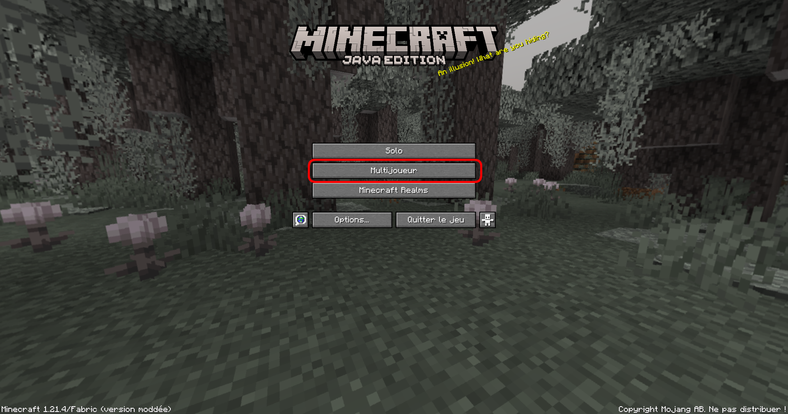

# <mark style="color:green;">💠 Comment rejoindre le serveur ? 🌏</mark>

## 🔸 Ajouter une version 🆕

### <mark style="color:green;">• Étape 1️⃣</mark>
**Lancez votre launcher Minecraft de base, puis cliquez sur l'onglet "Configuration" comme montré sur l'image ci-dessous.**
<figure></figure>

### <mark style="color:green;">• Étape 2️⃣</mark>
**Cliquez sur le bouton "Nouvelle configuration".**
<figure></figure>

### <mark style="color:green;">• Étape 3️⃣</mark>
**Cliquez sur la case "Version" pour ensuite sélectionner la version "release 1.20.4".**
<figure></figure>

### <mark style="color:green;">• Étape 4️⃣</mark>
**Après cette étape, vous n'avez plus qu'à cliquer sur le bouton "Installer" en bas à droite et votre jeu sera lancé automatiquement !**
<figure></figure>

## 🔸 Ajouter le serveur

### <mark style="color:green;">• Étape 1️⃣</mark>
**Après que votre jeu soit lancé, cliquez sur "Multijoueur", puis cliquez en bas sur "Nouveau serveur".**
<figure></figure>
<figure></figure>

### <mark style="color:green;">• Étape 2️⃣</mark>
**Entrez les informations comme ci-dessous, puis mettez l'option du pack de ressources en mode "Activé". Quand cela est réalisé, cliquez sur "Terminé".**
<figure></figure>

### <mark style="color:green;">• Étape 3️⃣</mark>
**Rejoignez le serveur en faisant un double clic sur le serveur, puis une fois arrivé dans le lobby, faites un clic droit avec la boussole en main pour ensuite cliquer sur le bloc vert comme ci-dessous.**
8. Pour finir, tu n'as plus qu'à cliquer sur le monde.
<figure></figure>

**Vous pouvez dès à présent commencer votre aventure sur Évolucraft ! 🥳**
